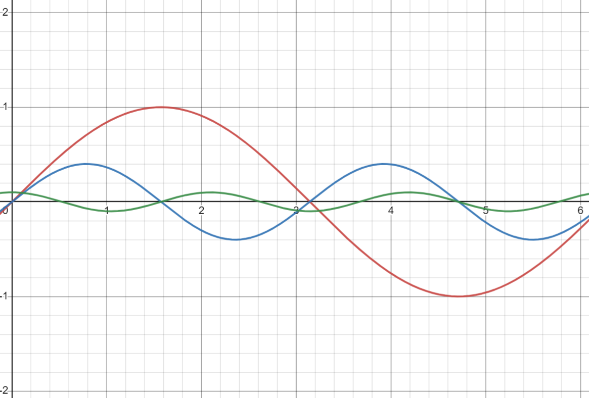
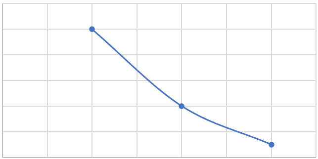

# EMGFlow Package Documentation

---

## Background

### What is The EMGFlow Package?

The EMGFlow package is a collection of functions that simplify the processing of EMG signals in Python. This includes preprocessing to detect outliers, visualizing signals, cleaning the raw data, and extracting features. EMGFlow provides a simple pipeline for each step needed to analyze EMG signals, while leaving it open enough to allow steps to be bypassed if not applicable to a use case.

### What Are EMG Signals?

EMG (Electromyography) signals represent the activity of a muscle. The most common approach to recording thes signals is by taking readings through electrodes that are attached onto the skin, above the muscle of interest. These recordings represent the strength of the electric signal over time, sometimes with multiple columns for the measurements from the different electrodes (_Electromyography (EMG)_, 2023).

### What Does EMG Signal Processing Involve?

EMG signal processing involves extracting meaningful summaries from the raw signal data (i.e the wave of signal strength over time). EMG processing is a subset of signal processing, so any measure applicable to signals work on EMGs, but they may not be relevant or provide meaningful information. As an example, pitch can be a useful feature for audio signal feature extraction, but is not used in the sphere of EMG signals as it is a perceptual property of sound (Darji, 2017).

There are 3 different domains of EMG features that can be extracted:
- Time domain features involve looking at the strength of the signals over time. 
- Frequency domain features involve looking at the composition of the signal, breaking it down into the frequencies its made of, and looking at their strengths. 
- Time-frequency domain features involve looking at both the time-domain and frequency-domain to take measures. 

This package will look at time-domain and frequency-domain features (Chowdhury et al., 2013).

---

## Package Overview

### How Are Signals Processed?

When a signal is recorded, it typically can't be used until it has been processed. Unlike other forms of data, the method of processing signals is more indirect. Signals have two important parts to them:
- Signal recording is the recorded signal: a recording of signal magnitude over time which forms a sort of wave.  
- Power Spectrum Density (PSD) is an interpretation of frequency by magnitude. The signal magnitude wave is interpreted as being formed by a combination of different frequency signals, and is deconstructed into individual frequencies. These frequencies are then recorded alongside their magnitude:

Combined signal:


Deconstructed signal:


Analysis of magnitudes: (x = frequency, y = magnitude of that frequency)


Filtering signals involves the application of filters to the frequencies of a signal which changes the appearance of the PSD that is not necessarily visible in the main signal. Consequently, operations can not be applied directly to the signal wave, but must use other methods to make meaningful changes.

### Key Definitions

**Signal**
In EMGFlow, a Signal is represented by a Pandas DataFrame. Signals are typically stored as a CSV file, and read in directly.
- Contains a `Time` column (in seconds) for time since start of recording
- Additional named columns are assumed to be Signal recordings that show Signal strength
- Signal strength units don't matter - calculation results will be proportional to the units used, but it is better to use the same units for each column and file
- The `Time` column is not used in calculations, and isn't needed as long as the sampling rate is known

**Sampling Rate**
The sampling rate (referred to as `sampling_rate` or `sr`) is the rate at which the data was recorded. This is easily found by taking the inverse of the rate at which `Time` column increases (in seconds).

**PSD**
A PSD is the Power Spectrum Density of a Signal. This is a different kind of DataFrame that applies a fourier transform to a Signal. That is, it interprets the Signal as the combination of different frequencies at different strengths, and shows the strength of each frequency in the Signal. This results in a DataFrame with a `Frequency` column for frequency (in Hz), and a `Power` column showing the normalized intensity of each frequency. In order to extract spectral features (features related to the distribution of frequencies that make up a Signal), the LTAS must be used (Long-Term Average Spectrum). The LTAS is similar to the PSD, but uses a rolling average with overlapping windows in its construction. While the PSD is not the same, in this instance the PSD is created using the same Welch method of creating the distribution that the LTAS uses itself (Elowsson & Friberg, 2017) using a function from SciPy. This function also cam be set to apply a Hanning window, which helps reduce noise introduced at the beginning and end of the signal (LDS Group, 2003).
### Signal Processing Pipeline

The Signal Processing module `SignalFilterer` is broken into 4 parts: notch filtering, bandpass filtering, smoothing and analysis. Each part has additional functions that support more specific needs, explained in more detail in the module descriptions.
#### `NotchFilterSignals()`

**Description**

Notch filtering involves filtering specific frequencies. This is typically due to some sort of interference, such as the power source of the device taking the reading.

**Parameters**

Notch filtering is controlled by the function `NotchFilterSignals()`, with the following main parameters:
- `in_path` <-- File path to input folder
- `out_path` <-- File path to output folder
- `sampling_rate` <-- Sampling rate of the data
- `notch` <-- Notch filters to be applied

`in_path` refers to the folder containing the signal data. The function will be able to detect signals in the folder, and in any subfolders.

`out_path` refers to the folder where the filtered signals will be output to. The function will automatically recreate the file structure of the input folder with additional subfolders.

`sampling_rate` refers to the sampling rate of the data. The function will assume that each signal, and each column, is using the same sampling rate.

`notch` refers to the notch filters being applied to the signal. This takes the form of a list of `(Hz,Q)` tuples. `Hz` is the frequency to which the filter is being applied, and `Q` is the Q-factor (strength of the filter, where a lower number is a stronger filter). The Q-factor needs to be explored to find a suitable value.  When the Q-factor is too high, there will be barely any effect.  When the Q_factor is too, important frequencies around the target being filtered out. All filters in the list will be applied to each column and signal.

**Value-Added**

`NotchFilterSignals()` provides flexibility for use in different regions of the world. Some filtering packages only provide notch filtering for 60Hz, the frequency where power can interfere with signal readings.  However, other regions use 50Hz frequencies.

For more information about further customizations and detail about `NotchFilterSignals()`, see [[SignalFilterer Documentation]]

#### `BandpassFilterSignals()`

**Description**

Bandpass filtering involves specifying a range of frequencies to keep, and removing all other frequencies outside this range. This is useful to remove interference outside  the most meaningful range of readings. 

**Parameters**

Bandpass filtering is controlled by the function `BandpassFilterSignals()`, with the following parameters:
- `in_path` <-- File path to input folder
- `out_path` <-- File path to output folder
- `sampling_rate` <-- Sampling rate of the data
- `low` <-- Lower frequency range
- `high` <-- Upper frequency range

`in_path` refers to the folder containing the signal data. The function will be able to detect signals in the folder, and in any subfolders.

`out_path` refers to the folder where the filtered signals will be output to. The function will automatically recreate the file structure of the input folder with additional subfolders.

`sampling_rate` refers to the sampling rate of the data. The function will assume that each signal, and each column, is using the same sampling rate.

`low` and `high` are the thresholds for the bandpass filter. All frequencies outside the range provided are filtered out of the signal. The defaults respectively are 20 and 450.

**Value-Added**

`BandpassFilterSignals()` uses bandpass thresholds of 20Hz and 450Hz, as this is default for EMG signals (De Luca et al., 2010). However, there is some disagreement within literature for different muscels, so `BandpassFilterSignals()` provides the option to change the thresholds.

For more information about further customizations and detail about `BandpassFilterSignals()`, see [[SignalFilterer Documentation]]

#### `SmoothFilterSignals()`

Smoothing involves limiting the impacts of noise and outliers in the signal. By default, this function uses the RMS smoothing method, as it is the best choice for smoothing EMG signals (RENSHAW et al., 2010).

Smoothing is controlled by the function `SmoothFilterSignals()`, with the following main parameters:
- `in_path` <-- File path to input folder
- `out_path` <-- File path to output folder
- `sampling_rate` <-- Sampling rate of the data
- `window_size` <-- Size of the window to smooth
- `method` <-- Smoothing method to use

`in_path` refers to the folder containing the signal data. The function will be able to detect signals in the folder, and in any subfolders.

`out_path` refers to the folder where the filtered signals will be output to. The function will automatically recreate the file structure of the input folder with additional subfolders.

`sampling_rate` refers to the sampling rate of the data. The function will assume that each signal, and each column, is using the same sampling rate.

`window_size` refers to the size of the window when the data is being smoothed. This affects how large of an area around the value to take an average of.

`method` refers to the smoothing method to use. Can be one of 'rms', 'boxcar', 'gauss' or 'loess'. The default is 'rms'.

**Value-Added**

`SmoothFilterSignals()` by default uses the RMS smoothing method, as it is the best choice for filtering EMG signals (RENSHAW et al., 2010). Regardless, EMGFlow provides different methods for smoothing signals which can be used instead.

For more information about further customizations and detail about `SmoothFilterSignals()`, see [[SignalFilterer Documentation]]

#### `AnalyzeSignals()`

**Description**

Analysis involves extracting the features from each signal into a feature file. This is the end of the pipeline, producing the final result.

Analysis is controlled by the function `AnalyzeSignals()`, with the following main parameters:
- `in_bandpass` <-- File path to input folder of data before being smoothed
- `in_smooth` <-- File path to input folder of data after being smoothed
- `out_path` <-- File path to output folder
- `sampling_rate` <-- Sampling rate of the data

`AnalyzeSignals()` extracts the following time-series features:
- Min
- Max
- Mean
- SD
- Skew
- Kurtosis
- IEMG
- MAV
- MMAV
- SSI
- VAR
- VOrder
- RMS
- WL
- LOG
- MFL
- AP
- Spectral Flux

And the following spectral features:
- Max frequency
- Twitch ratio
- Twitch index
- Twitch slope fast
- Twitch slope slow
- Spectral centroid
- Spectral flatness
- Spectral decrease
- Spectral entropy
- Spectral rolloff
- Spectral bandwidth

This function requires a path to smoothed and unsmoothed data. This is because while time-series features are extracted from smoothed data, spectral features are not. This is because high-frequency components of the signal can be lost in the smoothing, and we want to ensure the spectral features are as accurate as possible.

For more information about further customizations and specifications that can be made to `AnalyzeSignals()`, see [[SignalFilterer Documentation]]

For a more detailed explanation about the features extracted by `AnalyzeSignals()`, see [[ExtractFeatures Feature Documentation]]
#### Example

A simple example of using the EMGFlow package to process and analyze data would look like this:
```python
import EMGFlow

# Paths for data files
raw_path = '/data/raw/'
notch_path = '/data/notch/'
band_path = '/data/bandpass/'
smooth_path = '/data/smoothed/'
feature_path = '/data/feature/'

# Sampling rate
sampling_rate = 2000

# Filter parameters
notch_vals = [(50, 5)]
band_low = 20
band_high = 140
smooth_window = 50

# Signal analysis
NotchFilterSignals(raw_path, notch_path, sampling_rate, notch_vals)
BandpassFilterSignals(notch_path, band_path, sampling_rate, band_low, band_high)
SmoothFilterSignals(band_path, smooth_path, sampling_rate, smooth_window)
AnalyzeSignals(band_oath, smooth_path, feature_path, sampling_rate)
```

### Outlier Detection

The outlier detection module `OutlierFinder` provides functions to help detect outliers in large batches of signal data. This helps to identify which files need to be inspected for outliers.

Outlier detection is handled by the function `DetectOutliers()`. This function fits an inverse graph to the PSD representation of the signal, and identifies if there is a value significantly above a threshold.
- `in_path` <-- File path to input folder
- `sampling_rate` <-- Sampling rate of the data
- `threshold` <-- Threshold to consider a value an outlier

`in_path` refers to the folder containing the raw signal data. The function will be able to detect signals in the folder, and in any subfolders.

`sampling_rate` refers to the sampling rate of the data. The function will assume that each signal, and each column, is using the same sampling rate.

`threshold` refers to the number of times above the median for a value to be considered an outlier. This is checked for each column in the signal file, and is marked as an outlier if an outlier is found in any column.

This function outputs a dictionary of file names and locations for each signal marked as an outlier.

Example:
```python
import EMGFlow

# Parameters
notch_path = '/data/notch/'
sampling_rate = 2000
threshold = 15

# Detect outliers
outliers = DetectOutliers(notch_path, sampling_rate, threshold)
```

For more information about further customizations and specifications that can be made to `DetectOutliers()`, see [[OutlierFinder Documentation]]
### Plotting

The plotting module `PlotSignals` provides functions to help visualize individual, or large batches of signal data. This helps visually see what is happening in a signal to identify outliers, and determine the kinds of filters that need to be applied.

#### `PlotSpectrum()`

`PlotSpectrum` takes care of generating large numbers of signal plots for all signals contained in a folder and subfolders.
- `in_path` <-- File path to input folder
- `out_path` <-- File path to output folder
- `sampling_rate` <-- Sampling rate of the data

`in_path` refers to the folder containing the raw signal data. The function will be able to detect signals in the folder, and in any subfolders.

`out_path` refers to the folder where the plots will be output to. The function will automatically recreate the file structure of the input folder with additional subfolders.

`sampling_rate` refers to the sampling rate of the data. The function will assume that each signal, and each column, is using the same sampling rate.

For more information about further customizations and specifications that can be made to `PlotSpectrum()`, see [[PlotSignals Documentation]]
#### `PlotCompareSignals()`

`PlotCompareSignals()` compares plots of signals for two different stages of processing.
- `in_path1` <-- File path to input folder
- `in_path2` <-- File path to input folder
- `out_path` <-- File path to output folder
- `sampling_rate` <-- Sampling rate of the data

`in_path1` refers to the folder containing the first group of signal data. The function will be able to detect signals in the folder, and in any subfolders.

`in_path2` refers to the folder containing the second group of signal data. The function will be able to detect signals in the folder, and in any subfolders.

`out_path` refers to the folder where the plots will be output to. The function will automatically recreate the file structure of the input folder with additional subfolders.

`sampling_rate` refers to the sampling rate of the data. The function will assume that each signal, and each column, is using the same sampling rate.

For more information about further customizations and specifications that can be made to `PlotCompareSignals()`, see [[PlotSignals Documentation]]

---

## Sources

Chowdhury, R. H., Reaz, M. B. I., Ali, M. A. B. M., Bakar, A. A. A., Chellappan, K., & Chang, T. G. (2013). Surface Electromyography Signal Processing and Classification Techniques. _Sensors_, _13_(9), Article 9. [https://doi.org/10.3390/s130912431](https://doi.org/10.3390/s130912431)

Darji, M. (2017). Audio Signal Processing: A Review of Audio Signal Classification Features. _International Journal of Scientific Research in Computer Science, Engineering and Information Technology_, _2_(3), 227–230.

De Luca, C., Gilmore, L., Kuznetsov, M., & Roy, S. (2010). Filtering the surface EMG signal: Movement artifact and baseline noise contamination. _Journal of Biomechanics_, _43_, 1.

_Electromyography (EMG)_. (2023, April 24). John Hopkins Medicine. [https://www.hopkinsmedicine.org/health/treatment-tests-and-therapies/electromyography-emg](https://www.hopkinsmedicine.org/health/treatment-tests-and-therapies/electromyography-emg)

Elowsson, A., & Friberg, A. (2017). _Long-term Average Spectrum in Popular Music and its Relation to the Level of the Percussion_. 3. [https://www.researchgate.net/publication/317098414_Long-term_Average_Spectrum_in_Popular_Music_and_its_Relation_to_the_Level_of_the_Percussion](https://www.researchgate.net/publication/317098414_Long-term_Average_Spectrum_in_Popular_Music_and_its_Relation_to_the_Level_of_the_Percussion)

Hegedus, A., Trzaskoma, L., Soldos, P., Tuza, K., Katona, P., Greger, Z., Zsarnoczky-Dulhazi, F., & Kopper, B. (2020). Adaptation of Fatigue Affected Changes in Muscle EMG Frequency Characteristics for the Determination of Training Load in Physical Therapy for Cancer Patients. _Pathology Oncology Research_, _26_(2), 1129–1135. [https://doi.org/10.1007/s12253-019-00668-3](https://doi.org/10.1007/s12253-019-00668-3)

LDS Group. (2003). Understanding FFT Windows. _Application Note ANO14_. [https://www.egr.msu.edu/classes/me451/me451_labs/Fall_2013/Understanding_FFT_Windows.pdf](https://www.egr.msu.edu/classes/me451/me451_labs/Fall_2013/Understanding_FFT_Windows.pdf)

Radak, Z. (2018). _The Physiology of Physical Training_. Academic Press. [https://www.sciencedirect.com/topics/biochemistry-genetics-and-molecular-biology/fast-muscle-fiber](https://www.sciencedirect.com/topics/biochemistry-genetics-and-molecular-biology/fast-muscle-fiber)

RENSHAW, D., BICE, M. R., CASSIDY, C., ELDRIDGE, J. A., & POWELL, D. W. (2010). A Comparison of Three Computer-based Methods Used to Determine EMG Signal Amplitude. _International Journal of Exercise Science_, _3_(1), 43–48.