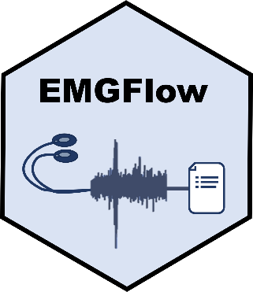
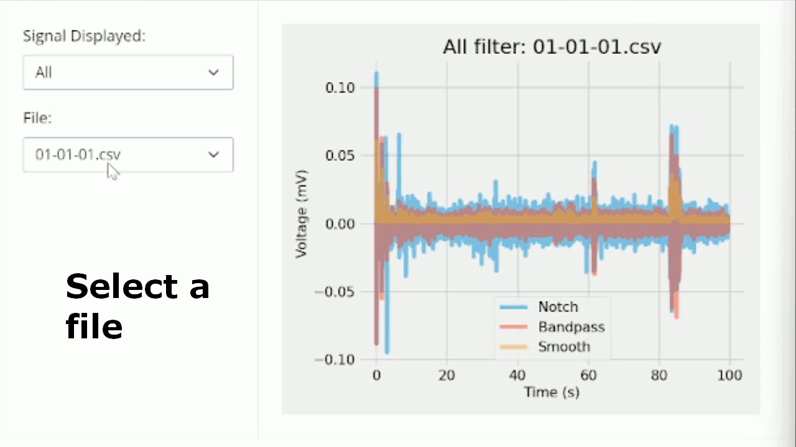

# EMGFlow 

[](https://pypi.python.org/pypi/emgflow)
[](https://github.com/WiIIson/EMGFlow-Python-Package/actions)
[](https://pypi.python.org/pypi/emgflow)
[](https://pepy.tech/project/EMGFlow)
[](https://pepy.tech/project/EMGFlow)

The open workflow for EMG signal processing and feature extraction.

**EMGFlow** is a Python package for researchers and clinicians to engage in signal processing. EMGFlow provides a broad range of functions to meet your EMG signal processing needs, without prescribing a specific workflow. EMGFlow follows open standards of data processing, such as CSV files and Pandas data frames to allow easy integration. With functions to extract 32 different features according to your needs, EMGFlow provides a uniquely deep feature extraction.

EMGFlow also includes an easy method for producing detailed graphs of EMG signals in large quantities.

The simple navigation menu allows you to switch between which files you see as well as which layers are overlayed:


---

## Statement Of Need

While several packages exist for processing physiological and neurological signals, support for surface electromyography (sEMG) has remained limited. Many packages lack a comprehensive set of features that can be extracted from sEMG data, leaving researchers to use a patchwork of tools. Other packages are orientated around event detection in individual recordings and use GUI-based workflow that requires greater manual intervention. While this design works well for single person recordings, it complicates the extraction of features from large datasets, such as those common to machine learning.

The EMGFlow package – a portmanteau of EMG and Workflow - fills this gap. Our package provides a flexible pipeline for the extraction of a wide range of sEMG features, with a scalable design that is suited to the processing of large datasets.

---

## Example

As a quick example, the following will create a feature file, starting with a folder of raw data:
```python
import EMGFlow

# Paths for data files
raw_path = '/data/raw'          # Raw file contains raw data
notch_path = '/data/notch'
band_path = '/data/bandpass'    # Additional files are empty
smooth_path = '/data/smoothed'
feature_path = '/data/feature'

# Sampling rate for all files
sampling_rate = 2000

# Filter parameters
notch_vals = [(50, 5)]  # Notch filters to apply (Q, Hz)
band_low = 20           # Low threshold for bandpass filter
band_high = 140         # High threshold for bandpass filter
smooth_window = 50      # Window size for smoothing filter

# Preprocess signals
EMGFlow.NotchFilterSignals(raw_path, notch_path, sampling_rate, notch_vals)
EMGFlow.BandpassFilterSignals(notch_path, band_path, sampling_rate, band_low, band_high)
EMGFlow.SmoothFilterSignals(band_path, smooth_path, sampling_rate, smooth_window)

# Extract features and save results to "Features.csv" in feature_path
df = EMGFlow.ExtractFeatures(band_oath, smooth_path, feature_path, sampling_rate)
```

---

## Documentation

[](https://wiiison.github.io/EMGFlow-Python-Package/docs-landing-page.html)
[](https://wiiison.github.io/EMGFlow-Python-Package/render-doc.html?doc=01)

General:
- [EMG processing background](https://wiiison.github.io/EMGFlow-Python-Package/render-doc.html?doc=02)
- [EMGFlow processing pipeline overview](https://wiiison.github.io/EMGFlow-Python-Package/render-doc.html?doc=03)
- [FileAccess module API](https://wiiison.github.io/EMGFlow-Python-Package/render-doc.html?doc=04)
- [PreprocessSignals module API](https://wiiison.github.io/EMGFlow-Python-Package/render-doc.html?doc=05)
- [ExtractFeatures module API](https://wiiison.github.io/EMGFlow-Python-Package/render-doc.html?doc=06)
- [OutlierFinder module API](https://wiiison.github.io/EMGFlow-Python-Package/render-doc.html?doc=07)
- [PlotSignals module API](https://wiiison.github.io/EMGFlow-Python-Package/render-doc.html?doc=08)

Examples:
- [Processing pipeline examples](https://wiiison.github.io/EMGFlow-Python-Package/render-doc.html?doc=01)

---

## Installation

EMGFlow can be installed from PyPI:
```python
pip install EMGFlow
```

Once installed, the package can be loaded as follows:
```python
import EMGFlow
```

Project dependencies can be seen [here](EMGFlow-Package/pyproject.toml).

---

## Contributions

Contributions and community guidelines can be seen [here](https://github.com/WiIIson/EMGFlow-Python-Package/blob/main/.github/CONTRIBUTING.md).

---

## Citations

This package can be cited as follows:

```bibtex
@software{Conley_EMGFlow_2024,
  author = {Conley, William and Livingstone, Steven R},
  month = {03},
  title = {{EMGFlow Package}},
  url = {https://github.com/WiIIson/EMGFlow-Python-Package},
  version = {1.0.17},
  year = {2024},
  note = "{\tt william@cconley.ca}"
}
```

If you are using a different version of EMGFlow, change the `version` tag to the version you are using.