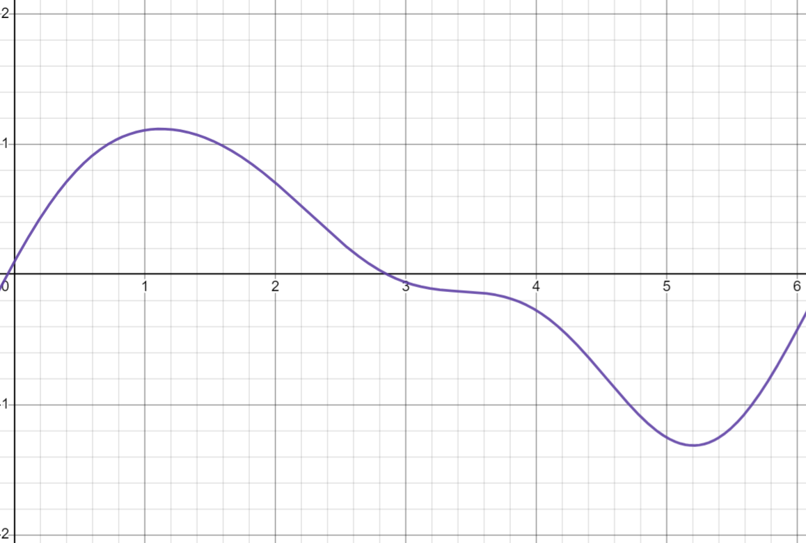
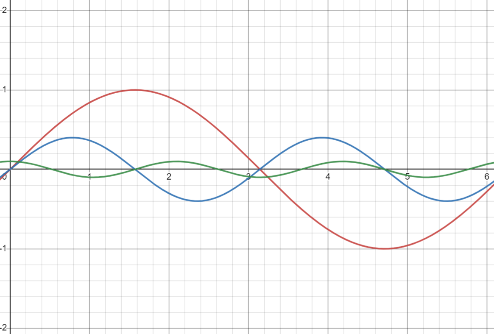
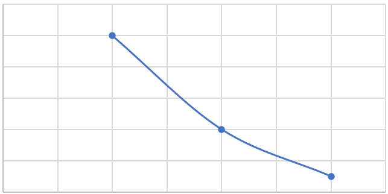

# Background

---

## Background

### What is The EMGFlow Package?

The EMGFlow package is a collection of functions that simplify the processing of EMG signals in Python. This includes preprocessing to detect outliers, visualizing signals, cleaning the raw data, and extracting features. EMGFlow provides a simple pipeline for each step needed to analyze EMG signals, while leaving it open enough to allow steps to be bypassed if not applicable to a use case.

### What Are EMG Signals?

EMG (Electromyography) signals represent the activity of a muscle. The most common approach to recording these signals is by taking readings through electrodes that are attached onto the skin, above the muscle of interest. These recordings represent the strength of the electric signal over time, sometimes with multiple columns for the measurements from the different electrodes (_Electromyography (EMG)_, 2023).

### What Does EMG Signal Processing Involve?

EMG signal processing involves extracting meaningful summaries from the raw signal data (i.e the wave of signal strength over time). EMG processing is a subset of signal processing, so any measure applicable to signals work on EMGs, but they may not be relevant or provide meaningful information. As an example, pitch can be a useful feature for audio signal feature extraction, but is not used in the sphere of EMG signals as it is a perceptual property of sound (Darji, 2017).

There are 3 different domains of EMG features that can be extracted:
- Time domain features involve looking at the strength of the signals over time. 
- Frequency domain features involve looking at the composition of the signal, breaking it down into the frequencies its made of, and looking at their strengths. 
- Time-frequency domain features involve looking at both the time-domain and frequency-domain to take measures. 

This package will look at time-domain and frequency-domain features (Chowdhury et al., 2013).

---

## Signals Processing

When a signal is recorded, it typically can't be used until it has been processed. Unlike other forms of data, the method of processing signals is more indirect. Signals have two important parts to them:
- Signal recording is the recorded signal: a recording of signal magnitude over time which forms a sort of wave.  
- Power Spectrum Density (PSD) is an interpretation of frequency by magnitude. The signal magnitude wave is interpreted as being formed by a combination of different frequency signals, and is deconstructed into individual frequencies. These frequencies are then recorded alongside their magnitude:

Combined signal:

Deconstructed signal:

Analysis of magnitudes: (x = frequency, y = magnitude of that frequency)

Filtering signals involves the application of filters to the frequencies of a signal which changes the appearance of the PSD that is not necessarily visible in the main signal. Consequently, operations can not be applied directly to the signal wave, but must use other methods to make meaningful changes.

---
## Key Definitions

**Signal**
In EMGFlow, a Signal is represented by a Pandas DataFrame. Signals are typically stored as a CSV file, and read in directly.
- Contains a `Time` column (in seconds) for time since start of recording
- Additional named columns are assumed to be Signal recordings that show Signal strength.
- Signal strength units don't matter - calculation results will be proportional to the units used, but it is better to use the same units for each column and file.
- The `Time` column is not used in calculations, and isn't needed as long as the sampling rate is known. Note that any column named "Time" will be assumed to be the `Time` column, and may be ignored.

**Sampling Rate**
The sampling rate (referred to as `sampling_rate` or `sr`) is the rate at which the data was recorded. This is easily found by taking the inverse of the rate at which `Time` column increases (in seconds).

**PSD**
A PSD is the Power Spectrum Density of a Signal. This is a different kind of DataFrame that applies a fourier transform to a Signal. That is, it interprets the Signal as the combination of different frequencies at different strengths, and shows the strength of each frequency in the Signal. This results in a DataFrame with a `Frequency` column for frequency (in Hz), and a `Power` column showing the normalized intensity of each frequency. In order to extract spectral features (features related to the distribution of frequencies that make up a Signal), the LTAS must be used (Long-Term Average Spectrum). The LTAS is similar to the PSD, but uses a rolling average with overlapping windows in its construction. While the PSD is not the same, in this instance the PSD is created using the same Welch method of creating the distribution that the LTAS uses itself (Elowsson & Friberg, 2017) using a function from SciPy. This function also cam be set to apply a Hanning window, which helps reduce noise introduced at the beginning and end of the signal (LDS Group, 2003).

---

## Sources

Chowdhury, R. H., Reaz, M. B. I., Ali, M. A. B. M., Bakar, A. A. A., Chellappan, K., & Chang, T. G. (2013). Surface Electromyography Signal Processing and Classification Techniques. _Sensors_, _13_(9), Article 9. [https://doi.org/10.3390/s130912431](https://doi.org/10.3390/s130912431)

Darji, M. (2017). Audio Signal Processing: A Review of Audio Signal Classification Features. _International Journal of Scientific Research in Computer Science, Engineering and Information Technology_, _2_(3), 227–230.

_Electromyography (EMG)_. (2023, April 24). John Hopkins Medicine. [https://www.hopkinsmedicine.org/health/treatment-tests-and-therapies/electromyography-emg](https://www.hopkinsmedicine.org/health/treatment-tests-and-therapies/electromyography-emg)

Elowsson, A., & Friberg, A. (2017). _Long-term Average Spectrum in Popular Music and its Relation to the Level of the Percussion_. 3. [https://www.researchgate.net/publication/317098414_Long-term_Average_Spectrum_in_Popular_Music_and_its_Relation_to_the_Level_of_the_Percussion](https://www.researchgate.net/publication/317098414_Long-term_Average_Spectrum_in_Popular_Music_and_its_Relation_to_the_Level_of_the_Percussion)

LDS Group. (2003). Understanding FFT Windows. _Application Note ANO14_. [https://www.egr.msu.edu/classes/me451/me451_labs/Fall_2013/Understanding_FFT_Windows.pdf](https://www.egr.msu.edu/classes/me451/me451_labs/Fall_2013/Understanding_FFT_Windows.pdf)

