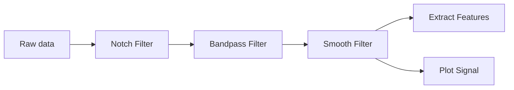

# Getting started with EMGFlow

## Download

EMGFlow can be installed from PyPI:

```bash
pip install EMGFlow
```

## Quick example

_EMGFlow_ extracts a comprehensive set of 32 statistical features from sEMG signals, achieved with only a few lines of code:

```python
import EMGFlow

# Load in-built data
path_names = EMGFlow.make_sample_data()

# Preprocess signals
EMGFlow.CleanSignals(path_names, sampling_rate = 2000)

# Plot data on the "EMG_zyg" column
EMGFlow.GenPlotDash(path_names, 'EMG_zyg', 'mV')

# Extract features and save results in "Features.csv" in feature_path
df = EMGFlow.ExtractFeatures(path_names, sampling_rate = 2000)
```

## Input data format

_EMGFlow_ accepts data in plaintext .CSV file format. Files should have the following format:

- Row 1 - Column headers
- Col 1 - Labelled Time, and contains the timestamps of sampled data
- Col 2:n - Assumed to be sEMG or related signal data.

| Time     | Data-1 | ... | Data-n |
| -------- | ------ | --- | ------ |
| 0        | 0      | ... |  -.04  |
| 0.1      | 0.32   | ... |   .9   |
| ...      | ...    | ... |   ...  |
| 20.0     | -1.2   | ... |   1.7  |

Note, the Time column can be omitted when the sample rate is known.

## EMGFlow Pipeline Processing Steps

