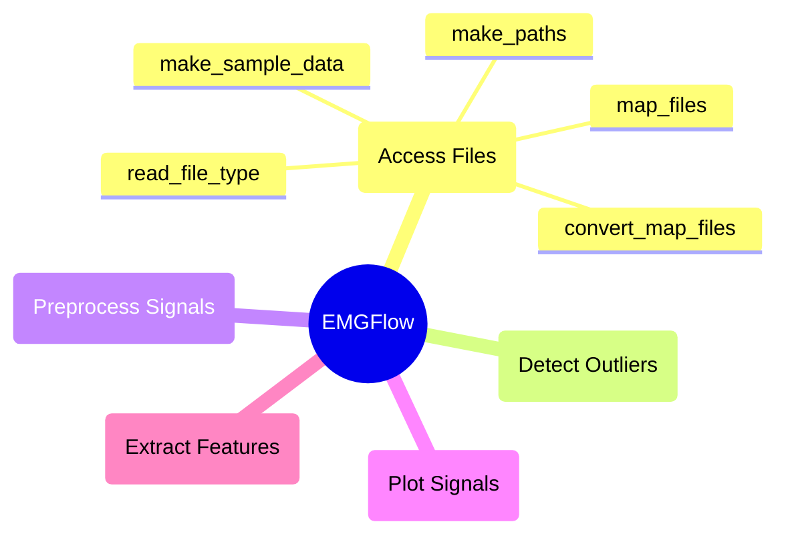

# `access_files` Module Documentation

These functions provide helper methods for accessing files, and are mostly used internally by the package.

## Module Structure



## `make_paths`

**Description**

`make_paths` generates a file structure for signal files, and returns a dictionary of the locations of these files.

"Raw", "Notch", "Bandpass", "Smooth" and "Feature" folders are created at a given location. By default, if no path is provided, these folders will be created inside a "Data" folder in the current working directory.

```python
make_paths(root=None)
```

**Parameters**

`root`: str (None)
- Root of the data to be generated. The default is None.

**Returns**

`make_paths`: dict-str
- A dictionary of file locations with keys for the stage in the processing pipeline.

**Example**

```python
# Create folders and get locations
pathNames = EMGFlow.make_paths()
```

## `make_sample_data`

**Description**

`make_sample_data` generates sample data in the "Raw" folder of a provided dictionary of file locations. Creates an "01" folder with "sample_data_01.csv", and an "02" folder with "sample_data_02.csv".

```python
make_sample_data(pathNames)
```

**Parameters**

`pathNames`: dict-str
- A dictionary of string file locations

**Error**

Raises an error if `pathNames` does not contain a `Raw` path key.

**Returns**

`make_sample_data`: None

**Example**

```python
# Create file paths, then create sample data
pathNames = EMGFlow.make_paths()
EMGFlow.make_sample_data(pathNames)
```

## `read_file_type`

**Description**

`read_file_type` is a safe wrapper for reading files of a given extension.

```python
read_file_type(path, fileExt)
```

**Parameters**

`path`: str
- String filepath of file to read.

`fileExt`: str
- String extension of the files to read.

**Error**

Raises an error if the file could not be read.

Raises an error if an unsupported file format was provided for `fileExt`.

**Returns**

`read_file_type`: pd.DataFrame
- Returns a Pandas dataframe of the file contents.

**Example**

```python
# Read a csv file
path = 'data/raw/file01.csv'
ext = 'csv'
df = EMGFlow.read_file_type(path, ext)
```


## `map_files`

**Description**

`map_files` generates a dictionary of file name and location keys/values from a folder and its subfolders.

```python
map_files(inPath, fileExt='csv', expression=None, base=None)
```

**Parameters**

`inPath`: str
- String filepath to a directory containing Signal files.

`fileExt`: str ("csv")
- String extension of the files to read. The default is `'csv'`.

`expression`: str (None)
- Optional regular expression. If provided, only maps files whose names match the regular expression matches.

`base`: str (None)
- Path of the root folder the path keys should start from. The default is None.

**Error**

Raises an error if `expression` is not None or a valid regular expression.

**Returns**

`map_files`: dict
- Returns a dictionary of file names and locations key/values.

**Example**

```python
# Map all csv files in 'dataFiles' folder and subfolders
fileLoc1 = EMGFlow.map_files('data')

# Map all csv files in 'dataFiles' folder and subfolders
# that start with 'DATA_'
fileLoc2 = EMGFlow.map_files('data', expression='^DATA_')
```


## `convert_map_files`

**Description**

A more advanced version of `map_files` that can coerce other data types into the `map_files` format.

If provided a dictionary (assumed to be a file location map), it will return it, filtered by `expression` if provided.

```python
convert_map_files(fileObj, fileExt='csv', experssion=None)
```

**Parameters**

`fileObj`: str, dict-str
- Any filepath data type supported by the function. Supported data types are: filepath string, or filepath dictionary.

`fileExt`: str ("csv")
- Extension of the files to read. The default is 'csv'.

`expression`: str (None)
- Optional regular expression. If provided, only maps files whose names match the regular expression matches.

**Error**

Raises an error if provided an unsupported file type for `fileObj` is provided.

Raises an error if `expression` is not None or a valid regular expression.

**Returns**

`convert_map_files`: dict-str
- Returns a dictionary of file names and locations keys/values.

**Example**

```python
# Read in file locations normally
fileLoc1 = EMGFlow.convert_map_files('/data')

# Filter an existing dataframe with a regular expression
fileLoc2 = EMGFlow.convert_map_files(fileLoc1, expression='^01')
```


## `map_files_fuse`

**Description**

Combines multiple dictionaries of mapped files (see `map_files`) into a Pandas dataframe.

Assumes that the files contained in the first dictionary are present in each of the following dictionaries.

```python
map_files_fuse(filedirs, names)
```

**Parameters**

`filedirs`:  list-dict-str
- List of dictionaries assumed to contain file maps.

`names`: list-str
- List of names to use for columns, same order as filedirs.

**Error**

Raises an error if files contained in the first element of `filedirs` are not contained in the other directories.

**Returns**

`map_files_fuse`: pd.DataFrame
- Returns a Pandas DataFrame containing each file, and their location for each directory.

**Example**

```python
# Create file directory dictionaries
dirRaw = EMGFlow.map_files('/data/raw')
notchPath = EMGFlow.map_files('/data/notch')
bandPath = EMGFlow.map_files('/data/bandpass')

# Create dictionary list and names
filedirs = [dirRaw, notchPath, bandPath]
names = ['Raw', 'Notch', 'Bandpass']

# Create data frame
dfDirs = EMGFlow.map_files_fuse(filedirs, names)
```