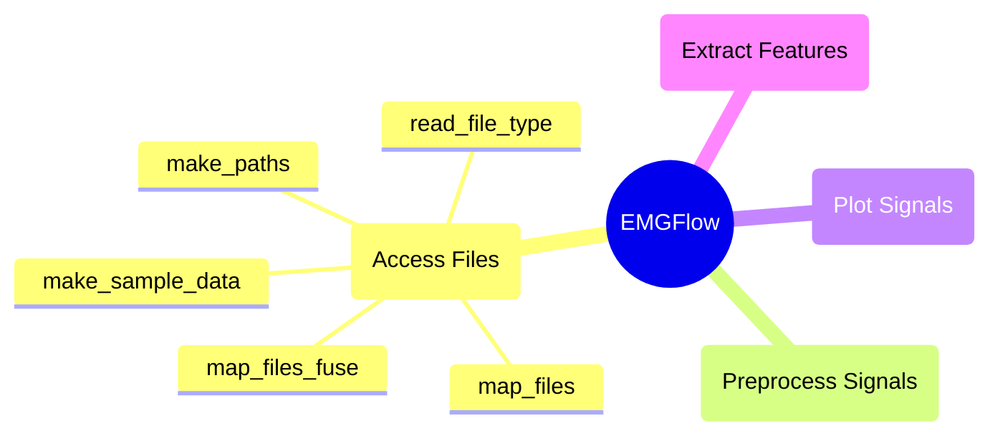

# `access_files` Module

These functions access files, set up file structures for working with sEMG signals, and load EMGFlow's built-in dataset. The functions are mostly used internally by the package.

## Module Structure




## `make_paths`

**Description**

Generates a file structure for signal files, and returns a dictionary of the locations for these files.

Creates '1_raw', '2_notch', '3_bandpass', '4_smooth', '5_filled' and '6_feature' subfolders at a given location. If no path is given, will create a 'Data' folder in the current working directory, with these subfolders inside.

The paths to these directories can be accessed with the corresponding keys: 'Raw', 'Notch', 'Bandpass', 'Smooth', 'Filled' and 'Feature'.

```python
make_paths(root=None)
```

**Parameters**

`root`: str, optional (None)
- Root of the data to be generated. The default is None.

**Returns**

`path_names`: dict-str
- A dictionary of file locations with keys for the stage in the processing pipeline.

**Example**

```python
# Create folders and get locations
path_names = EMGFlow.make_paths()
```


## `make_sample_data`

**Description**

Generates sample data in the '1_raw' folder of a provided dictionary of file locations.

Creates '01' and '02' folders, which each contain two sample data files ('01/sample_data_01.csv', '01/sample_data_02.csv', '02/sample_data_03.csv', '02/sample_data_04.csv')

The sample data will not be written if it already exists in the folder.

```python
make_sample_data(path_names)
```

**Parameters**

`path_names`: dict-str
- Dictionary of file locations.

**Raises**

An exception is raised if the provided `path_names` dictionary doesn't contain a 'Raw' path key.

An exception is raised if the sample data cannot be loaded.

**Returns**

None.

**Example**

```python
# Create file paths, then create sample data
path_names = EMGFlow.make_paths()
EMGFlow.make_sample_data(path_names)
```


## `read_file_type`

**Description**

Safe wrapper for reading files of a given extension.

Switches between different reading methods based on the instructions provided.
    
Supported formats that can be read are: 'csv'.

```python
read_file_type(path, file_ext)
```

**Parameters**

`path`: str
- Path of the file to read.

`file_ext`: str
- File extension to read.

**Raises**

An exception is raised if the file could not be read.

An exception is raised if an unsupported file format was provided for `file_ext`.

**Returns**

`file`: pd.DataFrame
- Returns a Pandas dataframe of the file contents.

**Example**

```python
# Read a csv file
path = '/Data/1_raw/01/sample_data_01.csv'
ext = 'csv'
df = EMGFlow.read_file_type(path, ext)
```


## `map_files`

**Description**

Generate a dictionary of file names and locations (keys/values) from the subfiles of a folder.

```python
map_files(in_path, file_ext='csv', expression=None, base=None)
```

**Parameters**

`in_path`: str
- The filepath to a directory to read signal files.

`file_ext`: str, optional ('csv')
- File extension for files to read. The default is 'csv'.

`expression`: str, optional (None)
- A regular expression. If provided, will only count files whose names match the regular expression. The default is None.

`base`: str, optional (None)
- Path of the root folder the path keys should start from. The default is None.

**Raises**

An exception is raised if `expression` is not None or a valid regular expression.

**Returns**

`file_dirs`: dict-str
- Returns a dictionary of file name keys and file path location values.

**Example**

```python
# Map all csv files in 'dataFiles' folder and subfolders
file_loc_1 = EMGFlow.map_files('data')

# Map all csv files in 'dataFiles' folder and subfolders
# that start with 'DATA_'
file_loc_2 = EMGFlow.map_files('data', expression='^DATA_')
```


## `map_files_fuse`

**Description**

Merge mapped file dictionaries into a single dataframe. Uses 'names' as the column names, and stores the file path to a file in different stages of the processing pipeline.

```python
map_files_fuse(file_dirs, names)
```

**Parameters**

`file_dirs`:  list-dict-str
- List of file location directories.

`names`: list-str
- List of names to use for file directory columns. Same order as `file_dirs`.

**Raises**

An exception is raised if a file contained in the first file directory is not found in the other file directories.

**Returns**

`path_df`: pd.DataFrame
- A dataframe of file names, and their locations in each file directory.

**Example**

```python
# Create file directory dictionaries
raw_path = EMGFlow.map_files('/Data/Raw')
notch_path = EMGFlow.map_files('/Data/Notch')
band_path = EMGFlow.map_files('/Data/Bandpass')

# Create dictionary list and names
file_dirs = [raw_path, notch_path, band_path]
names = ['Raw', 'Notch', 'Bandpass']

# Create data frame
dfDirs = EMGFlow.map_files_fuse(file_dirs, names)
```