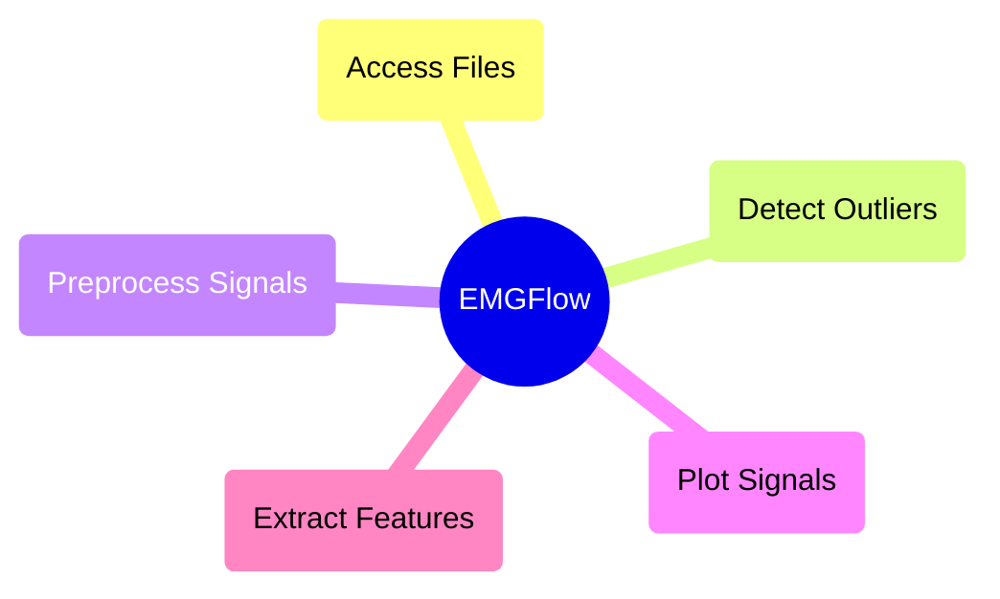

# API Overview

EMGFlow is broken into 5 modules: `access_files` for file IO, `detect_outliers` for detecting outliers, `preprocess_signals` for preprocessing signals, `plot_signals` generating visualizations, and `extract_features` feature extraction.

## File Format

The EMGFlow Python package works with CSV files, but is planned to expand to other file formats in the future. To prepare your data to be compatible with EMGFlow, it needs to be a CSV file with, ideally, a "Time" column, and additional columns for the signals you have recorded. "Time" should contain the time since the beginning of the recording, and the additional columns will have the recording of the signals at that time. Additionally, the file should have a constant sampling rate (time difference between each sequential row).

## Modules

### Module Structure

### `access_files` Module

These functions provide helper methods for accessing files, as well as functions for creating an EMG workflow filestructure.

`make_paths` is the beginning of the EMG processing pipeline. It generates folders for storing EMG data, and returns a dictionary with the locations of these folders. These locations are accessed under the keys "Raw", "Notch", "Bandpass", "Smooth" and "Feature" - each for a different stage of processing. This dictionary is passed to many of the processing functions. If you have your own file structure you want to use instead, you can create your own dictionary to use instead, manually setting the locations of the paths under these keys.

`make_sample_data` provides built-in data to test out a data processing pipeline. It writes EMG data files to the "Raw" directory of a provided dictionary.

`map_files` is widely used internally to the EMGFlow package. It takes a path to a folder, and generates a dictionary of paths to the files contained within based on their names. This makes it easier to loop over subfiles, reading and analyzing them.

This function forms the basis for the two modes of analysis offered by EMGFlow: automated or manual.

The "automated" mode is designed for bulk processing files. In these functions, input/output is handled using your filepath dictionary. The functions loop over the files in the input folder, apply the filters, and write the filtered files to the output folder. Notable functions for this workflow includes:
- `notch_filter_signals`
- `bandpass_filter_signals`
- `smooth_filter_signals`

The "manual" mode is designed for processing individual files. In these functions, input/output is handled by passing and recieving a dataframe. Notable functions include:
- `apply_notch_filters`
- `apply_bandpass_filter`
- `apply_rms_smooth`

For more information, see the documentation for the [access_files module](./access-files.md).

### `handle_outliers` Module

It can be useful to look for outliers in EMG data to identify which filters need to be applied. While filter parameters can typically be determined by looking at a signal, in a large dataset it can be tiresome to look through every file.

The `detect_spectral_outliers` function helps by using a frequency-domain anomaly detection algorithm. This helps identify which files may need additional processing, as well as determine if there is a pattern to which files contain outliers.

For more information, see the documentation for the [handle_outliers module](./handle-outliers.md).

### `preprocess_signals` Module

This module contains the functions used for preprocessing and cleaning sEMG signals before extracting features. The preprocessing stage is broken into 3 parts: notch filtering, bandpass filtering, and smoothing.

#### `notch_filter_signals`

Notch filtering involves filtering specific frequencies. This is typically due to some sort of interference, such as the power source of the device taking the reading.

`notch_filter_signals` provides flexibility for use in different regions of the world. Some filtering packages only provide notch filtering for 60Hz, the frequency where power can interfere with signal readings. However, other regions use different frequencies for power, such as 50Hz. EMGFlow allows you to choose the frequency and strength of the filter in a simple wrapper.

For more information, see the documentation for the [preprocess_signals module](./preprocess-signals.md).

#### `bandpass_filter_signals`

Bandpass filtering involves filtering frequencies outside a specific range. This is because sEMG signals only produce frequencies in a specific range, so any other recorded frequencies can be assumed to be interference.

`bandpass_filter_signals` uses bandpass thresholds of outside 20Hz and 450Hz, as this is the standard for EMG signals (De Luca et al., 2010). However, there is some disagreement within literature for different muscles, so `bandpass_filter_signals` provides the option to change these thresholds.

For more information, see the documentation for the [preprocess_signals module](./preprocess-signals.md).

#### `smooth_filter_signals`

Smoothing involves limiting the impacts of noise and outliers in the signal by applying a smoothing algorithm.

`smooth_filter_signals` uses the RMS smoothing slgorithm by default as it is the best choice for filtering EMG signals (RENSHAW et al., 2010), however, EMGFlow provides other options as well.

For more information, see the documentation for the [preprocess_signals module](./preprocess-signals.md).

### `plot_signals` Module

This module contains the functions used for visualizing individual, or large batches of signal data. This helps to see what is going on in the signal files whether to produce graphics, to make comparisons between files, or to look for outliers.

The `plot_dashboard` function uses an R Shiny Dashboard to dynamically load signal files. This makes it easy to compare different stages of processing, and jump between files.

The `plot_spectrum` function generates image files of power spectral density graphs for signals.

For more information, see the documentation for the [plot_signals module](./plot-signals.md).

### `extract_features` Module

This module contains the functions used for extracting features from signal data. This is primarily done with the `extract_features` function, though each individual feature is available as its own independent function for use in your own workflow.

The `extract_features` function writes the feature data to a "features.csv" file, with a column for the name of the signal file, and additional columns for each feature extracted. This is the end of the EMGFlow pipeline, producing this final file.

For more information, see the documentation for the [extract_features module](./extract-features.md).

## Sources

De Luca, C., Gilmore, L., Kuznetsov, M., & Roy, S. (2010). Filtering the surface EMG signal: Movement artifact and baseline noise contamination. _Journal of Biomechanics_, _43_, 1.

RENSHAW, D., BICE, M. R., CASSIDY, C., ELDRIDGE, J. A., & POWELL, D. W. (2010). A Comparison of Three Computer-based Methods Used to Determine EMG Signal Amplitude. _International Journal of Exercise Science_, _3_(1), 43–48.