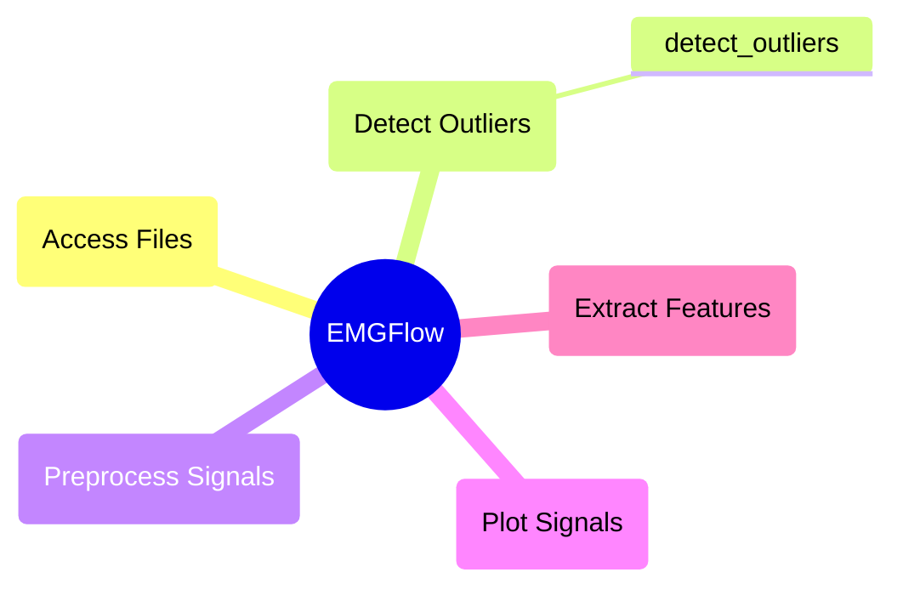

# `detect_outliers` Module Documentation

This module provides methods to help detect signal files that contain outliers. This helps for workflows involving batch processing of files, where it might be harder to determine if there are any patterns, or specific files that need additional filters applied.

## Module Structure



## `detect_outliers`

**Description:**

Analyzes signal files and returns a dictionary of file names and locations that are flagged as having outliers in their spectral composition. This can indicate the need for additional filters to be applied.

The function works by interpolating an inverse function from the peaks of the signal's spectrum. The function then calculates the metric average of the differences between the predicted spectrum intensity of the inverse function, and the actual spectrum intensity of the peaks. Finally, if the largest difference between the predicted and actual values is greater than the metric average multiplied by the threshold value, the file is flagged for having an outlier and is added to the dictionary.

```python
detect_outliers(inPath, samplingRate, threshold, cols=None, low=None, high=None, metirc=np.median, expression=None, windowSize=200, fileExt='csv')
```

**Parameters:**

`inPath`: str
- String filepath to a directory containing Signal files.

`samplingRate`: int/float
- Numerical value of the sampling rate of the `Signal`. This is the number of entries recorded per second, or the inverse of the difference in time between entries.

`threshold`: int/float
- Number of times greater than the metric calculated for the file to be considered an outlier

`cols`: str (None)
- List of string column names. If provided, will only search for outliers in the specified columns. If left `None`, will search for outliers in each column except for the `'Time'` column.

`low`: int/float (None)
- Minimum frequency range to search for outliers in. If left None, no lower limit is placed.

`high`: int/float (None)
- Maximum frequency range to search for outliers in. If left None, no upper limit is placed.

`metric`: int/float (np.median)
- Aggregation metric used to calculate outliers. Can be any function that takes a list of numeric values, and returns a single value. Recommended functions are: `np.median` and `np.mean`.

`expression`: str (None)
- String regular expression. If provided, will only search for outliers in `Signal` files whose names match the regular expression, and will ignore everything else.

`windowSize`: int (200)
- Window size when filtering for local maxima.

`fileExt`: str ("csv")
- String extension of the files to read. Any file in `inPath` with this extension will be considered to be a `Signal` file, and treated as such. The default is `'csv'`.

**Returns:**

`detect_outliers`: dict
- Returns a dictionary of file names and locations keys/values.

**Error**

Raises an error if `samplingRate` is less or equal to 0.

Raises an error if `threshold` is less or equal to 0.

Raises an error is `low` is greater than `high`.

Raises an error if `low` or `high` are negative.

Raises an error if `metric` is not a valid summary function.

Raises an error if a column in `cols` is not in a data file.

Raises an error if a file cannot be read in `inPath`.

Raises an error if an unsupported file format was provided for `fileExt`.

Raises an error if `expression` is not None or a valid regular expression

**Example:**

```python
pathNames = EMGFlow.make_paths()
sr = 2000
threshold = 5

outliers = EMGFlow.detect_outliers(pathNames['Notch'], sr, threshold)
```