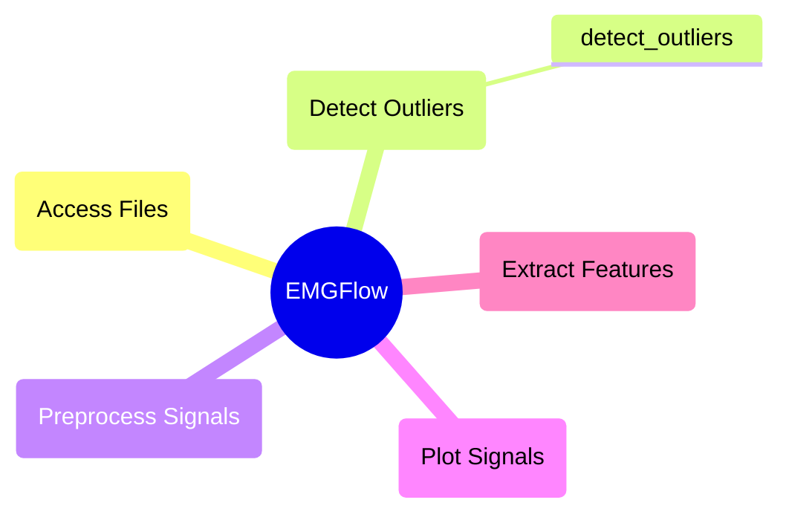

# `detect_outliers` Module

These functions help detect signal files that contain outliers. This helps for workflows involving batch processing of files, where it might be harder to determine if there are any patterns, or specific files that need additional filters applied.

## Module Structure



## `detect_outliers`

**Description:**

Analyzes signal files and returns a dictionary of file names and locations that are flagged as having outliers in their spectral composition. This can indicate the need for additional filters to be applied.

Works by interpolating an inverse function from the peaks of the signal's spectrum. The function then calculates the 'metric' aggregate of the differences between the predicted spectrum intensity of the inverse function, and the actual spectrum intensity of the peaks. Finally, if the largest difference between the predicted and actual values is greater than the metric average multiplied by the threshold value, the file is flagged for having an outlier and is added to the dictionary.

```python
detect_outliers(in_path, sampling_rate, threshold, cols=None, low=None, high=None, metirc=np.median, expression=None, window_size=200, file_ext='csv')
```

**Parameters:**

`in_path`: str
- Filepath to a directory to read signal files.

`sampling_rate`: int, float
- Sampling rate of the signal. This is the number of entries recorded per second, or the inverse of the difference in time between entries.

`threshold`: int, float
- Number of times greater than the metric calculated a recorded value has to be for the file to be considered an outlier.

`cols`: list-str, optional (None)
- List of columns of the signal to search for outliers in. The default is None, in which case outliers are searched for in every column except for 'time'.

`low`: int, float, optional (None)
- Lower frequency limit of where to search for outliers. Should be the same as lower limit for bandpass filtering, or some value that eliminates the irrelevant lower frequency ranges. The default is None, in which case no lower threshold is used.

`high`: int, float, optional (None)
- Upper frequency limit of where to search for outliers. Should be the same as upper limit for bandpass filtering, or some value that eliminates the irrelevant upper frequency ranges. The default is None, in which case no upper threshold is used.

`metric`: function, optional (np.median)
- Aggregation metric used to calculate outliers. Can be any function that takes a list of numeric values, and returns a single value. Recommended functions are: `np.median` and `np.mean`. The default is `np.median`.

`expression`: str, optional (None)
- A regular expression. If provided, will only search for outliers in files whose names match the regular expression. The default is None.

`window_size`: int, optional (200)
- The window size to use when filtering for local maxima. The default is 200.

`file_ext`: str, optional ("csv")
- File extension for files to read. Only reads files with this extension. The default is 'csv'.

**Raises**

A warning is raised if `window_size` is greater than half the size of a file read by the function.

An exception is raised if `window_size` is not an integer greater than 0.

An exception is raised if `sampling_rate` is less or equal to 0.

An exception is raised if `threshold` is less or equal to 0.

An exception is raised if `low` is greater than `high`.

An exception is raised if `low` or `high` are negative.

An exception is raised if `metric` is not a valid summary function.

An exception is raised if a column in `cols` is not in a data file.

An exception is raised if a file cannot not be read in `in_path`.

An exception is raised if an unsupported file format was provided for `file_ext`.

An exception is raised if `expression` is not None or a valid regular expression.

**Returns:**

`outliers`: dict
- Dictionary of file names/locations as keys/values for each file detected that contains an outlier.

**Example:**

```python
path_names = EMGFlow.make_paths()
sr = 2000
threshold = 5

outliers = EMGFlow.detect_outliers(path_names['Notch'], sr, threshold)
```