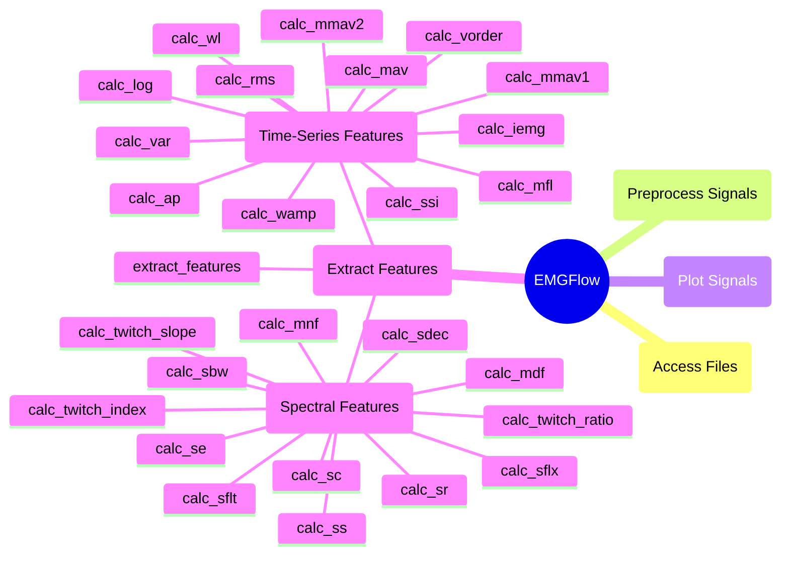

# `extract_features` Module

These functions extract features from the sEMG signal, capturing information in both time and frequency domains. The main function to do this is `extract_features`. Within this call, individual features are calculated by their own functions, allowing them to be incorporated into your own workflow.

## Module Structure




## Extract Features

The `extract_features` function is the main function of the `extract_features` module. It applies all the feature extraction functions available in this module to signal dataframe files, and generates a comprehensive 'Features.csv' file.

Each extracted feature is available as its own function for easy use.

### `extract_features`

**Description**

Extracts features from signals by running a series of feature extraction functions and saving the outputs to a feature file.

The input and output locations are controlled by the `path_names` dictionary. The input data is taken from the 'Smooth' and 'Bandpass' paths. The 'Smooth' step is optional, if it was not used, data is searched for in the following order: 'Smooth' -> 'Filled' -> 'FWR'.

All files within these folders and subfolders are assumed to be valid data if they match the provided file extension, and the optional regular expression. Files of the same name should exist in both the 'Smooth'/'Filled'/'FWR' and 'Bandpass' folders, being the same file at different stages in processing pipeline.

The 'Smooth'/'Filled'/'FWR' path is used to calculate time-series features, while the 'Bandpass' path is used to calculate spectral features.

Columns of these files that begin with 'mask\_' are assumed to be NaN mask columns, and are ignored unless specified in `column_names`.

The output is written as a 'Features.csv' file to the 'Feature' path.

```python
def extract_features(path_names:dict, column_names=None, sampling_rate:float=1000.0, expression:str=None, file_ext:str='csv', short_name:bool=True)
```

**Theory**

This function requires a path to smoothed and unsmoothed data. This is because while time-series features are extracted from smoothed data, spectral features are not. High-frequency components of the signal can be lost in the smoothing, and we want to ensure the spectral features are as accurate as possible.

**Parameters**

`path_names` : dict-str
- A dictionary of file locations with keys for stage in the processing pipeline. Required paths are: 'Bandpass', 'FWR', and 'Feature'. The dictionary can be created with the `make_paths` function.

`column_names` : list-str, optional (None)
- List of columns to analyze in each file. The default is None, in which case all columns except for 'Time' and columns whose names begin with 'mask_' will be analyzed. All files should have at least these columns in common. If None is used, all files will be assumed to have the same columns as the first file read.

`sampling_rate` : float, optional (1000.0)
- The sampling rate for all signal data being read. The default is 1000.0.

`expression` : str, optional (None)
- A regular expression. If provided, will only analyze files whose local paths inside of `path_names` match the regular expression. The default is None.

`file_ext` : str, optional ('csv')
- The file extension for files to read. Only extracts features in files with this extension. The default is 'csv'.

`short_name` : bool, optional (True)
- An option to shorten the key names of feature results. If True, makes the key column of the feature files the relative path of the file. If False, uses the full system path. The default is True.

**Raises**

A warning is raised if `expression` does not match with any files in the folders provided.

An exception is raised if 'Bandpass', 'FWR' or 'Feature' are not keys of the `path_names` dictionary provided.

An exception is raised if the 'Bandpass' and 'Smooth'/'Filled'/'FWR' filepaths do not contain the same files.

An exception is raised if a file cannot not be read in the 'Bandpass' or 'Smooth'/'Filled'/'FWR' filepaths.

An exception is raised if a file does not contain one of the columns from `column_names`.

An exception is raised if an unsupported file format was provided for `file_ext`.

An exception is raised if `expression` is not None or a valid regular expression.

**Returns**

`Features`: pd.DataFrame
- A Pandas dataframe of feature data for each file read. Each row is a different file analyzed, marked by the 'File\_ID' column. Additional columns show the values of the features extracted by the function.

**Example**

```python
path_names = EMGFlow.make_paths()
EMGFlow.make_sample_data(path_names)

column_names = ['EMG_zyg', 'EMG_cor']
sampling_rate = 2000

# Extracts all features from the files in the 'Bandpass' path and the 'Filled'
# path. If the 'Filled' path was empty, it would use 'Smooth' instead. Assumes
# the same files are in both paths.
features = EMGFlow.extract_features(path_names, column_names, sampling_rate)
```


## Time-Series Features

### Basic Time-Series Statistics

The `extract_features` function calculates some basic statistics that don't involve their own functions. This includes:
- Minimum voltage (using `np.min`)
- Maximum voltage (using `np.max`)
- Mean voltage (using `np.mean`)
- Standard deviation of voltage (using `np.std`)
- Skew of voltage (using `scipy.stats.skew`)
- Kurtosis of voltage (using `scipy.stats.kurtosis`)
- Maximum frequency (using `np.max`)

Skew and kurtosis are less common, and have a more detailed explanation below.

#### Kurtosis

Kurtosis describes the amount of data in the tails of a bell curve of a distribution.

Kurtosis is calculated as follows:
$$
k=\frac{1}{N}\sum_{i=1}^N\left(\frac{x_i-\mu}{\sigma}\right)^4
$$
- $\mu$ <-- Mean
- $\sigma$ <-- Standard deviation
- $N$ <-- Number of data points

**Kurtosis** is calculated with `scipy.stats.kurtosis`.

#### Skew

Skewness describes the symmetry of a dataset, considered more skewed the less symmetrical the left and right distributions of the median are.

Skew is calculated as follows:
$$s=\frac{\frac{\mu-M_o}{\sigma}}{\frac{3(\mu-M_d)}{\sigma}}$$
- $\mu$ <-- Mean
- $\sigma$ <-- Standard deviation
- $M_o$ <-- Mode
- $M_d$ <-- Median

**Skew** is calculated with `scipy.stats.skew`.


### `calc_ap`

**Description**

Calculate the Average Power (AP) from a column of `Signal`. Ignores NaNs.

The AP measures the energy distribution of the signal.

```python
def calc_ap(Signal:pd.DataFrame, column_name:str)
```

**Theory**

The AP is calculated as follows:
$$
\text{AP}=\frac{1}{N}\sum_{i=1}^Nx_i^2
$$
- $N$ <-- Number of data points

(Too et al., 2019)

**Parameters**

`Signal` : pd.DataFrame 
- A Pandas dataframe containing a 'Time' column, and additional columns for signal data.

`column_name` : str
- The column of `Signal` the feature is calculated from.

**Raises**

An exception is raised if `column_name` is not a column of `Signal`.

**Returns**

`AP` : float
- The calculated AP.

**Example**

```python
# Calculate the AP of Signal, for column 'EMG_zyg'
AP = EMGFlow.calc_ap(Signal, 'EMG_zyg')
```


### `calc_iemg`

**Description**

Calculate the Integreated EMG (IEMG) from a column of `Signal`. Ignores NaNs.

The IEMG measures the area under the curve of the signal, which can provide useful information about muscle activity. In an EMG signal, the IEMG describes when the muscle begins contracting, and is related to the signal sequence firing point (Phinyomark et al., 2009).

```python
def calc_iemg(Signal:pd.DataFrame, column_name:str, sampling_rate:float)
```

**Theory**

In the reference, the IEMG does not account for the sampling rate. Two signal recordings with the same shape but different sampling rate would have different results since we are integrating with respect to time. As such, the calculation made here will include multiplying by sampling rate.

The IEMG is calculated as follows:
$$
\text{IEMG}=s_r\sum_{i=1}^N|x_i|
$$
- $s_r$ <-- Sampling rate
- $N$ <-- Number of data points

(Spiewak et al., 2018)

**Parameters**

`Signal` : pd.DataFrame 
- A Pandas dataframe containing a 'Time' column, and additional columns for signal data.

`column_name` : str
- The column of `Signal` the feature is calculated from.

`sampling_rate` : int/float
- The sampling rate of `Signal`.

**Raises**

An exception is raised if `column_name` is not a column of `Signal`.

An exception is raised if `sampling_rate` is less than or equal to 0.

**Returns**

`IEMG`: float
- The calculated IEMG.

**Example**

```python
# Calculate the IEMG of Signal, for column 'EMG_zyg'
IEMG = EMGFlow.calc_iemg(Signal, 'EMG_zyg', 2000)
```


### `calc_log`

**Description**

Calculate the Log Detector (LOG) from a column of `Signal`. Ignores NaNs.

The LOG provides an estimate of the force exerted by the muscle.

```python
def calc_log(Signal:pd.DataFrame, column_name:str)
```

**Theory**

The LOG is calculated as follows:
$$
\text{LOG}=e^{\frac{1}{N}\sum_{i=1}^N\log(|x_k|)}
$$
- $N$ <-- Number of data points

(Tkach et al., 2010)

**Parameters**

`Signal` : pd.DataFrame 
- A Pandas dataframe containing a 'Time' column, and additional columns for signal data.

`column_name` : str
- The column of `Signal` the feature is calculated from.

**Raises**

An exception is raised if `column_name` is not a column of `Signal`.

**Returns**

`LOG` : float
- The calculated LOG.

**Example**

```python
# Calculate the LOG of Signal, for column 'EMG_zyg'
LOG = EMGFlow.calc_log(Signal, 'EMG_zyg')
```


### `calc_mav`

**Description**

Calculate the Mean Absolute Value (MAV) from a column of `Signal`. Ignores NaNs.
    
In an EMG signal, the MAV describes the muscle contraction level (Phinyomark et al., 2009).

```python
def calc_mav(Signal:pd.DataFrame, column_name:str)
```

**Theory**

The MAV is calculated as follows:
$$
\text{MAV}=\frac{1}{N}\sum_{i=1}^N|x_i|
$$
- $N$ <-- Number of data points

(Tkach et al., 2010)

**Parameters**

`Signal` : pd.DataFrame 
- A Pandas dataframe containing a 'Time' column, and additional columns for signal data.

`column_name` : str
- The column of `Signal` the feature is calculated from.

**Raises**

An exception is raised if `column_name` is not a column of `Signal`.

**Returns**

`MAV` : float
- The calculated MAV.

**Example**

```python
# Calculate the MAV of Signal, for column 'EMG_zyg'
MAV = EMGFlow.calc_mav(Signal, 'EMG_zyg', 2000)
```


### `calc_mfl`

**Description**

Calculate the Maximum Fractal Length (MFL) from a column of `Signal`. Ignores NaNs.
    
The MFL measures the activation of low-level muscle contractions.

```python
def calc_mfl(Signal:pd.DataFrame, column_name:str)
```

**Theory**

The MFL is calculated as follows:
$$
\text{MFL}=\log\left(\sqrt{\sum_{i=1}^{N-1}(x_{i+1}-x_i)^2}\right)
$$
- $N$ <-- Number of data points

(Too et al., 2019)

**Parameters**

`Signal` : pd.DataFrame 
- A Pandas dataframe containing a 'Time' column, and additional columns for signal data.

`column_name` : str
- The column of `Signal` the feature is calculated from.

**Raises**

An exception is raised if `column_name` is not a column of `Signal`.

**Returns**

`MFL` : float
- The calculated MFL.

**Example**

```python
# Calculate the MFL of Signal, for column 'EMG_zyg'
MFL = EMGFlow.calc_mfl(Signal, 'EMG_zyg')
```


### `calc_mmav1`

**Description**

Calculate the Modified Mean Absolute Value 1 (MMAV1) from a column of `Signal`. Ignores NaNs.

The MMAV1 is an alteration of MAV that gives more weight to values in the middle of the signal to reduce error from the beginning and end of the signal.

```python
def calc_mmav1(Signal:pd.DataFrame, column_name:str)
```

**Theory**

The MMAV1 is identical to MAV, except it introduces a weight to the calculation. Values are given a weight of 1 when they are between the 25th and 75th percentile, and 0.5 outside.

The MMAV1 is calculated as follows:
$$
\text{MMAV1}=\frac{1}{N}\sum_{i=1}^N|x_iw_i|
$$
$$
w_i=\left\{ \begin{matrix} 1 & \text{if }0.25N\le i\le 0.75N \\ 0.5 & \text{otherwise} \end{matrix} \right\}
$$
- $N$ <-- Number of data points

(Chowdhury et al., 2013)

**Parameters**

`Signal` : pd.DataFrame 
- A Pandas dataframe containing a 'Time' column, and additional columns for signal data.

`column_name` : str
- The column of `Signal` the feature is calculated from.

**Raises**

An exception is raised if `column_name` is not a column of `Signal`.

**Returns**

`MMAV1` : float
- The calculated MMAV1.

**Example**

```python
# Calculate the MMAV1 of Signal, for column 'EMG_zyg'
MMAV1 = EMGFlow.calc_mmav1(Signal, 'EMG_zyg', 2000)
```


### `calc_mmav2`

**Description**

Calculate the Modified Mean Absolute Value 2 (MMAV2) from a column of `Signal`. Ignores NaNs.

The MMAV2 is an alteration of MAV that gives more weight to values in the middle of the signal to reduce error from the beginning and end of the signal.

```python
def calc_mmav2(Signal:pd.DataFrame, column_name:str)
```

**Theory**

The MMAV2 is identical to MAV, except it introduces a weight to the calculation. Values are given a weight of 1 when they are between the 25th and 75th percentile, a weight of $\frac{4i}{N}$ when below the 25th percentile, and a weight of $\frac{4(i-N)}{N}$ when above the 75th percentile. This makes the weight smoothly increase and decrease approaching the center of the signal, as opposed to MMAV1 which instantly jumps from a weight of 0.5 to 1.

The MMAV2 is calculated as follows:
$$
\text{MMAV2}=\frac{1}{N}\sum_{i=1}^N|x_iw_i|
$$
$$
w_i=\left\{ \begin{matrix} 1 & \text{if }0.25N\le i\le 0.75N \\ \frac{4i}{N} & \text{if } i<0.25N  \\ \frac{4(i-N)}{4} & \text{if } i>0.75N \end{matrix} \right\}
$$
- $N$ <-- Number of data points

(Hamedi et al., 2014)

**Parameters**

`Signal` : pd.DataFrame 
- A Pandas dataframe containing a 'Time' column, and additional columns for signal data.

`column_name` : str
- The column of `Signal` the feature is calculated from.

**Raises**

An exception is raised if `column_name` is not a column of `Signal`.

**Returns**

`MMAV2` : float
- The calculated MMAV2.

**Example**

```python
# Calculate the MMAV2 of Signal, for column 'EMG_zyg'
MMAV2 = EMGFlow.calc_mmav2(Signal, 'EMG_zyg', 2000)
```


### `calc_rms`

**Description**

Calculate the Root Mean Square (RMS) from a column of `Signal`. Ignores NaNs.

In an EMG signal, the RMS provides information about the constant force, and non-fatiguing contractions of the muscles (Phinyomark et al., 2009).

```python
def calc_rms(Signal:pd.DataFrame, column_name:str)
```

**Theory**

The RMS is calculated as follows:
$$
\text{RMS}=\sqrt{\frac{1}{N}\sum_{i=1}^N|x_i|^2}
$$
- $N$ <-- Number of data points

(Spiewak et al., 2018)

**Parameters**

`Signal` : pd.DataFrame 
- A Pandas dataframe containing a 'Time' column, and additional columns for signal data.

`column_name` : str
- The column of `Signal` the feature is calculated from.

**Raises**

An exception is raised if `column_name` is not a column of `Signal`.

**Returns**

`RMS` : float
- The calculated RMS.

**Example**

```python
# Calculate the RMS of Signal, for column 'EMG_zyg'
RMS = EMGFlow.calc_rms(Signal, 'EMG_zyg')
```


### `calc_ssi`

**Description**

Calculate the Simple Square Integral (SSI) from a column of `Signal`. Ignores NaNs.

In an EMG signal, the SSI describes the energy of the signal (Phinyomark et al., 2009).

```python
def calc_ssi(Signal:pd.DataFrame, column_name:str, sampling_rate:float=1000.0)
```

**Theory**

In the reference, the SSI does not account for the sampling rate. Two signal recordings with the same shape but different sampling rate would have different results since we are integrating with respect to time. As such, the calculation made here will include multiplying by sampling rate.

The SSI is calculated as follows:
$$
\text{SSI}=s_r^2\sum_{i=1}^N|x_i|^2
$$
- $s_r$ <-- Sampling rate
- $N$ <-- Number of data points

(Spiewak et al., 2018)

**Parameters**

`Signal` : pd.DataFrame 
- A Pandas dataframe containing a 'Time' column, and additional columns for signal data.

`column_name` : str
- The column of `Signal` the feature is calculated from.

`sampling_rate` : int/float, optional (1000.0)
- The sampling rate of the `Signal`. The default is 1000.0.

**Raises**

An exception is raised if `column_name` is not a column of `Signal`.

An exception is raised if `sampling_rate` is less than or equal to 0.

**Returns**

`SSI`: float
- The calculated SSI.

**Example**

```python
# Calculate the SSI of Signal, for column 'EMG_zyg'
SSI = EMGFlow.calc_ssi(Signal, 'EMG_zyg', 2000)
```


### `calc_var`

**Description**

Calculate the Variance (VAR) from a column of `Signal`. Ignores NaNs.

In an EMG signal, the VAR describes the power of the signal (Phinyomark et al., 2009).

```python
def calc_var(Signal:pd.DataFrame, column_name:str)
```

**Theory**

The VAR is calculated as follows:
$$
\text{VAR}=\frac{1}{N-1}\sum_{i=1}^Nx_i^2
$$

(Spiewak et al., 2018)

**Parameters**

`Signal` : pd.DataFrame 
- A Pandas dataframe containing a 'Time' column, and additional columns for signal data.

`column_name` : str
- The column of `Signal` the feature is calculated from.

**Raises**

An exception is raised if `column_name` is not a column of `Signal`.

**Returns**

`VAR` : float
- The calculated VAR.

**Example**

```python
# Calculate the VAR of Signal, for column 'EMG_zyg'
VAR = EMGFlow.calc_var(Signal, 'EMG_zyg')
```


### `calc_vorder`

**Description**

Calculate the V-Order from a column of `Signal`. Ignores NaNs.

The V-Order is an alteration of VAR that takes the square root of the result.

```python
def calc_vorder(Signal:pd.DataFrame, column_name:str)
```

**Theory**

The V-Order is calculated using the $v$-operator, essentially working like a Euclidean distance to the $v$th order. One study indicates that the best value for $v$ is 2, meaning the V-Order is just the square root of the VAR feature.

The V-Order is calculated as follows:
$$
\text{vORDER}=\sqrt{\text{VAR}}
$$

(Tkach et al., 2010)

**Parameters**

`Signal` : pd.DataFrame 
- A Pandas dataframe containing a 'Time' column, and additional columns for signal data.

`column_name` : str
- The column of `Signal` the feature is calculated from.

**Raises**

An exception is raised if `column_name` is not a column of `Signal`.

**Returns**

`VOrder` : float
- The calculated V-Order.

**Example**

```python
# Calculate the V-Order of Signal, for column 'EMG_zyg'
VOrder = EMGFlow.calc_vorder(Signal, 'EMG_zyg')
```


### `calc_wamp`

**Description**

Calculate the Willison Amplitude (WAMP) from a column of `Signal`. Ignores NaNs.

The WAMP measures the number of times an EMG amplitude exceeds a given threshold. In an EMG signal, the WAMP describes the firing of Motor Unit Action Potentials (MUAP), and muscle contraction level (Phinyomark et al., 2009).

```python
def calc_wamp(Signal:pd.DataFrame, column_name:str, threshold:float)
```

**Theory**

Thresholds for the WAMP are commonly chosen within the 50-100 mV range. The WAMP counts the number of recorded times in the signal that the charge is greater than the threshold, so it can be affected by the sampling rate. If datasets with different sampling rates are being compared, it may be beneficial to normalize each result by the length of the signal.

When choosing a value, pass it in terms of the same units being used in the data.

The WAMP is calculated as follows:
$$
\text{WAMP}=\sum_{i=1}^{N-1}f(|x_{i+1}-x_i|)
$$
$$
f(x)=\left\{\begin{matrix} 1 & \text{if }x>\epsilon \\ 0 & \text{otherwise} \end{matrix}\right\}
$$
- $N$ <-- Number of data points
- $\epsilon$ <-- Voltage change threshold

(Tkach et al., 2010)

**Parameters**

`Signal` : pd.DataFrame 
- A Pandas dataframe containing a 'Time' column, and additional columns for signal data.

`column_name` : str
- The column of `Signal` the feature is calculated from.

`threshold` : float
- Threshold of the WAMP.

**Raises**

An exception is raised if `column_name` is not a column of `Signal`.

**Returns**

`WAMP` : int
- The calculated WAMP.

**Example**

```python
# Calculate the WAMP of Signal, for column 'EMG_zyg'
WAMP = EMGFlow.calc_wamp(Signal, 'EMG_zyg', 55)
```


### `calc_wl`

**Description**

Calculate the Waveform Length (WL) from a column of `Signal`. Ignores NaNs.

The WL provides information about the amplitude, frequency, and duration of the signal.

```python
def calc_wl(Signal:pd.DataFrame, column_name:str)
```

**Theory**

The WL is calculated as follows:
$$
\text{WL}=\sum_{i=1}^{N-1}|x_{i+1}-x_i|
$$
- $N$ <-- Number of data points

(Spiewak et al., 2018)

**Parameters**

`Signal` : pd.DataFrame 
- A Pandas dataframe containing a 'Time' column, and additional columns for signal data.

`column_name` : str
- The column of `Signal` the feature is calculated from.

**Raises**

An exception is raised if `column_name` is not a column of `Signal`.

**Returns**

`WL` : float
- The calculated WL.

**Example**

```python
# Calculate the WL of Signal, for column 'EMG_zyg'
WL = EMGFlow.calc_wl(Signal, 'EMG_zyg')
```


## Spectral Features


### calc_mdf

**Description**

Calculate the Median Frequency (MDF) from `psd`. Ignores NaNs.

```python
def calc_mdf(psd:pd.DataFrame)
```

**Theory**

MDF is the frequency on the power spectrum that can divide it into two regions of equal total power.

Since it may not be possible to perfectly divide the spectrum into two regions of exactly equal power, this function finds the frequency that divides it the best.

**Parameters**

`psd` : pd.DataFrame
- A Pandas dataframe containing a 'Frequency' and 'Power' column. The 'Power' column should be normalized.

**Raises**

An exception is raised if `psd` does not have the columns 'Frequency' and 'Power'. The 'Power' column should be normalized.

**Returns**

`med_freq` : float
- The MDF of `psd`.

**Example**

```python
# Calculate the MDF of Signal, for column 'EMG_zyg'
psd = EMGFlow.emg_to_psd(Signal['EMG_zyg'], 2000)
MDF = EMGFlow.calc_mdf(psd)
```


### calc_mnf

**Description**

Calculate the Mean Frequency (MNF) from `psd`. Ignores NaNs.

```python
def calc_mnf(psd:pd.DataFrame)
```

**Theory**

MNF is the mean frequency on the power spectrum, weighted by the power of each frequency.

MNF is calculated as follows:

$$
\text{MNF}=\frac{\sum_i^N f_ip_i}{\sum_i^N p_i}
$$

(Phinyomark et al., 2009)

**Parameters**

`psd` : pd.DataFrame
- A Pandas dataframe containing a 'Frequency' and 'Power' column. The 'Power' column should be normalized. The 'Power' column should be normalized.

**Raises**

An exception is raised if `psd` does not have the columns 'Frequency' and 'Power'.

**Returns**

`mean_freq` : float
- The MNF of `psd`.

**Example**

```python
# Calculate the MNF of Signal, for column 'EMG_zyg'
psd = EMGFlow.emg_to_psd(Signal['EMG_zyg'], 2000)
MNF = EMGFlow.calc_mnf(psd)
```


### `calc_sbw`

**Description**

Calculate the Spectral Bandwidth (SBW) from `psd`. Ignores NaNs.

The SBW calculates the difference between the upper and lower freqencies in the frequency band.

```python
def calc_sbw(psd:pd.DataFrame, p:int=2)
```

**Theory**

SBW has a parameter $p$ that can be adjusted to different values. Using a value of 2 will result in the standard deviation around the centroid.

SBW is calculated as follows:
$$
\text{SBW}=\left( \sum X(m)\cdot (m-\text{SC})^p \right)^{\frac{1}{p}}
$$

(Tjoa, 2022)

**Parameters**

`psd` : pd.DataFrame
- A Pandas dataframe containing a 'Frequency' and 'Power' column. The 'Power' column should be normalized.

`p` : int, optional (2)
- Order of the SBW. The default is 2, which gives the standard deviation around the centroid.

**Raises**

An exception is raised if `p` is not greater than 0.

An exception is raised if `psd` does not have columns 'Frequency' and 'Power'.

**Returns**

`SBW` : float
- The SBW of `psd`.

**Example**

```python
# Calculate the SBW of Signal, for column 'EMG_zyg'
psd = EMGFlow.emg_to_psd(Signal['EMG_zyg'], 2000)
SBW = EMGFlow.calc_sbw(psd)
```


### `calc_sc`

**Description**

Calculate the Spectral Centroid (SC) from `psd`. Ignores NaNs.

The SC is the "center of mass" of a signal after a Fourier transform is applied.

```python
def calc_sc(psd:pd.DataFrame)
```

**Theory**

SC is calculated as follows:
$$
\text{SC}=\frac{\sum_{i=f_0}^{f_N}i\cdot p_i}{\sum_{i=f_0}^{f_N} p_i}
$$
- $p_i$ <-- Power of normalized PSD at frequency $i$
- $f_0$ <-- Minimum frequency of the PSD
- $f_N$ <-- Maximum frequency of the PSD

(Roldán Jiménez et al., 2019)

**Parameters**

`psd` : pd.DataFrame
- A Pandas dataframe containing a 'Frequency' and 'Power' column. The 'Power' column should be normalized. The 'Power' column should be normalized.

**Raises**

An exception is raised if `psd` does not have the columns 'Frequency' and 'Power'.

**Returns**

`SC` : float
- The SC of `psd`.

**Example**

```python
# Calculate the SC of Signal, for column 'EMG_zyg'
psd = (Signal['EMG_zyg'], 2000)
SC = EMGFlow.calc_sc(psd)
```


### `calc_sdec`

**Description**

Calculate the Spectral Decrease (SDec) from `psd`. Ignores NaNs.

SDec is the decrease of the slope of the spectrum with respect to frequency.

```python
def calc_sdec(psd)
```

**Theory**

SDec is calculated as follows:
$$
\text{SDec}=\frac{\sum_{m=1}^{N-1}\frac{1}{N}(|X(m)|-|X(0)|)}{\sum_{m=1}^{N-1}|X(m)|}
$$

(Nagineni et al., 2018)

**Parameters**

`psd` : pd.DataFrame
- A Pandas dataframe containing a 'Frequency' and 'Power' column. The 'Power' column should be normalized. The 'Power' column should be normalized.

**Raises**

An exception is raised if `psd` does not have columns 'Frequency' and 'Power'.

**Returns**

`SDec` : float
- The SDec of `psd`.

**Example**

```python
# Calculate the SDec of Signal, for column 'EMG_zyg'
psd = EMGFlow.emg_to_psd(Signal['EMG_zyg'], 2000)
SDec = EMGFlow.calc_sdec(psd)
```


### `calc_se`

**Description**

Calculate the Spectral Entropy (SE) from `psd`. Ignores NaNs.

SE is the Shannon entropy of the spectrum.

```python
def calc_se(psd:pd.DataFrame)
```

**Theory**

SE is calculated as follows:
$$
\text{SE}=-\sum_{i=1}^mp(dB_i)\log_2(p(dB_i))
$$

(Llanos et al., 2017)

**Parameters**

`psd` : pd.DataFrame
- A Pandas dataframe containing a 'Frequency' and 'Power' column. The 'Power' column should be normalized. The 'Power' column should be normalized.

**Raises**

An exception is raised if `psd` does not have columns 'Frequency' and 'Power'.

**Returns**

`SE` : float
- The SE of `psd`.

**Example**

```python
# Calculate the SE of Signal, for column 'EMG_zyg'
psd = EMGFlow.emg_to_psd(Signal['EMG_zyg'], 2000)
SEntropy = EMGFlow.calc_se(psd)
```


### `calc_sflt`

**Description**

Calculate the Spectral Flatness (SFlt) from `psd`. Ignores NaNs.

The SF measures noise in the magnitude spectrum.

```python
def calc_sflt(psd:pd.DataFrame)
```

**Theory**

SF is calculated as follows:
$$
\text{SF}=\frac{\prod_{i=0}^{N-1}|p_i|^{\frac{1}{N}}}{\frac{1}{N}\sum_{i=0}^{N-1}|p_i|}
$$
- $p_i$ <-- $i$th element of PSD strength
- $N$ <-- Number of elements in PSD

(Nagineni et al., 2018)

**Parameters**

`psd` : pd.DataFrame
- A Pandas dataframe containing a 'Frequency' and 'Power' column. The 'Power' column should be normalized. The 'Power' column should be normalized.

**Raises**

An exception is raised if `psd` does not have the columns 'Frequency' and 'Power'.

**Returns**

`SF` : float
- The SF of `psd`.

**Example**

```python
# Calculate the SF of Signal, for column 'EMG_zyg'
psd = EMGFlow.emg_to_psd(Signal['EMG_zyg'], 2000)
SC = EMGFlow.calc_sf(psd)
```


### `calc_sflx`

**Description**

Calculate the Spectral Flux (SFlx) from `Signal1` and `diff`. Ignores NaNs.

Spectral Flux measures the change in spectrums between two signals, or two sections of a signal.

`calc_sflx` behaves differently, depending on if `diff` is a Pandas dataframe or float. A dataframe treats `diff` as a second signal, and finds the spectral flux between it and `Signal1`. Providing a float $n$ will split `Signal1` into the first $n$\% of the dataframe, and the remaining $n-1$\% of the dataframe, finding the spectral flux between these two parts.

The call to `calc_spec_flux` within `extract_features` uses a default value of `diff=0.5`.

```python
def calc_sflx(Signal1:pd.DataFrame, diff, column_name:str, sampling_rate:float=1000.0, diff_sr:float=None)
```

**Theory**

Spectral Flux is used to compare the spectral compositions of two signals. This is complicated to implement, so there is no one function to handle this.

Spectral Flux is calculated as follows:
$$
\text{FL}_{i,i-1}=\sum_{k=1}^{Wf_L}(\text{EN}_i(k)-\text{EN}_{i-1}(k))^2
$$

(Giannakopoulos & Pikrakis, 2014)

**Parameters**

`Signal1` : pd.DataFrame
- A Pandas dataframe containing a 'Time' column, and additional columns for signal data.

`diff` : pd.DataFrame, float
- The divisor of the calculation. If a percentage is provided, it will calculate the spectral flux of `Signal1`, divided into two different parts (`diff` and 1-`diff`). If `diff` is instead a Pandas dataframe, it will claculate the spectral flux of `Signal1` and `diff`.

`column_name` : str
- The column of `Signal1` the feature is calculated from. If a second signal is provided for `diff`, it should have a column of the same name.

`sampling_rate` : int/float, optional (1000.0)
- The sampling rate of `Signal1`. The default is 1000.0.

`diff_sr` : int, float, optional (None)
- The sampling rate for `diff` if it is a dataframe. The default is None, in which case `diff` is assumed to have the same sampling rate as `Signal1`.

**Raises**

An exception is raised if `column_name` is not a column of `Signal1`.

An exception is raised if `sampling_rate` is less than or equal to 0.

An exception is raised if `diff` is a float, but isn't between 0 and 1.

An exception is raised if `diff` is a dataframe and does not contain `column_name`.

An exception is raised if `diff_sr` is less than or equal to 0.

An exception is raised if `diff` is an invalid data type.

**Returns**

`flux` : float
- The Spectral Flux of `Signal1` and `diff`.

**Example**

```python
# Calculate the Spectral Flux of two signals
flux1 = EMGFlow.calc_spec_flux(Signal1, Signal2, 'EMG_zyg', 2000)

# Calculate the Spectral Flux of one signal divided at the halfway point
flux2 = EMGFlow.calc_spec_flux(Signal1, 0.5, 'EMG_zyg', 2000)
```


### `calc_sr`

**Description**

Calculate the Spectral Rolloff (SR) from `psd`. Ignores NaNs.

The spectral rolloff point is the frequency of the PSD where 85% of the total spectral energy lies below it.

```python
calc_sr(psd:pd.DataFrame, percent:float=0.85)
```

**Theory**

The actual threshold for SR can be set manually, but literature suggests that 85% is the best point.

(Tjoa, 2022)

**Parameters**

`psd` : pd.DataFrame
- A Pandas dataframe containing a 'Frequency' and 'Power' column. The 'Power' column should be normalized. The 'Power' column should be normalized.

`percent` : float, optional (0.85)
- The percentage of power that should be below the SR point. The default is 0.85.

**Raises**

An exception is raised if `psd` does not have columns 'Frequency' and 'Power'.

An exception is raised if `percent` is not between 0 and 1.

**Returns**

`SRoll` : float
- The SR of `psd`.

**Example**

```python
# Calculate the SR of Signal, for column 'EMG_zyg'
psd = EMGFlow.emg_to_psd(Signal['EMG_zyg'], 2000)
SR = EMGFlow.calc_sr(psd)
```


### `calc_ss`

**Description**

Calculate the Spectral Spread (SS) from a `psd`. Ignores NaNs.

SS is also called the "instantaneous bandwidth", and measures the standard deviation around the SC.

```python
def calc_ss(psd:pd.DataFrame)
```

**Theory**

SS is calculated as follows:
$$
\text{SS}=\frac{\sum_{m=0}^{N-1}(m-\text{SC})^2 \cdot |X(m)|}{\sum_{m=0}^{N-1}
|X(m)|}
$$

(Nagineni et al., 2018)

**Parameters**

`psd` : pd.DataFrame
- A Pandas dataframe containing a 'Frequency' and 'Power' column. The 'Power' column should be normalized. The 'Power' column should be normalized.

**Raises**

An exception is raised if `psd` does not have columns 'Frequency' and 'Power'.

**Returns**

`SS` : float
- The SS of `psd`.

**Example**

```python
# Calculate the SS of Signal, for column 'EMG_zyg'
psd = EMGFlow.emg_to_psd(Signal['EMG_zyg'], 2000)
SS = EMGFlow.calc_ss(psd)
```


### `calc_twitch_index`

**Description**

Calculate the Twitch Index from `psd`. Ignores NaNs.

```python
def calc_twitch_ratio(psd:pd.DataFrame, freq:float=60.0)
```

**Theory**

This metric uses a proposed muscle separation theory put forward by this project. This measure is typically used in audio feature extraction, separating the high and low frequencies. This kind of separation is not typically done in EMG feature extraction. However, literature suggests that there are both high and low frequency muscle activations (slow twitching muscles, and fast twitching muscles) that can be separated by an approximately 60Hz threshold. As such, this experimental feature is being added by applying this audio feature in a new context.

Twitch Index is an adaptation of the Hammarberg index (Eyben et al., 2016).

Twitch Index is calculated as follows:
$$
\text{TR}=\frac{\max\left(\sum_{i=f_0}^{f_t} p_i\right)}{\max\left(\sum_{i=f_t}^{f_N}p_i\right)}
$$
- $p_i$ <-- Power of normalized PSD at frequency $i$
- $f_0$ <-- Minimum frequency of the PSD
- $f_t$ <-- Threshold frequency of the PSD
- $f_N$ <-- Maximum frequency of the PSD

**Parameters**

`psd` : pd.DataFrame
- A Pandas dataframe containing a 'Frequency' and 'Power' column. The 'Power' column should be normalized. The 'Power' column should be normalized.

`freq` : int, float, optional (60.0)
- Frequency threshold of the Twitch Index separating fast-twitching (high-frequency) muscles from slow-twitching (low-frequency) muscles. The default is 60.0.

**Raises**

An exception is raised if `freq` is less than or equal to 0.

An exception is raised if `psd` does not have the columns 'Frequency' and 'Power'.

**Returns**

`twitch_index` : float
- The Twitch Ratio of `psd`.

**Example**

```python
# Calculate the Twitch Index of Signal, for column 'EMG_zyg'
psd = EMGFlow.emg_to_psd(Signal['EMG_zyg'], 2000)
twitch_index = EMGFlow.calc_twitch_index(psd)
```


### `calc_twitch_ratio`

**Description**

Calculate the Twitch Ratio from `psd`. Ignores NaNs.

```python
def calc_twitch_ratio(psd:pd.DataFrame, freq:float=60.0)
```

**Theory**

This metric uses a proposed muscle separation theory put forward by this project. This measure is typically used in audio feature extraction, separating the high and low frequencies. This kind of separation is not typically done in EMG feature extraction. However, literature suggests that there are both high and low frequency muscle activations that can be separated by an approximately 60Hz threshold (Hegedus et al., 2020). Since these muscles are present in the face (McComas, 1998), this experimental feature is being added by applying this audio feature in a new context.

Twitch Ratio is an adaptation of Alpha Ratio (Eyben et al., 2016).

Twitch Ratio is calculated as follows:
$$
\text{TR}=\frac{\sum_{i=f_0}^{f_t} p_i}{\sum_{i=f_t}^{f_N}p_i}
$$
- $p_i$ <-- Power of normalized PSD at frequency $i$
- $f_0$ <-- Minimum frequency of the PSD
- $f_t$ <-- Threshold frequency of the PSD
- $f_N$ <-- Maximum frequency of the PSD

**Parameters**

`psd` : pd.DataFrame
- A Pandas dataframe containing a 'Frequency' and 'Power' column. The 'Power' column should be normalized. The 'Power' column should be normalized.

`freq` : int, float, optional (60.0)
- Frequency threshold of the Twitch Ratio separating fast-twitching (high-frequency) muscles from slow-twitching (low-frequency) muscles. The default is 60.0.

**Raises**

An exception is raised if `freq` is less than or equal to 0.

An exception is raised if `psd` does not have the columns 'Frequency' and 'Power'.

**Returns**

`twitch_ratio` : float
- The Twitch Ratio of `psd`.

**Example**

```python
# Calculate the Twitch Ratio of Signal, for column 'EMG_zyg'
psd = EMGFlow.emg_to_psd(Signal['EMG_zyg'], 2000)
twitch_ratio = EMGFlow.calc_twitch_ratio(psd)
```


### `calc_twitch_slope`

**Description**

Calculate the Twitch Slope from `psd`. Ignores NaNs.

```python
def calc_twitch_slope(psd:pd.DataFrame, freq:float=60.0)
```

**Theory**

This metric uses a proposed muscle separation theory put forward by this project. This measure is typically used in audio feature extraction, separating the high and low frequencies. This kind of separation is not typically done in EMG feature extraction. However, literature suggests that there are both high and low frequency muscle activations (slow twitching muscles, and fast twitching muscles) that can be separated by an approximately 60Hz threshold. As such, this experimental feature is being added by applying this audio feature in a new context.

Twitch Slope is an adaptation of spectral slope (Eyben et al., 2016).

`calc_twitch_slope` uses the `np.linalg.lstsq` to find the slope of the line of best fit for the two regions separated by frequency, and returns both values.

**Parameters**

`psd` : pd.DataFrame
- A Pandas dataframe containing a 'Frequency' and 'Power' column. The 'Power' column should be normalized. The 'Power' column should be normalized.

`freq` : int, float, optional (60.0)
- Frequency threshold of the Twitch Slope separating fast-twitching (high-frequency) muscles from slow-twitching (low-frequency) muscles. The default is 60.0.

**Raises**

An exception is raised if `freq` is less than or equal to 0.

An exception is raised if `psd` does not have the columns 'Frequency' and 'Power'.

**Returns**

`fast_slope` : float
- The Twitch Slope of the fast-twitching muscles of `psd`.

`slow_slope` : float
- The Twitch Slope of the slow-twitching muscles of `psd`

**Example**

```python
# Calculate the Twitch Index of Signal, for column 'EMG_zyg'
psd = EMGFlow.emg_to_psd(Signal['EMG_zyg'], 2000)
fast_slope, slow_slope = EMGFlow.calc_twitch_slope(psd)
```


## Sources

Chowdhury, R. H., Reaz, M. B. I., Ali, M. A. B. M., Bakar, A. A. A., Chellappan, K., & Chang, Tae. G. (2013). Surface Electromyography Signal Processing and Classification Techniques. _Sensors (Basel, Switzerland)_, _13_(9), 12431–12466. [https://doi.org/10.3390/s130912431](https://doi.org/10.3390/s130912431)

Eyben, F., Scherer, K. R., Schuller, B. W., Sundberg, J., André, E., Busso, C., Devillers, L. Y., Epps, J., Laukka, P., Narayanan, S. S., & Truong, K. P. (2016). The Geneva Minimalistic Acoustic Parameter Set (GeMAPS) for Voice Research and Affective Computing. _IEEE Transactions on Affective Computing_, _7_(2), 190–202. [https://doi.org/10.1109/TAFFC.2015.2457417](https://doi.org/10.1109/TAFFC.2015.2457417)

Giannakopoulos, T., & Pikrakis, A. (2014). Introduction to Audio Analysis. In T. Giannakopoulos & A. Pikrakis (Eds.), _Introduction to Audio Analysis_ (pp. 59–103). Academic Press. [https://doi.org/10.1016/B978-0-08-099388-1.00004-2](https://doi.org/10.1016/B978-0-08-099388-1.00004-2)

Hamedi, M., Salleh, S.-H., Astaraki, M., Noor, A. M., & Harris, A. R. A. (2014). Comparison of Multilayer Perceptron and Radial Basis Function Neural Networks for EMG-Based Facial Gesture Recognition. In H. A. Mat Sakim & M. T. Mustaffa (Eds.), The 8th International Conference on Robotic, Vision, Signal Processing & Power Applications (Vol. 291, pp. 285–294). Springer Singapore. https://doi.org/10.1007/978-981-4585-42-2_33

Hegedus, A., Trzaskoma, L., Soldos, P., Tuza, K., Katona, P., Greger, Z., Zsarnoczky-Dulhazi, F., & Kopper, B. (2020). Adaptation of Fatigue Affected Changes in Muscle EMG Frequency Characteristics for the Determination of Training Load in Physical Therapy for Cancer Patients. _Pathology Oncology Research_, _26_(2), 1129–1135. [https://doi.org/10.1007/s12253-019-00668-3](https://doi.org/10.1007/s12253-019-00668-3)

Llanos, F., Alexander, J. M., Stilp, C. E., & Kluender, K. R. (2017). Power spectral entropy as an information-theoretic correlate of manner of articulation in American English. _The Journal of the Acoustical Society of America_, _141_(2), EL127–EL133. [https://doi.org/10.1121/1.4976109](https://doi.org/10.1121/1.4976109)

McComas, A. J. (1998). Oro-facial muscles: Internal structure, function and ageing. _Gerodontology_, _15_(1), 3–14. [https://doi.org/10.1111/j.1741-2358.1998.00003.x](https://doi.org/10.1111/j.1741-2358.1998.00003.x)

Nagineni, S., Taran, S., & Bajaj, V. (2018). Features based on variational mode decomposition for identification of neuromuscular disorder using EMG signals. _Health Information Science and Systems_, _6_(1), 13. [https://doi.org/10.1007/s13755-018-0050-4](https://doi.org/10.1007/s13755-018-0050-4)

Phinyomark, A., Limsakul, C., & Phukpattaranont, P. (2009). A Novel Feature Extraction for Robust EMG Pattern Recognition. 1(1).

Roldán Jiménez, C., Bennett, P., Ortiz García, A., & Cuesta Vargas, A. I. (2019). Fatigue Detection during Sit-To-Stand Test Based on Surface Electromyography and Acceleration: A Case Study. _Sensors (Basel, Switzerland)_, _19_(19), 4202. [https://doi.org/10.3390/s19194202](https://doi.org/10.3390/s19194202)

Spiewak, C., Islam, M. R., Assad-Uz-Zaman, M., & Rahman, M. (2018). A Comprehensive Study on EMG Feature Extraction and Classifiers. _Open Access Journal of Biomedical Engineering and Its Applications_, _1_. [https://doi.org/10.32474/OAJBEB.2018.01.000104](https://doi.org/10.32474/OAJBEB.2018.01.000104)

Tjoa, S. (2022). _Spectral Features_. Music Information Retrieval. [https://musicinformationretrieval.com/spectral_features.html](https://musicinformationretrieval.com/spectral_features.html)

Tkach, D., Huang, H., & Kuiken, T. A. (2010). Study of stability of time-domain features for electromyographic pattern recognition. _Journal of NeuroEngineering and Rehabilitation_, _7_, 21. [https://doi.org/10.1186/1743-0003-7-21](https://doi.org/10.1186/1743-0003-7-21)

Too, J., Abdullah, A. R., Mohd Saad, N., & Tee, W. (2019). EMG Feature Selection and Classification Using a Pbest-Guide Binary Particle Swarm Optimization. _Computation_, _7_(1), Article 1. [https://doi.org/10.3390/computation7010012](https://doi.org/10.3390/computation7010012)