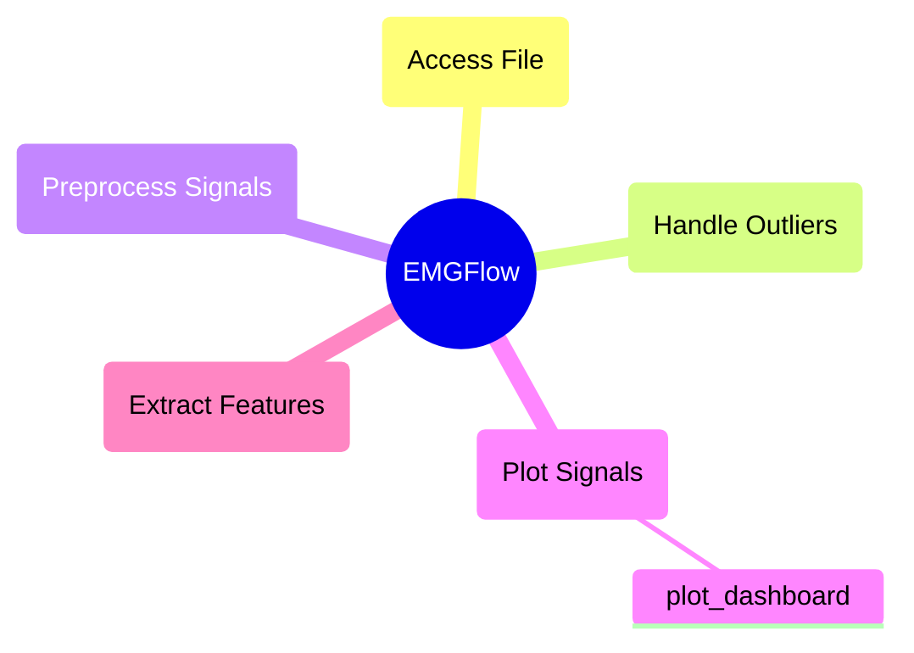
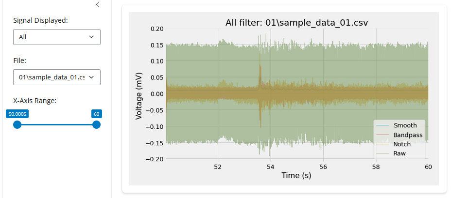

# `plot_signals` Module

These functions help visualize individual, or large batches of signal data. This helps visually see what is happening in a signal to identify outliers, and determine the kinds of filters that need to be applied.

## Module Structure



## `plot_dashboard`

**Description:**

Creates an HTML dashboard from a `path_names` filepath dictionary (see `make_paths`). Has a side bar menu to navigate the signal file and stage being displayed.

The visualization is created in the default browser, and is opened automatically. The function will automatically create plots for any paths provided in the dictionary, using the keys as the legend.

Each filepath in the dictionary is expected to contain the same named files to display them at the different stages. To avoid error, the `plot_dashboard` ignores the 'Feature' filepath.

When the dashboard runs, the terminal will pause to host the visualization. To resume normal execution, enter 'CTRL + C'.

```python
plot_dashboard(path_names, col, units, expression=None, file_ext='csv', autorun=True)
```

**Parameters:**

- A dictionary of keys (stage of preprocessing) and values (filepath to that stage). The provided dictionary is required to have a `Raw`, `Notch`, `Bandpass`, and `Smooth` path.

`col`: str
- Column of the signal files being plotted.

`units`: str
- Units to use for the y axis of the plot. The same units as recorded in the column values.

`expression`: str, optional (None)
- A regular expression. If provided, will only visualize files whose names match the regular expression. The default is None.

`file_ext`: str, optional ("csv")
- File extension for files to read. Only reads files with this extension. The default is 'csv'.

`autorun`: bool, optional (True)
- Boolean controlling the behavior of the function. If True (default), will automatically run the visualization in the default browser. If False, will return a `shiny.App` instance.

**Raises**

An exception is raised if the directories in `path_names` don't contain the same files.

An exception is raised if `col` is not found in any of the signal files read.

An exception is raised if a file cannot not be read in a path in `path_names`.

An exception is raised if an unsupported file format was provided for `file_ext`.

An exception is raised if `expression` is not None or a valid regular expression.

**Returns**

`app`: None or shiny.app
- A shiny app containing the visualization. Only returned if `autorun` is True.

**Example:**

```python
# Create a plot of each stage
path_names = EMGFlow.make_paths()
EMGFlow.make_sample_data(path_names)
EMGFlow.clean_signals(path_names, 2000)

col = 'EMG_zyg'
units = 'mV'

EMGFlow.plot_dashboard(path_names, col, units)
```

