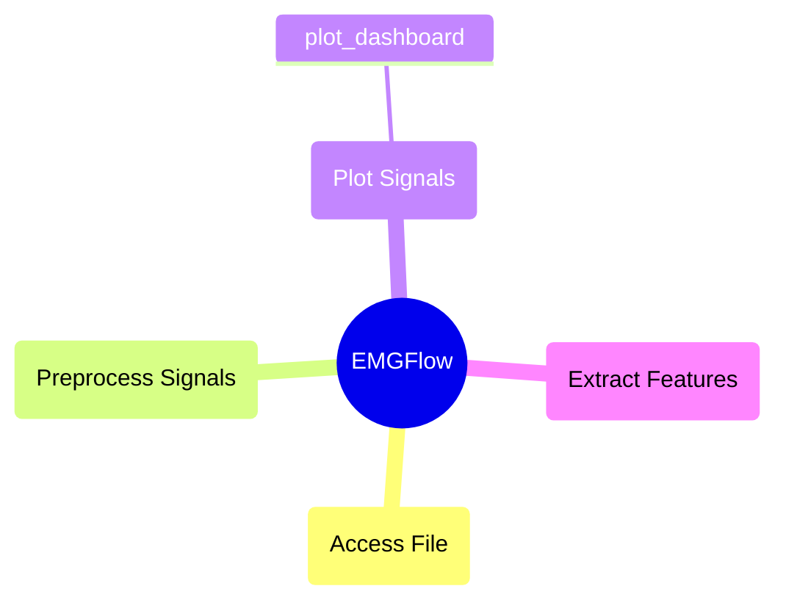

# `plot_signals` Module

These functions help visualize individual, or large batches of signal data. This helps visually see what is happening in a signal to identify outliers, and determine the kinds of filters that need to be applied.

## Module Structure



## `plot_dashboard`

**Description:**

Generate a Shiny dashboard of different processing stages for a given column of signal data.

Uses a `path_names` filepath dictionary (see `make_paths`). Has a side bar menu to navigate the file and stage being displayed.

The function ignores the 'feature' filepath. The remaining filepaths are tested for files, and included if found.

```python
def plot_dashboard(path_names:dict, column_name:str, units:str, file_ext:str='csv', use_mask:bool=False, show_legend:bool=True, auto_run:bool=True)
```

**Parameters:**

`path_names` : dict-str
- A dictionary of file locations with keys for stage in the processing pipeline. The function will generate graphs for as many paths are provided in the dictionary. The dictionary can be created with the 'make_paths' function.

`column_name` : str
- The column of the signals to display in the visualization.

`units` : str
- Units to use for the y axis of the plot, should be the same units used for the values in 'column_name'.

`file_ext` : str, optional ('csv')
- File extension for files to read. Only visualizes files with this extension. The default is 'csv'.

`use_mask` : bool, optional (False)
- An option to visualize the NaN mask If True, it will set values to NaN based on the NaN mask. If False, it will use the unaltered values of the column ignoring the NaN mask. The default is False.

`show_legend` : bool, optional (True)
- An option to show the legend on the plot. If True, it will show the legend. If False, the legend will be hidden. The default is True.

`auto_run` : bool, optional (True)
- An option to automatically see the visualization. If True, it will run the visual and open it in the default browser. If False, it will return the visualization object. The default is True.

**Raises**

An exception is raised if `column_name` is not a column of a signal file.

An exception is raised if a file contained in the first file directory (`path_names[0]`) is not found in the other file directories.

An exception is raised if a file could not be read.

An exception is raised if an unsupported file format was provided for `file_ext`.

**Returns**

`app` : None or shiny.app
- If `auto_run` is True, returns None. If False, returns a shiny.App instance.

**Example:**

```python
# Create a plot of each stage
path_names = EMGFlow.make_paths()
EMGFlow.make_sample_data(path_names)
EMGFlow.clean_signals(path_names, sampling_rate=2000)

column_name = 'EMG_zyg'
units = 'mV'

EMGFlow.plot_dashboard(path_names, column_name, units)
```

