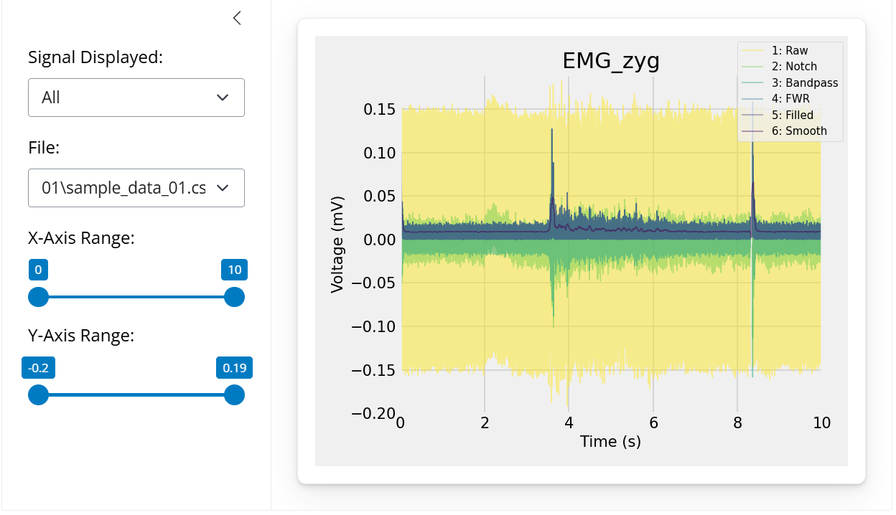

# `PlotSignals` Module Documentation

The plotting module `PlotSignals` provides functions to help visualize individual, or large batches of signal data. This helps visually see what is happening in a signal to identify outliers, and determine the kinds of filters that need to be applied.

## Module Structure


## `GenPlotDash`

**Description:**

Creates a HTML dashboard from a series of signal file paths to compare filtering progress at different stages. Has a side bar menu to navigate the signal file and stage being displayed.

The visualization is created in the default browser, and is opened automatically. The function will automatically create plots for any paths provided in the dictionary, using the keys as the legend.

```python
GenPlotDash(path_names, sampling_rate, col, units, expression=None, file_ext='csv', autorun=True)
```

**Parameters:**

`path_names`: dictionary of strings
- A dictionary of keys (stage of preprocessing) and values (filepath to that stage).

`sampling_rate`: int/float
- Numerical value of the sampling rate of the `Signal`. This is the number of entries recorded per second, or the inverse of the difference in time between entries.

`col`: str
- String column name to display in the visualization.

`units`: str
- Units to use for the y axis of the plot, same units used for the column values.

`expression`: str (None)
- String regular expression. If provided, will only create visualizations for `Signal` files whose names match the regular expression, and will ignore everything else.

`file_ext`: str ("csv")
- String extension of the files to read. Any file in `in_path` with this extension will be considered to be a `Signal` file, and treated as such. The default is `'csv'`.

`autorun`: bool (True)
- Boolean controlling the behavior of the function. If True (default), will automatically run the visualization in the default browser. If False, will return a shiny.App instance.

**Returns:**

`GenPlotDash`: None or shiny.app

**Error**

Raises an error if the directories referenced in `path_names` don't contain the same files.

Raises an error if `col` is not found in a dataframe.

Raises an error if a file cannot be read from one of the folders in `in_paths`.

Raises an error if an unsupported file format was provided for `file_ext`.

Raises an error if `expression` is not a valid regular expression.

**Example:**

```python
# Create a plot of each stage
path_names = EMGFlow.MakePaths()
col = 'EMG_zyg'
units = 'mV

EMGFlow.GenPlotDash(path_names, col, units)
```



## `PlotSpectrum`

**Description:**

Creates plots of PSDs of each column in the Signal files in a directory

The plots are saved as PNG files in the output directory

```python
PlotSpectrum(in_path, out_path, sampling_rate, cols=None, p=None, expression=None file_ext='csv')
```

**Parameters:**


`in_path`: str
- String of a filepath to read Signal files from.

`out_path`: str
- String of a filepath to output plots to.

`sampling_rate`: int/float
- Numerical value of the sampling rate of the `Signal`. This is the number of entries recorded per second, or the inverse of the difference in time between entries.

`cols`: str (None)
- List of string column names. If provided, will only create plots for the specified columns. If left `None`, will create plots for each column except for the `'Time'` column.

`p`: float (None)
- Random sampling probability, if set to a float between 0 and 1, will randomly plot signals at probability `p`

`expression`: str (None)
- String regular expression. If provided, will only create visualizations for `Signal` files whose names match the regular expression, and will ignore everything else.

`file_ext`: str ("csv")
- String extension of the files to read. Any file in `in_path` with this extension will be considered to be a `Signal` file, and treated as such. The default is `'csv'`.

**Returns:**

`PlotSpectrum`: None

**Error**

Raises an error if `sampling_rate` is less or equal to 0.

Raises an error if a column in `cols` is not in a dataframe.

Raises an error if `p` is not None and not between 0 and 1.

Raises an error if a file cannot be read in `in_path`.

Raises an error if an unsupported file format was provided for `file_ext`.

Raises an error if `expression` is not a valid regular expression.

**Example:**

```python
path_names = EMGFlow.MakePaths()
path_names['Plots'] = 'Data/Plots' # Add a path for plots

sr = 2000

EMGFlow.PlotSpectrum(path_names['Raw'], path_names['Plots'], sr)
```

## `PlotCompareSignals`

**Description:**

Creates plots of PSDs from two different stages in the processing pipeline.

The plots are saved as PNG files in the output directory

```python
PlotCompareSignals(in_path1, in_path2, out_path, sampling_rate, cols=None, expression=None, file_ext='csv')
```

**Parameters:**

`in_path1`: str
- String of a filepath to read Signal files from.

`in_path2`: str
- String of a filepath to read Signal files from.

`out_path`: str
- String of a filepath to output plots to.

`sampling_rate`: int/float
- Numerical value of the sampling rate of the `Signal`. This is the number of entries recorded per second, or the inverse of the difference in time between entries.

`cols`: str (None)
- List of string column names. If provided, will only create plots for the specified columns. If left `None`, will create plots for each column except for the `'Time'` column.

`expression`: str (None)
- String regular expression. If provided, will only create visualizations for `Signal` files whose names match the regular expression, and will ignore everything else.

`file_ext`: str ("csv")
- String extension of the files to read. Any file in `in_path` with this extension will be considered to be a `Signal` file, and treated as such. The default is `'csv'`.

**Returns:**

`PlotCompareSignals`: None

**Error**

Raises an error if `in_path1` and `in_path2` don't contain the same files.

Raises an error if `sampling_rate` is less or equal to 0.

Raises an error if a column in `cols` is not in a dataframe.

Raises an error if a file cannot be read in `in_path1` or `in_path2`.

Raises an error if an unsupported file format was provided for `file_ext`.

Raises an error if `expression` is not a valid regular expression.

**Example:**

```python
path_names = EMGFlow.MakePaths()
path_names['Plots'] = 'Data/Plots' # Add a path for plots

sr = 2000

EMGFlow.PlotSpectrum(path_names['Raw'], path_names['Notch'], path_names['Plots'], sr)
```