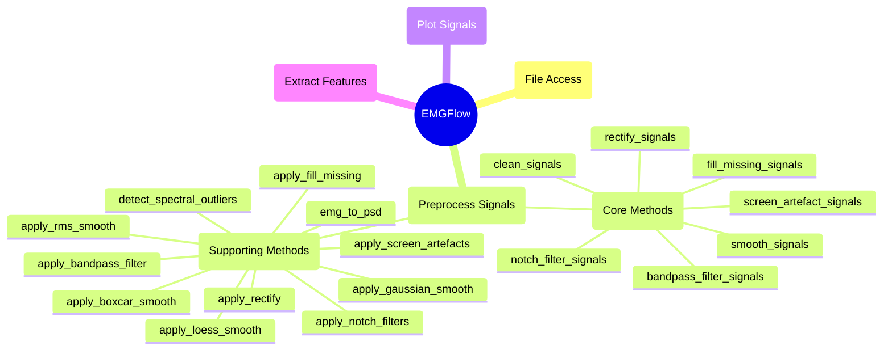

# `preprocess_signals` Module

These functions clean sEMG signals prior to their use in feature extraction. Signal processing is broken into 3 parts: notch filtering, bandpass filtering and smoothing. Each part has additional functions that support more specific needs, explained in more detail in the module descriptions.

## Module Structure




## Core Methods


### `bandpass_filter_signals`

**Description**

Apply a bandpass filter (`passband_edges`) to all signal files in a folder and its subfolders. Writes filtered signal files to an output folder, and generates a file structure matching the input folder.

```python
def bandpass_filter_signals(in_path:str, out_path:str, column_names=None, sampling_rate:float=1000.0, passband_edges:tuple[float,float]=(20.0,450.0), min_segment:float=30.0, expression:str=None, copy_unmatched:bool=False, file_ext:str='csv')
```

**Theory**

The values of `passband_edges` default to 20Hz and 450Hz respectively, as research suggests this is a good range for EMG signals. The journal "Filtering the surface EMG signal: Moving artifact and baseline noise contamination" suggests using values if 15-28Hz for the lower threshold, and 400-450Hz for the upper threshold.

These values can also be set manually for specific needs. There is some disagreement in documentation, suggesting other values may be better for some cases.

**Parameters**

`in_path` : str
- Filepath to a directory to read signal files.

`out_path` : str
- Filepath to a directory to write filtered signals.

`column_names` : list-str, optional (None)
- List of columns of the signals to apply the filter to. The default is None, in which case the filter is applied to every column except for 'Time' and columns that start with 'mask\_'.

`sampling_rate` : float, optional (1000.0)
- The sampling rate of the signal files. The default is 1000.0.

`passband_edges` : tuple[float,float], optional ((20.0, 450.0))
- Lower and upper frequency limit (Hz) of the bandpass filter. The default is (20.0, 450.0).

`min_segment` : float, optional (30.0)
- The minimum length (in ms) for data to be considered valid. If a length of data is less than this time, it is set to NaN. If a length of invalid data is less than this time, it is ignored in calculations. The default is 30.0.

`expression` : str, optional (None)
- A regular expression. If provided, will only apply the filter to files whose local paths inside of `in_path` match the regular expression. The default is None.

`copy_unmatched` : bool, optional (False)
- If True, copies files that don't match the regular expression to the output folder without filtering. The default is False, which ignores files that don't match.

`file_ext` : str, optional ('csv')
- The file extension for files to read. Only filters files with this extension. The default is 'csv'.

**Raises**

A warning is raised if no files in `in_path` match with `expression`.

An exception is raised if `expression` is not None or a valid regular expression.

An exception is raised if a column from `column_names` is not a column of a signal file.

An exception is raised if `sampling_rate` is less than or equal to 0.

An exception is raised if the limits in `passband_edges` are higher than 1/2 of `sampling_rate`.

An exception is raised if the upper limit of `passband_edges` is not higher than the lower limit.

An exception is raised if `min_segment` is longer than a signal recording.

An exception is raised if a file could not be read.

An exception is raised if an unsupported file format was provided for `file_ext`.

**Returns**

None.

**Example**

```python
path_names = EMGFlow.make_paths()
EMGFlow.make_sample_data(path_names)

column_names = ['EMG_zyg', 'EMG_cor']
sampling_rate = 2000
passband_edges = (20, 200)

# Apply bandpass filters of below 20Hz and above 200Hz to the files in the
# 'Notch' path, and write the output to the 'Bandpass' path.
EMGFlow.bandpass_filter_signals(path_names['Notch'], path_names['Bandpass'], column_names, sampling_rate, passband_edges)
```


### `clean_signals`

**Description**

Apply all EMG preprocessing filters to all signal files in a folder and its subfolders. Uses the 'path_names' dictionary, starting with files in the 'raw' path, and moving through 'notch', 'bandpass', and 'fwr' as the filters are applied.
    
Optionally, 'do_screen', 'do_fill' and 'do_smooth' can be set to True to do the associated step.

```python
def clean_signals(path_names:dict, sampling_rate:float=1000.0, notch_f0:float=60.0, do_screen=False, do_fill=True, do_smooth=True, file_ext:str='csv')
```

**Parameters**

`path_names` : dict-str
- A dictionary of file locations with keys for stage in the processing pipeline. Required paths are: 'raw', 'notch', 'bandpass', and 'fwr'. The dictionary can be created with the `make_paths` function.

`sampling_rate` : float, optional (1000.0)
- The sampling rate of the signal files. The default is 1000.0.

`notch_f0` : float, optional (60.0)
- The Hz value of the notch filter. The default is 60.0.

`do_screen` : bool, optional (False)
- An option to use the optional processing step of artefact screening. The default is False.

`do_fill` : bool, optional (True)
- An option to use the optional processing step of filling missing values. The default is True.

`do_smooth` : bool, optional (True)
- An option to use the optional processing step of smoothing. The default is True.

`file_ext` : str, optional ('csv')
- The file extension for files to read. Only processes files with this extension. The default is 'csv'.

**Raises**

An exception is raised if 'raw', 'notch', 'bandpass', or 'fwr' are not keys of the `path_names` dictionary provided.

An exception is raised if 'screened', 'filled', or 'smooth' are not keys of the `path_names` dictionary provided if the associated parameter is set to True.

An exception is raised if `sampling_rate` is less than or equal to 0.

An exception is raised if `min_segment` is longer than the recording of `Signal`.

An exception is raised if a file could not be read.

An exception is raised if an unsupported file format was provided for `file_ext`.

**Returns**

None.

**Example**

```python
# Create path dictionary, then clean the signals.
path_names = EMGFlow.make_paths()
sampling_rate = 2000
EMGFlow.clean_signals(path_names, sampling_rate)
```


### `fill_missing_signals`

**Description**

Apply an interpolation method ('method') to all signal files in a folder. Writes interpolated signal files to an output folder, and generates a file structure matching the input structure.

```python
def fill_missing_signals(in_path:str, out_path:str, column_names=None, sampling_rate:float=1000.0, method:str='pchip', max_segment:float=500.0, expression:str=None, copy_unmatched:bool=False, file_ext:str='csv')
```

**Parameters**

`in_path` : str
- Filepath to a directory to read signal files.

`out_path` : str
- Filepath to a directory to write filtered signals.

`column_names` : list-str, optional (None)
- List of columns of the signals to apply the interpolation to. The default is None, in which case the interpolation is applied to every column except for 'Time' and columns that start with 'mask\_'.

`sampling_rate` : float, optional (1000.0)
- The sampling rate of the signal files. The default is 1000.0

`method` : str, optional ('pchip')
- The interpolation method to use. Valid methods are 'pchip' and 'spline'. The default is 'pchip'.

`max_segment` : float, optional (500.0)
- The maximum length (in ms) of NaN values to fill. If a length of invalid data is longer than this threshold, it will not be interpolated. The default is 500.0.

`expression` : str, optional (None)
- A regular expression. If provided, will only apply the interpolation to files whose local paths inside of `in_path` match the regular expression. The default is None.

`copy_unmatched` : bool, optional (False)
- If True, copies files that don't match the regular expression to the output folder without interpolating. The default is False, which ignores files that don't match.

`file_ext` : str, optional ('csv')
- The file extension for files to read. Only interpolates files with this extension. The default is 'csv'.

**Raises**

A warning is raised if no files in `in_path` match with `expression`.

An exception is raised if `expression` is not None or a valid regular expression.

An exception is raised if a column from `column_names` is not a column of a signal file.

An exception is raised if 'Time' is in `column_names`.

An exception is raised if 'Time' is not a column of a signal file.

An exception is raised if `sampling_rate` is less than or equal to 0.

An exception is raised if `max_segment` results in a gap size less than or equal to 0.

An exception is raised if `method` is an invalid interpolation method.

An exception is raised if there aren't enough valid points to perform interpolation on a signal file.

An exception is raised if a file could not be read.

An exception is raised if an unsupported file format was provided for `file_ext`.

**Returns**

None.

**Example**

```python
# Fill missing values in all data from the 'Raw' path, and put the output in
# the 'Filled' path.
path_names = EMGFlow.make_paths()
EMGFlow.fill_missing_signals(path_names['Raw'], path_names['Filled'])
```


### `notch_filter_signals`

**Description**

Apply a list of notch filters (`notch_vals`) to all signal files in a folder and its subfolders. Writes filtered signal files to an output folder, and generates a file structure matching the input folder.

```python
def notch_filter_signals(in_path:str, out_path:str, column_names=None, sampling_rate:float=1000.0, notch_vals=[(60,5)], min_segment:float=30.0, expression:str=None, copy_unmatched:bool=False, file_ext:str='csv')
```

**Parameters**

`in_path` : str
- Filepath to a directory to read signal files.

`out_path` : str
- Filepath to a directory to write filtered signals.

`column_names` : list-str, optional (None)
- List of columns of the signals to apply the filter to. The default is None, in which case the filter is applied to every column except for 'Time' and columns that start with 'mask_'.

`sampling_rate` : float, optional (1000.0)
- The sampling rate of the signal files. The default is 1000.0.

`notch_vals` : list-tuples, optional ([(60, 5)])
- A list of (Hz, Q) tuples corresponding to the notch filters being applied. Hz is the frequency the filter is applied to, and Q is the Q-score (an intensity score where a higher number means a less extreme filter). The default is [(60, 5)].

`min_segment` : float, optional (30.0)
- The minimum length (in ms) for data to be considered valid. If a length of data is less than this time, it is set to NaN. If a length of invalid data is less than this time, it is ignored in calculations. The default is 30.0.

`expression` : str, optional (None)
- A regular expression. If provided, will only apply the filter to files whose local paths inside of `in_path` match the regular expression. The default is None.

`copy_unmatched` : bool, optional (False)
- If True, copies files that don't match the regular expression to the output folder without filtering. The default is False, which ignores files that don't match.

`file_ext` : str, optional ('csv')
- The file extension for files to read. Only filters files with this extension. The default is 'csv'.

**Raises**

A warning is raised if no files in `in_path` match with `expression`.

An exception is raised if `expression` is not None or a valid regular expression.

An exception is raised if a column from `column_names` is not a column of a signal file.

An exception is raised if `sampling_rate` is less than or equal to 0.

An exception is raised if `min_segment` is longer than a signal recording.

An exception is raised if a Hz value in `notch_vals` is greater than `sampling_rate`/2 or less than 0.

An exception is raised if a file could not be read.

An exception is raised if an unsupported file format was provided for `file_ext`.

**Returns**

None.

**Example**

```python
# Basic parameters
path_names = EMGFlow.make_paths()
EMGFlow.make_sample_data(path_names)
sampling_rate = 2000
notch_vals = [(50,5), (150,25)]

# Special case parameters
notch_vals_spec = [(317,25)]
expression = "^(08|11)"
column_names = ['EMG_zyg', 'EMG_cor']

# Apply notch_vals filters to all files in the 'Raw' path, and write them to
# the 'Notch' path.
EMGFlow.notch_filter_signals(path_names['Raw'], path_names['Notch'], column_names, sampling_rate, notch_vals)

# Apply an additional special case filter to files in the '08' or '11' folder
EMGFlow.notch_filter_signals(path_names['Notch'], path_names['Notch'], column_names, sampling_rate, notch_vals_spec, expression=expression)
```


### `rectify_signals`

**Description**

Apply a Full Wave Rectifier (FWR) to all signal files in a folder and its subfolders. Writes filtered signal files to an output folder, and generates a file structure matching the input folder.

```python
def rectify_signals(in_path:str, out_path:str, column_names=None, expression:str=None, copy_unmatched:bool=False, file_ext:str='csv')
```

**Parameters**

`in_path` : str
- Filepath to a directory to read signal files.

`out_path` : str
- Filepath to a directory to write filtered signals.

`column_names` : list-str, optional (None)
- List of columns of the signals to apply the filter to. The default is None, in which case the filter is applied to every column except for 'Time' and columns that start with 'mask\_'.

`expression` : str, optional (None)
- A regular expression. If provided, will only apply the filter to files whose local paths inside of 'in\_path' match the regular expression. The default is None.

`copy_unmatched` : bool, optional (False)
- If True, copies files that don't match the regular expression to the output folder without filtering. The default is False, which ignores files that don't match.

`file_ext` : str, optional ('csv')
- The file extension for files to read. Only filters files with this extension. The default is 'csv'.

**Raises**

A warning is raised if no files in `in_path` match with `expression`.

An exception is raised if `expression` is not None or a valid regular expression.

An exception is raised if a column from `column_names` is not a column of a signal file.

An exception is raised if a file could not be read.

An exception is raised if an unsupported file format was provided for `file_ext`.

**Returns**

None.

**Example**

```python
# Rectify all data from the 'Raw' path, and put the output in the 'FWR' path.
pathNames = EMGFlow.make_paths()
EMGFlow.rectify_signals(pathNames['Raw'], pathNames['FWR'])
```


### `screen_artefact_signals`

**Description**

Apply a screening filter to all signal files in a folder and its subfolders. Writes filtered signal files to an output folder, and generates a file structure matching the input folder.

The Hampel filter helps identify outliers based on the Median Absolute Deviation (MAD), and replaces them with the median of their window. A threshold is calculated as product of the MAD with `n_sigma` and and a constant 1.4826. If the difference between a value and the median is greater than this threshold, it is considered an outlier and replaced with the median.

To keep track of which values have been replaced, a "NaN mask" column is created which determines if each value is valid (True) or NaN (False).

The Wiener filter improves the quality of signals by minimizing the effect of noise on the output signal. This allows better interpretation of muscular movement.

```python
def screen_artefact_signals(in_path:str, out_path:str, column_names=None, sampling_rate:float=1000.0, method='hampel', window_ms:float=100.0, n_sigma:float=10.0, min_segment:float=30.0, expression:str=None, copy_unmatched:bool=False, file_ext:str='csv')
```

**Parameters**

`in_path` : str
- Filepath to a directory to read signal files.

`out_path` : str
- Filepath to a directory to write filtered signals.

`column_names` : list-str, optional (None)
- List of columns of the signals to apply the filter to. The default is None, in which case the filter is applied to every column except for 'Time' and columns that start with 'mask\_'.

`sampling_rate` : float, optional (1000.0)
- The sampling rate of the signal files. The default is 1000.0.

`method` : str, optional ('hampel')
- The screening method to use. Valid methods are 'hampel' and 'wiener'. The default is 'hampel'.

`window_ms` : float, optional (100.0)
- The size of the outlier detection window in ms. The default is 100.0.

`n_sigma` : float, optional (10.0)
- The number of standard deviations away for a value to be considered an outlier. The default is 10.0.

`min_segment` : float, optional (30.0)
- The minimum length (in ms) for data to be considered valid. If a length of data is less than this time, it is set to NaN. If a length of invalid data is less than this time, it is ignored in calculations. The default is 30.0.

`expression` : str, optional (None)
- A regular expression. If provided, will only apply the filter to files whose local paths inside of `in_path` match the regular expression. The default is None.

`copy_unmatched` : bool, optional (False)
- If True, copies files that don't match the regular expression to the output folder without filtering. The default is False, which ignores files that don't match.

`file_ext` : str, optional ('csv')
- The file extension for files to read. Only filters files with this extension. The default is 'csv'.

**Raises**

A warning is raised if no files in `in_path` match with `expression`.

An exception is raised if `expression` is not None or a valid regular expression.

A warning is raised if `window_ms` is longer than half a signal recording.

An exception is raised if a column from `column_names` is not a column of a signal file.

An exception is raised if `sampling_rate` is less than or equal to 0.

An exception is raised if `window_ms` results in a `window_size` less than or equal to 0.

An exception is raised if `min_segment` is longer than a signal recording.

An exception is raised if `method` is an invalid screening method.
 
An exception is raised if a file could not be read.

An exception is raised if an unsupported file format was provided for `file_ext`.

**Returns**

None.

**Example**

```python
# Screen artefacts in all data from the 'Raw' path, and put the output in the
# 'Screened' path.
path_names = EMGFlow.make_paths()
EMGFlow.screen_artefact_signals(path_names['Raw'], path_names['Screened'], sampling_rate=2000)
```


### `smooth_signals`

**Description**

Apply a smoothing filter (`method`) to all signal files in a folder and its subfolders. Writes filtered signal files to an output folder, and generates a file structure matching the input folder.

```python
def smooth_signals(in_path:str, out_path:str, column_names=None, sampling_rate:float=1000.0, method:str='rms', window_ms:float=50.0, sigma:float=1.0, min_segment:float=30.0, expression:str=None, copy_unmatched:bool=False, file_ext:str='csv')
```

**Theory**

By default, the `smooth_filter_signals` function uses the RMS smoothing method. This is because for EMG signals, RMS smoothing is considered to be the best method (RENSHAW et al., 2010).

Other smoothing functions are also available for use if needed.

**Parameters**

`in_path` : str
- Filepath to a directory to read signal files.

`out_path` : str
- Filepath to a directory to write filtered signals.

`column_names` : list-str, optional (None)
- List of columns of the signals to apply the smoothing filter to. The default is None, in which case the smoothing filter is applied to every column except for 'Time' and columns that start with 'mask\_'.

`sampling_rate` : float, optional (1000.0)
- The sampling rate of the signal files. The default is 1000.0.

`method` : str, optional ('rms')
- The smoothing method to use. Valid methods are 'rms', 'boxcar', 'gauss' and 'loess'. The default is 'rms'.

`window_ms` : float, optional (50.0)
- The size of the smoothing window in ms. The default is 50.0.

`sigma`: float, optional (1.0)
- The value of sigma used for a Gaussian filter. Only affects output when using a Gaussian filter. The default is 1.0.

`min_segment` : float, optional (30.0)
- The minimum length (in ms) for data to be considered valid. If a length of data is less than this time, it is set to NaN. If a length of invalid data is less than this time, it is ignored in calculations. The default is 30.0.

`expression` : str, optional (None)
- A regular expression. If provided, will only apply the smoothing filter to files whose local paths inside of `in_path` match the regular expression. The default is None.

`copy_unmatched` : bool, optional (False)
- If True, copies files that don't match the regular expression to the output folder without smoothing. The default is False, which ignores files that don't match.

`file_ext` : str, optional ('csv')
- The file extension for files to read. Only smooths files with this extension. The default is 'csv'.

**Raises**

A warning is raised if no files in `in_path` match with `expression`.

An exception is raised if `expression` is not None or a valid regular expression.

An exception is raised if `method` is an invalid smoothing method.

A warning is raised if `window_ms` is longer than half a signal recording.

An exception is raised if a column from `column_names` is not a column of a signal file.

An exception is raised if `sampling_rate` is less than or equal to 0.

An exception is raised if `window_ms` results in a `window_size` less than or equal to 0.

An exception is raised if `min_segment` is longer than a signal recording.

An exception is raised if a file could not be read.

An exception is raised if an unsupported file format was provided for `file_ext`.

**Returns**

None.

**Example**

```python
path_names = EMGFlow.make_paths()
EMGFlow.make_sample_data(path_names)
column_names = ['EMG_zyg', 'EMG_cor']
sampling_rate = 2000
window_ms = 120

# Apply smoothing filter with window size 20 to all files in the 'Bandpass'
# path and write the output to the 'Smooth' path.
EMGFlow.smooth_filter_signals(path_names['Bandpass'], path_names['Smooth'], column_names, sampling_rate, window_ms=window_ms)
```


## Supporting Methods


### `apply_bandpass_filter`

**Description**

Apply a bandpass filter (`passband_edges`) to a column of `Signal`.

```python
def apply_bandpass_filter(Signal:pd.DataFrame, column_name:str, sampling_rate:float=1000.0, passband_edges:tuple[float,float]=(20.0,450.0), min_segment:float=30.0)
```

**Parameters**

`Signal` : pd.DataFrame
- A Pandas dataframe containing a 'Time' column, and additional columns for signal data.

`column_name` : str
- The column of `Signal` the bandpass filter is applied to.

`sampling_rate` : float, optional (1000.0)
- The sampling rate of `Signal`. The default is 1000.0.

`passband_edges` : tuple[float,float], optional ([20.0, 450.0])
- Lower and upper frequency limit (Hz) of the bandpass filter. The default is (20.0, 450.0).

`min_segment` : float, optional (30.0)
- The minimum length (in ms) for data to be considered valid. If a length of data is less than this time, it is set to NaN. If a length of invalid data is less than this time, it is ignored in calculations. The default is 30.0.

**Raises**

An exception is raised if `column_name` is not a column of `Signal`.

An exception is raised if `sampling_rate` is less than or equal to 0.

An exception is raised if the limits in `passband_edges` are higher than 1/2 of `sampling_rate`.

An exception is raised if the upper limit of `passband_edges` is not higher than the lower limit.

An exception is raised if `min_segment` is longer than the recording of `Signal`.

**Returns**

`band_Signal` : pd.DataFrame
- A copy of `Signal` after the bandpass filter is applied.

**Example**

```python
# Apply a bandpass filter below 20Hz, and above 250Hz.
sampling_rate = 2000
band_Signal = EMGFlow.apply_bandpass_filter(Signal, 'EMG_zyg', sampling_rate, (20, 250))
```


### `apply_boxcar_smooth`

**Description**

Apply a boxcar smoothing filter to a column of `Signal`.

```python
def apply_boxcar_smooth(Signal:pd.DataFrame, column_name:str, sampling_rate:float=1000.0, window_ms:float=50.0, min_segment:float=30.0)
```

**Theory**

For a window size $\mu$, the boxcar smoothing algorithm is:
$$
s_i=\frac{\sum_{j=i-\mu}^{i+\mu}x_j}{2\mu+1}
$$
(O’Haver, 2023)

**Parameters**

`Signal` : pd.DataFrame
- A Pandas dataframe containing a 'Time' column, and additional columns for signal data.

`column_name` : str
- The column of `Signal` the boxcar smoothing filter is applied to.

`sampling_rate` : float, optional (1000.0)
- The sampling rate of `Signal`. The default is 1000.0.

`window_ms` : float, optional (50.0)
- The size of the smoothing window in ms. The default is 50.0.

`min_segment` : float, optional (30.0)
- The minimum length (in ms) for data to be considered valid. If a length of data is less than this time, it is set to NaN. If a length of invalid data is less than this time, it is ignored in calculations. The default is 30.0.

**Raises**

A warning is raised if `window_ms` is longer than half the recording of `Signal`.

An exception is raised if `column_name` is not a column of `Signal`.

An exception is raised if `sampling_rate` is less than or equal to 0

An exception is raised if `window_ms` results in a window size less than or equal to 0.

An exception is raised if `min_segment` is longer than the recording of `Signal`.

**Returns**

`boxcar_Signal` : pd.DataFrame
- A copy of `Signal` after the boxcar smoothing filter is applied.

**Example**

```python
column_name='EMG_zyg'
sampling_rate=2000.0
window_ms=100.0
boxcar_Signal = EMGFlow.apply_boxcar_smooth(Signal, column_name, sampling_rate, window_ms)
```


### `apply_fill_missing`

**Description**

Apply an interpolation method (`method`) to a column of `Signal`. Fills NaN values with interpolated results.

```python
def apply_fill_missing(Signal:pd.DataFrame, column_name:str, sampling_rate:float=1000.0, method:str='pchip', max_segment:float=500.0)
```

**Parameters**

`Signal` : pd.DataFrame
- A Pandas dataframe containing a 'Time' column, and additional columns for signal data.

`column_name` : str
- The column of `Signal` the interpolation is applied to.

`sampling_rate` : float, optional (1000.0)
- The sampling rate of `Signal`. The default is 1000.0.

`method` : str, optional ('pchip')
- The interpolation method to use. Valid methods are 'pchip' and 'spline'. The default is 'pchip'.

`max_segment` : float, optional (500.0)
- The maximum length (in ms) of NaN values to fill. If a length of invalid data is longer than this threshold, it will not be interpolated. The default is 500.0.

**Raises**

An exception is raised if `column_name` is not a column of `Signal`.

An exception is raised if `column_name` is 'Time'.

An exception is raised if 'Time' is not a column of `Signal`.

An exception is raised if `sampling_rate` is less than or equal to 0.

An exception is raised if `max_segment` results in a gap size less than or equal to 0.

An exception is raised if `method` is an invalid interpolation method.

An exception is raised if there aren't enough valid points to perform interpolation.

**Returns**

`filled_Signal` : pd.DataFrame
- A copy of `Signal` after the NaN values are filled.

**Example**

```python
# Fill missing values in a sample data file.
pathNames = EMGFlow.make_paths()
filePath = os.path.join(pathNames['Raw'], '01', 'sample_data_01.csv')
Signal = EMGFlow.read_file_type(filePath, 'csv')
FSignal = EMGFlow.apply_fill_missing(Signal, 'EMG_zyg')
```


### `apply_gaussian_smooth`

**Description**

Apply a Gaussian smoothing filter to a column of `Signal`.

```python
def apply_gaussian_smooth(Signal:pd.DataFrame, column_name:str, sampling_rate:float=1000.0, window_ms:float=50.0, sigma:float=1.0, min_segment:float=30.0)
```

**Theory**

For a window size $\mu$, the Gaussian smoothing algorithm is:
$$
s\\_j=\sum\\_{i=j-\mu}^{j+\mu}\frac{1}{\sqrt{2\pi}\sigma}e^{-\frac{(\mu-i)^2}{2\sigma^2}}
$$
- $\sigma$ is the standard deviation parameter we want to look at

(Fisher et al., 2003)

**Parameters**

`Signal` : pd.DataFrame
- A Pandas dataframe containing a 'Time' column, and additional columns for signal data.

`column_name` : str
- The column of `Signal` the Gaussian smoothing filter is applied to.

`sampling_rate` : float, optional (1000.0)
- The sampling rate of `Signal`. The default is 1000.0.

`window_ms` : float, optional (50.0)
- The size of the smoothing window in ms. The default is 50.0.

`sigma` : float, optional (1.0)
- Parameter of sigma in the Gaussian smoothing. The default is 1.0.

`min_segment` : float, optional (30.0)
- The minimum length (in ms) for data to be considered valid. If a length of data is less than this time, it is set to NaN. If a length of invalid data is less than this time, it is ignored in calculations. The default is 30.0.

**Raises**

A warning is raised if `window_ms` is longer than half the recording of `Signal`.

An exception is raised if `column_name` is not a column of `Signal`.

An exception is raised if `sampling_rate` is less than or equal to 0

An exception is raised if `window_ms` results in a window size less than or equal to 0.

An exception is raised if `min_segment` is longer than the recording of `Signal`.

**Returns**

`gauss_Signal` : pd.DataFrame
- A copy of `Signal` after the Gaussian smoothing filter is applied.

**Example**

```python
column_name='EMG_zyg'
sampling_rate=2000.0
window_ms=100.0
gauss_Signal = EMGFlow.apply_gaussian_smooth(Signal, column_name, sampling_rate, window_ms)
```


### `apply_loess_smooth`

**Description**

Apply a Loess smoothing filter to a column of `Signal`.

```python
def apply_loess_smooth(Signal:pd.DataFrame, column_name:str, sampling_rate:float=1000.0, window_ms:float=50.0, min_segment:float=30.0)
```

**Theory**

For a window size $\mu$, the Loess smoothing algorithm is:
$$
s_j=\sum_{i=j-\mu}^{j+\mu}w_ix_i
$$
$$
w_i=\left(1-\left(\frac{d_i}{\max(d_i)}\right)^3\right)^3
$$
- $d$ represents a series of evenly spaced numbers such that $-1\lt d_i\lt 1$

(Figueira, 2021)

**Parameters**

`Signal` : pd.DataFrame
- A Pandas dataframe containing a 'Time' column, and additional columns for signal data.

`column_name` : str
- The column of `Signal` the Loess smoothing filter is applied to.

`sampling_rate` : float, optional (1000.0)
- The sampling rate of `Signal`. The default is 1000.0.

`window_ms` : float, optional (50.0)
- The size of the smoothing window in ms. The default is 50.0.

`min_segment` : float, optional (30.0)
- The minimum length (in ms) for data to be considered valid. If a length of data is less than this time, it is set to NaN. If a length of invalid data is less than this time, it is ignored in calculations. The default is 30.0.

**Raises**

A warning is raised if `window_ms` is longer than half the recording of `Signal`.

An exception is raised if `column_name` is not a column of `Signal`.

An exception is raised if `sampling_rate` is less than or equal to 0

An exception is raised if `window_ms` results in a window size less than or equal to 0.

An exception is raised if `min_segment` is longer than the recording of `Signal`.

**Returns**

`loess_Signal` : pd.DataFrame
- A copy of `Signal` after the Loess smoothing filter is applied.

**Example**

```python
width = 20
loess_Signal = EMGFlow.apply_loess_smooth(Signal, 'EMG_zyg', width)
```


### `apply_notch_filters`

**Description**

Apply a list of notch filters (`notch_vals`) to a column of `Signal`.

```python
def apply_notch_filters(Signal:pd.DataFrame, column_name:str, sampling_rate:float=1000.0, notch_vals=[(60,5)], min_segment:float=30.0)
```

**Parameters**

`Signal` : pd.DataFrame
- A Pandas dataframe containing a 'Time' column, and additional columns for signal data.

`column_name` : str
- The column of `Signal` the notch filter is applied to.

`sampling_rate` : float, optional (1000.0)
- The sampling rate of 'Signal'. The default is 1000.0.

`notch_vals` : list-tuple, optional ([(60, 5)])
- A list of (Hz, Q) tuples corresponding to the notch filters being applied. Hz is the frequency the filter is applied to, and Q is the Q-score (an intensity score where a higher number means a less extreme filter). The default is [(60, 5)].

`min_segment` : float, optional (30.0)
- The minimum length (in ms) for data to be considered valid. If a length of data is less than this time, it is set to NaN. If a length of invalid data is less than this time, it is ignored in calculations. The default is 30.0.

**Raises**

An exception is raised if `column_name` is not a column of `Signal`.

An exception is raised if `sampling_rate` is less than or equal to 0.

An exception is raised if `min_segment` is longer than the recording of `Signal`.

An exception is raised if a Hz value in `notch_vals` is greater than `sampling_rate`/2 or less than 0.

**Returns**

`notch_Signal` : pd.DataFrame
- A copy of `Signal` after the notch filters are applied.

**Example**

```python
# Apply a notch filter of 150Hz at a Q-score of 5, and of 250Hz at a Q-score of
# 5.
sampling_rate = 2000
notch_Signal = EMGFlow.apply_notch_filters(Signal, 'EMG_zyg', sampling_rate, [(150, 5), (250, 5)])
```


### `apply_rectify`

**Description**

Applies a Full Wave Rectifier (FWR) to a column of `Signal`.

```python
def apply_rectify(Signal:pd.DataFrame, column_name:str)
```

**Parameters**

`Signal` : pd.DataFrame 
- A Pandas dataframe containing a 'Time' column, and additional columns for signal data.

`column_name` : str
- The column of `Signal` the FWR filter is applied to.

**Raises**

An exception is raised if `column_name` is not a column of `Signal`.

**Returns**

`fwr_Signal` : pd.DataFrame
- A copy of `Signal` after the FWR filter is applied.

**Example**

```python
# Apply a Full Wave Rectifier (FWR)
fwr_Signal = EMGFlow.apply_fwr(Signal, 'EMG_zyg')
```


### `apply_rms_smooth`

**Description**

Apply a Root Mean Square (RMS) smoothing filter to a column of `Signal`.

```python
def apply_rms_smooth(Signal:pd.DataFrame, column_name:str, sampling_rate:float=1000.0, window_ms:float=50.0, min_segment:float=30.0)
```

**Theory**

For a window size $\mu$, the RMS smoothing algorithm is:
$$
s_i=\sqrt{\frac{\sum_{j=i-\mu}^{i+\mu}x_j^2}{2\mu+1}}
$$

(Dwivedi et al., 2023)

**Parameters**

`Signal` : pd.DataFrame
- A Pandas dataframe containing a 'Time' column, and additional columns for signal data.

`column_name` : str
- The column of `Signal` the RMS smoothing filter is applied to.

`sampling_rate` : float, optional (1000.0)
- The sampling rate of `Signal`. The default is 1000.0.

`window_ms` : float, optional (50.0)
- The size of the smoothing window in ms. The default is 50.0.

`min_segment` : float, optional (30.0)
- The minimum length (in ms) for data to be considered valid. If a length of data is less than this time, it is set to NaN. If a length of invalid data is less than this time, it is ignored in calculations. The default is 30.0.

**Raises**

A warning is raised if `window_ms` is longer than half the recording of `Signal`.

An exception is raised if `column_name` is not a column of `Signal`.

An exception is raised if `sampling_rate` is less than or equal to 0

An exception is raised if `window_ms` results in a window size less than or equal to 0.

An exception is raised if `min_segment` is longer than the recording of `Signal`.

**Returns**

`rms_Signal` : pd.DataFrame
- A copy of `Signal` after the RMS smoothing filter is applied.

**Example**

```python
column_name='EMG_zyg'
sampling_rate=2000.0
window_ms=100.0
rms_Signal = EMGFlow.apply_rms_smooth(Signal, column_name, sampling_rate, window_ms)
```


### `apply_screen_artefacts`

**Description**

Apply a screening filter to a column of `Signal`.

Provides options for a Hampel filter or a Wiener filter.

The Hampel filter helps identify outliers based on the Median Absolute Deviation (MAD), and replaces them with the median of their window. A threshold is calculated as product of the MAD with `n_sigma` and and a constant 1.4826. If the difference between a value and the median is greater than this threshold, it is considered an outlier and replaced with the median.

To keep track of which values have been replaced, a "NaN mask" column is created which determines if each value is valid (True) or NaN (False).

The Wiener filter improves the quality of signals by minimizing the effect of noise on the output signal. This allows better interpretation of muscular movement.

```python
def apply_screen_artefacts(Signal:pd.DataFrame, column_name:str, sampling_rate:float=1000.0, method='hampel', window_ms:float=100.0, n_sigma:float=10.0, min_segment:float=30.0)
```

**Parameters**

`Signal` : pd.DataFrame
- A Pandas dataframe containing a 'Time' column, and additional columns for signal data.

`column_name` : str
- The column of '`Signal` the screening filter is applied to.

`sampling_rate` : float, optional (1000.0)
- The sampling rate of 'Signal'. The default is 1000.0.

`method` : str, optional ('hampel')
- The screening method to use. Valid methods are 'hampel' and 'wiener'. The default is 'hampel'.

`window_ms` : float, optional (100.0)
- The size of the outlier detection window in ms. The default is 100.0.

`n_sigma` : float, optional (10.0)
- The number of standard deviations away for a value to be considered an outlier. The default is 10.0.

`min_segment` : float, optional (30.0)
- The minimum length (in ms) for data to be considered valid. If a length of data is less than this time, it is set to NaN. If a length of invalid data is less than this time, it is ignored in calculations. The default is 30.0.

**Raises**

A warning is raised if `window_ms` is longer than half the recording of `Signal`.

An exception is raised if `column_name` is not a column of `Signal`.

An exception is raised if `sampling_rate` is less than or equal to 0.

An exception is raised if `window_ms` results in a window size less than or equal to 0.

An exception is raised if `min_segment` is longer than the recording of `Signal`.

An exception is raised if `method` is an invalid screening method.

**Returns**

`hamp_Signal` : pd.DataFrame
- A copy of `Signal` after the screening filter is applied.

**Example**

```python
# Screen artefacts in a sample data file.
pathNames = EMGFlow.make_paths()
filePath = os.path.join(pathNames['Raw'], '01', 'sample_data_01.csv')
Signal = EMGFlow.read_file_type(filePath, 'csv')
ASignal = EMGFlow.apply_screen_artefacts(Signal, 'EMG_zyg', 2000)
```


### `detect_spectral_outliers`

**Description:**

Detect outliers in all signal files in a folder. Returns a dictionary of files that contain outliers.
    
Determines outliers by interpolating an inverse function from the peaks of the signal's spectrum, then finding the `metric` aggregate (median by default) of the differences between the predicted spectrum, and the actual spectrum. Files are labelled as having outliers if any points are `threshold` times greater than the predicted value.

```python
def detect_spectral_outliers(in_path:str, column_names=None, sampling_rate:float=1000.0, window_ms:float=50.0, threshold:float=5.0, metric=np.median, low:float=None, high:float=None, expression:str=None, file_ext:str='csv')
```

**Parameters:**

`in_path` : str
- Filepath to a directory to read signal files.

`column_names` : list-str, optional (None)
- List of columns of the signals to apply the outlier detection to. The default is None, in which case the outlier detection is applied to every column except for 'Time' and columns that start with 'mask\_'.

`sampling_rate` : float
- The sampling rate of the signal files.

`window_ms` : float, optional (50.0)
- The size of the outlier detection window in ms. The default is 50.0.

`threshold` : float, optional (5.0)
- The number of times greater than the metric a value has to be for classification as an outlier. The default is 5.0.

`metric` : function, optional (`np.median`)
- The aggregation method to use. Valid methods are any aggregation function that works with a list or array (e.g., `np.mean`). The default is `np.median`.

`low` : float, optional (None)
- Lower frequency limit (Hz) of the outlier detection. The default is None, in which case no lower threshold is used.

`high` : float, optional (None)
- Upper frequency limit (Hz) of the outlier detection. The default is None, in which case no upper threshold is used.

`expression` : str, optional (None)
- A regular expression. If provided, will only apply the outlier detection to files whose local paths inside of `in_path` match the regular expression. The default is None.

`file_ext` : str, optional ('csv')
- The file extension for files to read. Only detects outliers in files with this extension. The default is 'csv'.

**Raises**

A warning is raised if no files in `in_path` match with `expression`.

A warning is raised if `window_ms` is longer than half a signal recording.

An exception is raised if `expression` is not None or a valid regular expression.

An exception is raised if `sampling_rate` is not greater than 0.

An exception is raised if `window_size` is not greater than 0.

An exception is raised if `threshold` is not greater than 0.

An exception is raised if `metric` is not a valid summary function.

An exception is raised if `low` or `high` are not between 0 and `sampling_rate`/2.

An exception is raised if `low` is greater than `high`.

An exception is raised if a column from `column_names` is not a column of a signal file.

An exception is raised if there is not enough maxima to create an interpolation.

An exception is raised if a file could not be read.

An exception is raised if an unsupported file format was provided for `file_ext`.

**Returns:**

`outliers` : dict
- Dictionary of file names/locations as keys/values for each file detected that contains an outlier.

**Example:**

```python
path_names = EMGFlow.make_paths()
column_names = ['EMG_zyg', 'EMG_cor']
sampling_rate = 2000
window_ms = 120

outliers = EMGFlow.detect_spectral_outliers(path_names['Notch'], column_names, sampling_rate, window_ms)
```


### `emg_to_psd`

**Description**

Creates a Power Spectrum Density (PSD) dataframe from a signal, showing the intensity of each frequency detected in the signal. Uses the Welch method, meaning it can be used as a Long Term Average Spectrum (LTAS).

```python
def emg_to_psd(Signal:pd.DataFrame, column_name:str, sampling_rate:float=1000.0, max_segment:float=2.5, normalize:bool=True, nan_mask=None)
```

**Parameters**

`Signal` : pd.DataFrame
- A Pandas dataframe containing a 'Time' column, and additional columns for signal data.

`column_name` : str
- The column of `Signal` the PSD is calculated from.

`sampling_rate` : float, optional (1000.0)
- The sampling rate of `Signal`. The default is 1000.0.

`max_segment` : float, optional (2.5)
- The maximum length (in ms) of NaN values to fill. If a length of invalid data is longer than this threshold, it will not be interpolated. The default is 2.5.

`normalize` : bool, optional (True)
- If True, will normalize the result. If False, will not. The default is True.

`nan_mask` : pd.Series, optional (None)
- Optional series that controls the calculation of the function. Can be a True/False mask that is the same size as the selected column, and will set all associated False values in the column to NaN in the calculation. The default is None, in which case no NaN masking will be done.

**Raises**

An exception is raised if `column_name` is not a column of `Signal`.

An exception is raised if `sampling_rate` is less than or equal to 0.

An exception is raised if `nan_mask` is not the same length as `column_name`.

An exception is raised if there are too many NaN values to make a valid window.

**Returns**

`psd` : pd.DataFrame
- A Pandas dataframe containing a 'Frequency' and 'Power' column. The 'Power' column indicates the intensity of each frequency in `Signal`. Results will be normalized if `normalize` is set to True.

**Example**

```python
column_name = 'EMG_zyg'
sampling_rate = 2000
PSD = EMGFlow.emg_to_psd(Signal, column_name, sampling_rate)
```


## Sources

Dwivedi, D., Ganguly, A., & Haragopal, V. V. (2023). Contrast between simple and complex classification algorithms. In T. Goswami & G. R. Sinha (Eds.), _Statistical Modeling in Machine Learning_ (pp. 93–110). Academic Press. [https://doi.org/10.1016/B978-0-323-91776-6.00016-6](https://doi.org/10.1016/B978-0-323-91776-6.00016-6)

Figueira, J. P. (2021, June 1). _LOESS_. Medium. [https://towardsdatascience.com/loess-373d43b03564](https://towardsdatascience.com/loess-373d43b03564)

Fisher, R., Perkins, S., Walker, A., & Wolfart, E. (2003). _Gaussian Smoothing_. [https://homepages.inf.ed.ac.uk/rbf/HIPR2/gsmooth.htm](https://homepages.inf.ed.ac.uk/rbf/HIPR2/gsmooth.htm)

O’Haver, T. (2023, April). _A Pragmatic Introduction to Signal Processing: Smoothing_. [https://terpconnect.umd.edu/~toh/spectrum/Smoothing.html](https://terpconnect.umd.edu/~toh/spectrum/Smoothing.html)

RENSHAW, D., BICE, M. R., CASSIDY, C., ELDRIDGE, J. A., & POWELL, D. W. (2010). A Comparison of Three Computer-based Methods Used to Determine EMG Signal Amplitude. _International Journal of Exercise Science_, _3_(1), 43–48.