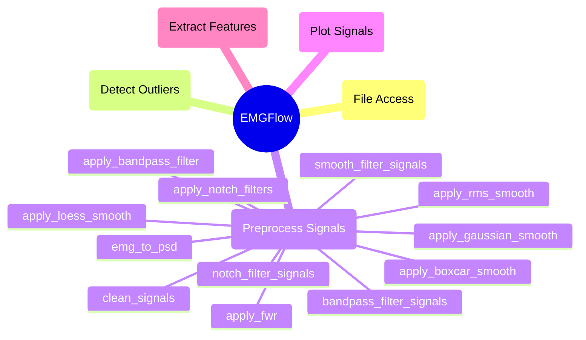

# Signal Preprocessing

The `PreProcessSignals` module provides preprocessing functions for cleaning sEMG signals prior to their use in feature extraction. Signal processing is broken into 3 parts: notch filtering, bandpass filtering and smoothing. Each part has additional functions that support more specific needs, explained in more detail in the module descriptions.

## Module Structure




## `emg_to_psd`

### Description

Creates a PSD (power spectrum density) dataframe of a Signal. Uses the Welch method, meaning it can be used as a Long Term Average Spectrum (LTAS).

```python
emg_to_psd(sig_vals, sampling_rate=1000, normalize=True)
```

### Parameters

`sig_vals`: list-float
- A list of float values. A column of a signal dataframe.

`sampling_rate`: int, float, optional (1000)
- Sampling rate of `sig_vals`. This is the number of entries recorded per second, or the inverse of the difference in time between entries.

`normalize`: bool, optional (True)
- If True, will normalize the result of the PSD by its maximum strength. If False, will not. The default is True.

### Raises

An exception is raised if `sig_vals` is a `pd.DataFrame`, not a column of a dataframe.

An exception is raised if `sampling_rate` is less or equal to 0.

### Returns

`psd`: pd.DataFrame
- A Pandas dataframe containing a 'Frequency' and 'Power' column. The 'Power' column indicates the intensity of each corresponding frequency in `sig_vals`. Results will be normalized if `normalize` is set to True.

### Example

```python
sampling_rate = 2000
PSD = EMGFlow.emg_to_psd(Signal['EMG_zyg'], sampling_rate)
```


## `apply_notch_filters`

**Description**

Applies a list of notch filters to a `Signal` dataframe, using the `scipy.signal.iirnotch` method. Returns a new dataframe object and does not modify the input `Signal`.

Components of a `Signal` dataframe:
- Has a column named `Time` containing time indexes
- `Time` indexes are all equally spaced apart
- Has one (or more) columns with any other name, holding the value of the electrical signal read at that time

```python
apply_notch_filters(Signal, col, sampling_rate, notch_vals)
```

**Parameters**

`Signal`: pd.DataFrame 
- A Pandas dataframe containing a 'Time' column, and additional columns for signal data.

`col`: str
- Column of `Signal` the filter is applied to.

`sampling_rate`: int, float
- Sampling rate of the `Signal`. This is the number of entries recorded per second, or the inverse of the difference in time between entries.

`notch_vals`: tuple list
- A list of `(Hz, Q)` tuples corresponding to the notch filters being applied. `Hz` is the frequency to apply the filter to, and `Q` is the Q-score (an intensity score where a higher number means a less extreme filter).

**Raises**

An exception is raised if `col` is not a column of `Signal`.

An exception is raised if `sampling_rate` is less or equal to 0.

An exception is raised if a `Hz` value in `notch_vals` is greater than `sampling_rate/2` or less than 0.

**Returns**

`notch_Signal`: pd.DataFrame
- A copy of `Signal` after the bandpass filter is applied.

**Example**

```python
# Apply a notch filter of 150Hz at a Q-score of 5, and of 250Hz at a Q-score of
# 5.
sampling_rate = 2000
notch_Signal = EMGFlow.apply_notch_filters(Signal, 'EMG_zyg', sampling_rate, [(150, 5), (250, 5)])
```


## `notch_filter_signals`

**Description**

Applies notch filters to all signal files detected in a folder, reading each in as a `Signal` dataframe. Writes the output to a new folder directory, mirroring the file hierarchy of the input.

Components of a `Signal` dataframe:
- Has a column named `Time` containing time indexes
- `Time` indexes are all equally spaced apart
- Has one (or more) columns with any other name, holding the value of the electrical signal read at that time

All files contained within the folder and subfolders with the proper extension are assumed to be signal files. All signal files within the folder and subfolders should have the same change in time between entries, as the same `sampling_rate` value will be used for each.

```python
notch_filter_signals(in_path, out_path, sampling_rate, notch_vals, cols=None, expresion=None, exp_copy=False, file_ext='csv')
```

**Parameters**

`in_path`: str
- Filepath to a directory to read signal files.

`out_path`: str
- Filepath to an output directory.

`sampling_rate`: int, float
- Sampling rate of the `Signal`. This is the number of entries recorded per second, or the inverse of the difference in time between entries.

`notch_vals`: list-tuple
- A list of `(Hz, Q)` tuples corresponding to the notch filters being applied. `Hz` is the frequency to apply the filter to, and `Q` is the Q-score (an intensity score where a higher number means a less extreme filter).

`cols`: str, optional (None)
- List of columns of the Signal to apply the filter to. The default is None, in which case the filter is applied to every column except for 'Time'.

`expression`: str, optional (None)
- A regular expression. If provided, will only filter files whose names match the regular expression. The default is None.

`exp_copy`: bool, optional (False)
- If True, copies files that don't match the regular expression to the output folder without filtering. The default is False, which ignores files that don't match.

`file_ext`: str, optional ("csv")
- File extension for files to read. Only reads files with this extension. The default is 'csv'.

**Raises**

Raises a warning if no files in `in_path` match with `expression`.

An exception is raised if any column in `cols` is not found in any of the signal files read.

An exception is raised if `sampling_rate` is less or equal to 0.

An exception is raised if a Hz value in `notch_vals` is greater than `sampling_rate/2` or less than 0.

An exception is raised if a file cannot not be read in `in_path`.

An exception is raised if an unsupported file format was provided for `file_ext`.

An exception is raised if `expression` is not None or a valid regular expression.

**Returns**

None.

**Example**

```python
# Basic parameters
path_names = EMGFlow.make_paths()
EMGFlow.make_sample_data(path_names)
sampling_rate = 2000
notch_vals = [(50,5), (150,25)]

# Special case parameters
notch_vals_spec = [(317,25)]
reg = "^(08|11)"
cols = ['EMG_zyg', 'EMG_cor']

# Apply notch_vals filters to all files in the 'Raw' path, and write them to
# the 'Notch' path.
EMGFlow.notch_filter_signals(path_names['Raw'], path_names['Notch'], sampling_rate, notch_vals, cols)

# Apply an additional special case filter to files beginning with '08' or '11',
# keeping them in the 'Notch' path.
EMGFlow.notch_filter_signals(path_names['Notch'], path_names['Notch'], sampling_rate, notch_vals_spec, cols)
```


## `apply_bandpass_filter`

**Description**

Applies a bandpass filter to a `Signal` dataframe, using the `scipy.signal.lfilter` method. Returns a new Pandas dataframe object and does not modify the input `Signal`.

Components of a `Signal` dataframe:
- Has a column named `Time` containing time indexes
- `Time` indexes are all equally spaced apart
- Has one (or more) columns with any other name, holding the value of the electrical signal read at that time

```python
apply_bandpass_filter(Signal, col, sampling_rate, low=20, high=450)
```

**Parameters**

`Signal`: pd.DataFrame 
- A Pandas dataframe containing a 'Time' column, and additional columns for signal data.

`col`: str
- String name of a column in `Signal` the filters are being applied to.

`sampling_rate`: int, float
- Sampling rate of the `Signal`. This is the number of entries recorded per second, or the inverse of the difference in time between entries.

`low`: int, float, optional (20)
- Lower frequency limit of the bandpass filter. The default is 20Hz.

`high`: int, float, optional (450)
- Upper frequency limit of the bandpass filter. The default is 450Hz.

**Raises**

An exception is raised if `col` is not a column of `Signal`.

An exception is raised if `sampling_rate` is less or equal to 0.

An exception is raised if `high` is not higher than `low`.

An exception is raised if `high` or `low` are higher than 1/2 of `sampling_rate`.

**Returns**

`band_Signal`: pd.DataFrame
- A copy of `Signal` after the bandpass filter is applied.

**Example**

```python
# Apply a bandpass filter below 20Hz, and above 250Hz.
sampling_rate = 2000
band_Signal = EMGFlow.apply_bandpass_filter(Signal, 'EMG_zyg', sampling_rate, 20, 250)
```


## `bandpass_filter_signals`

**Description**

Applies a bandpass filter to all `Signal` files in a folder. Writes output to a new folder directory, mirroring the file hierarchy of the input.

Components of a `Signal` dataframe:
- Has a column named `Time` containing time indexes
- `Time` indexes are all equally spaced apart
- Has one (or more) columns with any other name, holding the value of the electrical signal read at that time

All files contained within the folder and subfolders with the proper extension are assumed to be signal files. All signal files within the folder and subfolders should have the same change in time between entries, as the same `sampling_rate` value will be used for each.

```python
bandpass_filter_signals(in_path, out_path, sampling_rate, low=20, high=450, cols=None, expression=None, exp_copy=False, file_ext='csv')
```

**Theory**

The `low` and `high` parameters default to 20Hz and 450Hz respectively, as research suggests this is a good range for EMG signals. The journal "Filtering the surface EMG signal: Moving artifact and baseline noise contamination" suggests using values if 15-28Hz for the lower threshold, and 400-450Hz for the upper threshold.

These values can also be set manually for specific needs. There is some disagreement in documentation, suggesting other values may be better for some cases.

**Parameters**

`in_path`: str
- Filepath to a directory to read signal files.

`out_path`: str
- Filepath to an output directory.

`sampling_rate`: int, float
- Sampling rate of the `Signal`. This is the number of entries recorded per second, or the inverse of the difference in time between entries.

`low`: int, float, optional (20)
- Lower frequency limit of the bandpass filter. The default is 20Hz.

`high`: int, float, optional (450)
- Upper frequency limit of the bandpass filter. The default is 450Hz.

`cols`: str, optional (None)
- List of columns of the Signal to apply the filter to. The default is None, in which case the filter is applied to every column except for 'Time'.

`expression`: str, optional (None)
- A regular expression. If provided, will only filter files whose names match the regular expression. The default is None.

`exp_copy`: bool, optional (False)
- If True, copies files that don't match the regular expression to the output folder without filtering. The default is False, which ignores files that don't match.

`file_ext`: str, optional ("csv")
- File extension for files to read. Only reads files with this extension. The default is 'csv'.

**Raises**

A warning is raised if no files in `in_path` match with `expression`.

An exception is raised if any column in `cols` is not found in any of the signal files read.

An exception is raised if `sampling_rate` is less or equal to 0.

An exception is raised if `high` is not higher than `low`.

An exception is raised if `high` or `low` are higher than 1/2 of `sampling_rate`.

An exception is raised if a file cannot not be read in `in_path`.

An exception is raised if an unsupported file format was provided for `file_ext`.

An exception is raised if `expression` is not None or a valid regular expression.

**Returns**

None.

**Example**

```python
path_names = EMGFlow.make_paths()
EMGFlow.make_sample_data(path_names)

sampling_rate = 2000
low = 20
high = 200
cols = ['EMG_zyg', 'EMG_cor']

# Apply bandpass filters of below 20Hz and above 200Hz to the files in the
# 'Notch' path, and write the output to the 'Bandpass' path.
EMGFlow.bandpass_filter_signals(path_names['Notch'], path_names['Bandpass'], sampling_rate, low, high, cols)
```


## `apply_fwr`

**Description**

Applies a Full Wave Rectifier (FWR) to a `Signal` dataframe.

Components of a `Signal` dataframe:
- Has a column named `Time` containing time indexes
- `Time` indexes are all equally spaced apart
- Has one (or more) columns with any other name, holding the value of the electrical signal read at that time

```python
apply_fwr(Signal, col)
```

**Parameters**

`Signal`: pd.DataFrame 
- A Pandas dataframe containing a 'Time' column, and additional columns for signal data.

`col`: str
- Column of `Signal` the filter is applied to.

**Raises**

An exception is raised if 'col' is not a column of 'Signal'.

**Returns**

`fwr_Signal`: pd.DataFrame
- A copy of `Signal` after the FWR filter is applied.

**Example**

```python
fwr_Signal = EMGFlow.apply_fwr(Signal, 'EMG_zyg')
```


## `apply_boxcar_smooth`

**Description**

Applies a boxcar smoothing filter to a `Signal` dataframe. Applies a simple unweighted average.

Components of a `Signal` dataframe:
- Has a column named `Time` containing time indexes
- `Time` indexes are all equally spaced apart
- Has one (or more) columns with any other name, holding the value of the electrical signal read at that time

```python
apply_boxcar_smooth(Signal, col, window_size)
```

**Theory**

For a window size $\mu$, the boxcar smoothing algorithm is:
$$
s_i=\frac{\sum_{j=i-\mu}^{i+\mu}x_j}{2\mu+1}
$$
(O’Haver, 2023)

**Parameters**

`Signal`: pd.DataFrame 
- A Pandas dataframe containing a 'Time' column, and additional columns for signal data.

`col`: str
- Column of `Signal` the filter is applied to.

`window_size`: int
- Size of the window of the filter.

**Raises**

A warning is raised if `window_size` is greater than the length of `Signal`.

An exception is raised if `col` is not a column of `Signal`.

An exception is raised if `window_size` is less or equal to 0.

**Returns**

`boxcar_Signal`: pd.DataFrame
- A copy of `Signal` after the boxcar smoothing filter is applied.

**Example**

```python
width = 20
boxcar_Signal = EMGFlow.apply_boxcar_smooth(Signal, 'EMG_zyg', width)
```


## `apply_rms_smooth`

**Description**

Applies a Root Mean Squared (RMS) smoothing filter to the `Signal` dataframe. Takes the average of a window around each point.

Components of a `Signal` dataframe:
- Has a column named `Time` containing time indexes
- `Time` indexes are all equally spaced apart
- Has one (or more) columns with any other name, holding the value of the electrical signal read at that time

```python
apply_rms_smooth(Signal, col, window_size)
```

**Theory**

For a window size $\mu$, the RMS smoothing algorithm is:
$$
s_i=\sqrt{\frac{\sum_{j=i-\mu}^{i+\mu}x_j^2}{2\mu+1}}
$$

(Dwivedi et al., 2023)

**Parameters**

`Signal`: pd.DataFrame 
- A Pandas dataframe containing a 'Time' column, and additional columns for signal data.

`col`: str
- Column of `Signal` the filter is applied to.

`window_size`: int
- Size of the window of the filter.

**Raises**

A warning is raised if `window_size` is greater than the length of `Signal`.

An exception is raised if `col` is not found in `Signal`.

An exception is raised if `window_size` is less or equal to 0.

**Returns**

`rms_Signal`: pd.DataFrame
- A copy of `Signal` after the RMS smoothing filter is applied.

**Example**

```python
width = 20
rms_Signal = EMGFlow.apply_rms_smooth(Signal, 'EMG_zyg', width)
```


## `apply_gaussian_smooth`

**Description**

Applies a Root Mean Squared (RMS) smoothing filter to a `Signal` dataframe. Applies a Gaussian weighted average.

Components of a `Signal` dataframe:
- Has a column named `Time` containing time indexes
- `Time` indexes are all equally spaced apart
- Has one (or more) columns with any other name, holding the value of the electrical signal read at that time

```python
apply_gaussian_smooth(Signal, col, window_size, sigma=1)
```

**Theory**

For a window size $\mu$, the Gaussian smoothing algorithm is:
$$
s\\_j=\sum\\_{i=j-\mu}^{j+\mu}\frac{1}{\sqrt{2\pi}\sigma}e^{-\frac{(\mu-i)^2}{2\sigma^2}}
$$
- $\sigma$ is the standard deviation parameter we want to look at

(Fisher et al., 2003)

**Parameters**

`Signal`: pd.DataFrame 
- A Pandas dataframe containing a 'Time' column, and additional columns for signal data.

`col`: str
- Column of `Signal` the filter is applied to.

`window_size`: int
- Size of the window of the filter.

`sigma`: int, float, optional (1)
- Value of sigma in the Gaussian smoothing's distribution. The default is 1.

**Raises**

A warning is raised if `window_size` is greater than the length of `Signal`.

An exception is raised if `col` is not found in `Signal`.

An exception is raised if `window_size` is less or equal to 0.

**Returns**

`gauss_Signal`: pd.DataFrame
- A copy of `Signal` after the Gaussian smoothing filter is applied.

**Example**

```python
width = 20
gauss_Signal = EMGFlow.apply_gaussian_smooth(Signal, 'EMG_zyg', width)
```


## `apply_loess_smooth`

**Description**

Applies a Loess smoothing filter to a `Signal` dataframe. Applies a tricubic weighted average.

Components of a `Signal` dataframe:
- Has a column named `Time` containing time indexes
- `Time` indexes are all equally spaced apart
- Has one (or more) columns with any other name, holding the value of the electrical signal read at that time

```python
apply_loess_smooth(Signal, col, window_size)
```

**Theory**

For a window size $\mu$, the Loess smoothing algorithm is:
$$
s_j=\sum_{i=j-\mu}^{j+\mu}w_ix_i
$$
$$
w_i=\left(1-\left(\frac{d_i}{\max(d_i)}\right)^3\right)^3
$$
- $d$ represents a series of evenly spaced numbers such that $-1\lt d_i\lt 1$

(Figueira, 2021)

**Parameters**

`Signal`: pd.DataFrame 
- A Pandas dataframe containing a 'Time' column, and additional columns for signal data.

`col`: str
- Column of `Signal` the filter is applied to.

`window_size`: int
- Size of the window of the filter.

**Raises**

A warning is raised if `window_size` is greater than the length of `Signal`.

An exception is raised if `col` is not found in `Signal`.

An exception is raised if `window_size` is less or equal to 0.

**Returns**

`loess_Signal`: pd.DataFrame
- A copy of `Signal` after the Loess smoothing filter is applied.

**Example**

```python
width = 20
loess_Signal = EMGFlow.apply_loess_smooth(Signal, 'EMG_zyg', width)
```


## `smooth_filter_signals`

**Description**

Apply smoothing filters to all signal files in a folder. Writes filtered signals to an output folder, and generates a file structure matching the input folder. The method used to smooth the signals can be specified, but is RMS as default.

Components of a `Signal` dataframe:
- Has a column named `Time` containing time indexes
- `Time` indexes are all equally spaced apart
- Has one (or more) columns with any other name, holding the value of the electrical signal read at that time

All files contained within the folder and subfolders with the proper extension are assumed to be signal files. All signal files within the folder and subfolders should have the same change in time between entries, as the same `sampling_rate` value will be used for each.

```python
smooth_filter_signals(in_path, out_path, window_size, cols=None, expression=None, exp_copy=False, file_ext='csv', method='rms', sigma=1)
```

**Theory**

By default, the `smooth_filter_signals` function uses the RMS smoothing method. This is because for EMG signals, RMS smoothing is considered to be the best method (RENSHAW et al., 2010).

Other smoothing functions are also available for use if needed.

**Parameters**

`in_path`: str
- Filepath to a directory to read signal files.

`out_path`: str
- Filepath to an output directory.

`window_size`: int
- Size of the window in the smoothing filter.

`cols`: str, optional (None)
- List of columns of the Signal to apply the filter to. The default is None, in which case the filter is applied to every column except for 'Time'.

`expression`: str, optional (None)
- A regular expression. If provided, will only filter files whose names match the regular expression. The default is None.

`exp_copy`: bool, optional (False)
- If True, copies files that don't match the regular expression to the output folder without filtering. The default is False, which ignores files that don't match.

`file_ext`: str, optional ('csv')
- File extension for files to read. Only reads files with this extension. The default is 'csv'.

`method`: str, optional ('rms')
- Smoothing method to be used. The default is 'rms', but can also be 'boxcar', 'gauss' or 'loess'.

`sigma`: int, float, optional (1)
- Value of `sigma` used with a Gaussian filter. Only affects output when using a Gaussian filter.

**Raises**

A warning is raised if `window_size` is greater than the length of `Signal`.

A warning is raised if `expression` does not match with any files.

An exception is raised if an invalid smoothing method is used. Valid methods are one of: 'rms', 'boxcar', 'gauss' or 'loess'.

An exception is raised if any column in `cols` is not found in any of the signal files read.

An exception is raised if `window_size` is less or equal to 0.

An exception is raised if a file cannot not be read in `in_path`.

An exception is raised if an unsupported file format was provided for `file_ext`.

An exception is raised if `expression` is not None or a valid regular expression.

**Returns**

None.

**Example**

```python
path_names = EMGFlow.make_paths()
EMGFlow.make_sample_data(path_names)
size = 20
cols = ['EMG_zyg', 'EMG_cor']

# Apply smoothing filter with window size 20 to all files in the 'Bandpass'
# path and write the output to the 'Smooth' path.
EMGFlow.smooth_filter_signals(path_names['Bandpass'], path_names['Smooth'], size, cols)
```


## `clean_signals`

**Description**

Automates the EMG preprocessing workflow, proforming notch filtering, bandpass filtering and smoothing.

This function is a wrapper for `notch_filter_signals`, `bandpass_filter_signals` and `smooth_filter_signals` using their default values, a (50Hz, 5Q) notch filter, and a bandpass window size of 50.

```python
clean_signals(path_names, 2000)
```

**Parameters**

`path_names`: dictionary of strings
- A dictionary of keys (stage of preprocessing) and values (filepath to that stage). The provided dictionary is required to have a `Raw`, `Notch`, `Bandpass`, and `Smooth` path.

`sampling_rate`: int, float
- Sampling rate of the `Signal`. This is the number of entries recorded per second, or the inverse of the difference in time between entries.

**Returns**

`None`

**Error**

An exception is raised if the provided 'path_names' dictionary doesn't contain a 'Raw', 'Notch', 'Bandpass' or 'Smooth' path key.

**Example**

```python
# Create path dictionary, then clean the signals.
path_names = EMGFlow.make_paths()
EMGFlow.clean_signals(path_names, 2000)
```

## Sources

Dwivedi, D., Ganguly, A., & Haragopal, V. V. (2023). Contrast between simple and complex classification algorithms. In T. Goswami & G. R. Sinha (Eds.), _Statistical Modeling in Machine Learning_ (pp. 93–110). Academic Press. [https://doi.org/10.1016/B978-0-323-91776-6.00016-6](https://doi.org/10.1016/B978-0-323-91776-6.00016-6)

Figueira, J. P. (2021, June 1). _LOESS_. Medium. [https://towardsdatascience.com/loess-373d43b03564](https://towardsdatascience.com/loess-373d43b03564)

Fisher, R., Perkins, S., Walker, A., & Wolfart, E. (2003). _Gaussian Smoothing_. [https://homepages.inf.ed.ac.uk/rbf/HIPR2/gsmooth.htm](https://homepages.inf.ed.ac.uk/rbf/HIPR2/gsmooth.htm)

O’Haver, T. (2023, April). _A Pragmatic Introduction to Signal Processing: Smoothing_. [https://terpconnect.umd.edu/~toh/spectrum/Smoothing.html](https://terpconnect.umd.edu/~toh/spectrum/Smoothing.html)

RENSHAW, D., BICE, M. R., CASSIDY, C., ELDRIDGE, J. A., & POWELL, D. W. (2010). A Comparison of Three Computer-based Methods Used to Determine EMG Signal Amplitude. _International Journal of Exercise Science_, _3_(1), 43–48.