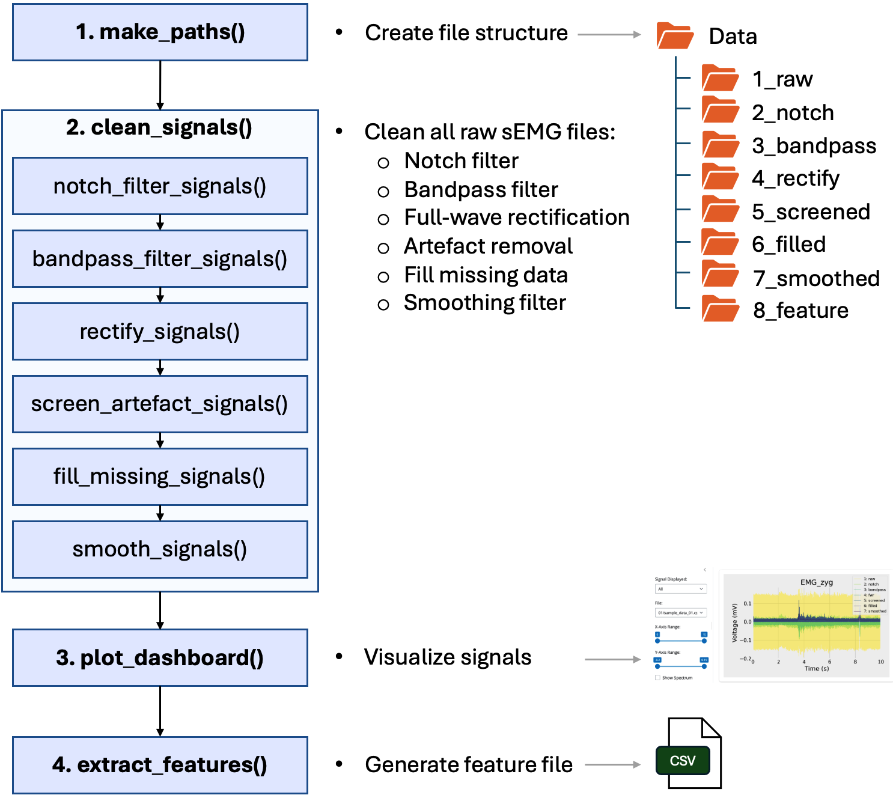
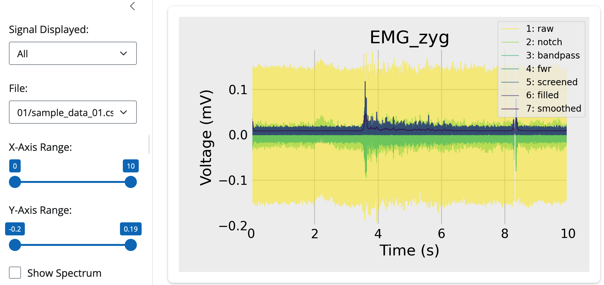

# Summary

Surface electromyography (sEMG) is increasingly used to study human physiology and behaviour, spurred by advances in deep learning and wearable sensors. Here, we introduce _EMGFlow_, an open-source Python package that streamlines preprocessing and feature extraction for sEMG signals. Tailored for batch processing, _EMGFlow_ handles large datasets typical in machine learning, extracting a comprehensive set of 33 statistical features across time and frequency domains. The package supports flexible file selection with regular expressions and uses Pandas DataFrames end-to-end to facilitate interoperability. An interactive dashboard visualises signals at each preprocessing stage to aid user decisions. _EMGFlow_ is distributed under the GNU General Public License v3.0 (GPL-3.0) and is available on PyPI. Documentation with guides, API references, and runnable examples is available at [https://wiiison.github.io/EMGFlow-Python-Package/](https://wiiison.github.io/EMGFlow-Python-Package/).

# Statement of Need

Although several packages process physiological and neurological signals, support for sEMG has remained limited. Many lack a comprehensive feature set for sEMG, forcing researchers to use a patchwork of tools. Others focus on event detection with GUI-centric workflows that suit continuous recordings of a single participant, but complicate batch feature extraction common in machine learning [@abadi_decaf_2015; @chen_emotion_2022; @koelstra_deap_2012; @schmidt_wesad_2018; @sharma_dataset_2019; @zhang_biovid_2016].

_EMGFlow_, a portmanteau of EMG and Workflow, fills this gap by providing a flexible pipeline for extracting a wide range of sEMG features, with a scalable design suited for large datasets. An overview of package metadata is presented in Table 1.

| Metadata| Description|
|:--------|:-----------|
| License |GPLv3 |
| Implementation | Python >= 3.9 |
| Code repository | https://github.com/WiIIson/EMGFlow-Python-Package |
| Documentation | https://wiiison.github.io/EMGFlow-Python-Package |
| PyPI installation | `pip install EMGFlow` |

 **Table 1:** _EMGFlow_ package metadata.

# Comparison to Other Packages

Compared to existing toolkits, _EMGFlow_ provides a broader, sEMG-specific library of 33 features [@bizzego_pyphysio_2019; @bota_biosppy_2024; @makowski_neurokit2_2021; @sjak-shie_physiodata_2022; @soleymani_toolbox_2017]. Its dashboard visualises batch-processed files rather than single recordings, enabling inspection of preprocessing effects across datasets [@gabrieli_pysiology_2020]. Adjustable filters and smoothing support support international mains standards (50 vs 60 Hz), a subtle detail some packages omit.

# Features

## A Simplified Workflow

Extracting features from large datasets is fundamental in machine learning and quantitative analysis. _EMGFlow_ supports batch-processing, enabling fully or semi-automated treatment of sEMG recordings. Figure 1 outlines the pipeline.


 **Figure 1:** An overview of the processing pipeline.

Example 1 demonstrates end-to-end preprocessing and feature extraction. We create project paths with `make_paths()` and load bundled sample data with `make_sample_data()` (adapted from PeakAffectDS [@greene_peakaffectds_2022]). Next, we run automated preprocessing via `clean_signals()` using sensible, literature-based defaults, and then write a plaintext CSV of 33 features per file with `extract_features()`.

```python
# %% Example 1: Quickstart (full pipeline)
import EMGFlow

# Create project paths
path_names = EMGFlow.make_paths()

# Load sample data
EMGFlow.make_sample_data(path_names)

# Preprocess signals (sample data recorded at 50 Hz mains)
EMGFlow.clean_signals(path_names, sampling_rate=2000)

# Extract features to disk "Features.csv"
EMGFlow.extract_features(path_names, sampling_rate=2000)
```

## Tailored Preprocessing

Example 2 shows how advanced users can tailor low-level preprocessing. After setup, Step 1  applies a notch filter to remove AC mains interference. Most functions use common sense defaults, which can be modified task-wide or for select cases. For instance, the sample data were recorded in New Zealand (200-240 VAC 50Hz), so we set the notch frequency and quality factor accordingly.

```python
# %% Example 2: Tailored preprocessing
import EMGFlow

# Setup workspace
path_names = EMGFlow.make_paths()
EMGFlow.make_sample_data(path_names)

# Data sampling rate
sampling_rate = 2000

# Notch filter for mains hum (Hz, Q-score)
notch_main = [(50, 5)]

# Columns names containing sEMG (Zygomaticus major, Corrugator supercilii)
muscles = ['EMG_zyg', 'EMG_cor']

# Step 1. Apply notch filter to all files in 1_raw, writing output to 2_notch
EMGFlow.notch_filter_signals(path_names['Raw'], path_names['Notch'], muscles, sampling_rate, notch_main)
```

_EMGFlow_ preserves the raw directory structure and mirrors it at each pipeline stage. All preprocessing functions accept an optional regular expression to target specific files. In Step 1b, we apply an additional notch filter at 150 Hz (the 3rd harmonic) only to files in subfolder `/01`.

```python
# Custom notch settings
notch_custom = [(150, 25)]
path_pattern = '^01/'

# Step 1b. Apply custom notch filter all to files in subfolder "/01"
EMGFlow.notch_filter_signals(path_names['Notch'], path_names['Notch'], muscles, sampling_rate, notch_custom, expression=path_pattern)
```

## Interference Attenuation

Surface EMG is susceptible to multiple sources of interference that affect the signal with distinct spectral signatures [@boyer_reducing_2023]. Band-pass filtering is typically performed in Step 2 to isolate the frequency spectrum of human muscle activity. Common passbands are 10-500 Hz [@livingstone_deficits_2016; @mcmanus_analysis_2020; @sato_emotional_2021; @tamietto_unseen_2009], though precise edges vary by domain [@abadi_decaf_2015]. Step 3 performs full-wave rectification, converting negative values to positive [@dakin_rectification_2014; @rutkowska_optimal_2024].

```python
# Passband edges (low, high)
passband_edges = [20, 450]

# Step 2. Apply band-pass filter
EMGFlow.bandpass_filter_signals(path_names['Notch'], path_names['Bandpass'], muscles, sampling_rate, passband_edges)

# Step 3. Apply full-wave rectifier
EMGFlow.rectify_signals(path_names['Bandpass'], path_names['FWR'], muscles)
```

Signal artefacts are another source of contamination, and span a diverse range of phenomeneon including thermal noise, eyeblinks, and random noise bursts [@boyer_reducing_2023]. These can be mitigated with `screen_artefacts()`, which applies a Hampel filter (default), or Wiener filter, both reported as robust denoisers [@allen_hampel_2009; @bhowmik_outlier_2017; @jarrah_density_2022]. Because artefact profiles vary across projects, we recommend visual inspectection with the the interactive dashboard to tune `n_sigma` (Hampel) and `window_ms` [@bhowmik_outlier_2017; @pearson_hampel_2016]. In Step 4 we target `/02/sample_data_04.csv` which contains an artificial, band-limited noise pulse, and copy other files forward untouched.

```python
screen_pattern = r'^02/sample_data_04\.csv$'

# Step 4. Apply hampel artefact filter to 02/sample_data_04.csv
EMGFlow.screen_artefact_signals(path_names['FWR'], path_names['Screened'], muscles, sampling_rate, expression=screen_pattern, copy_unmatched=True)
```

Missing data consisting of brief gaps or `NaN`s can be filled with `fill_missing_signals()`, which defaults to Piecewise Cubic Hermite Interpolating Polynomial (`method=pchip`). PCHIP is shape-preserving, monotonicity-respecting, and avoids overshoot - properites desirable for sEMG [@scipy_pchip_2025]. Cubic spline is also available [@shin_relationship_2021]. In Step 5, we address artifically injected gaps with PCHIP.

In Step 6, optional smoothing removes residual high-frequency noise before feature extraction. The default smoother RMS, equal to the square root of the total power, estimates signal amplitude and is commonly used in sEMG [@mcmanus_analysis_2020]. Boxcar, Gaussian, and LOESS alternatives are also provided.

```python
# Step 5. Fill missing data
EMGFlow.fill_missing_signals(path_names['Screened'], path_names['Filled'], muscles, sampling_rate)

# Step 6. Apply smoothing filter
EMGFlow.smooth_signals(path_names['Filled'], path_names['Smooth'], muscles, sampling_rate)
```

## An Interactive Dashboard

_EMGFlow_ includes a Shiny dashboard to visualize preprocessing effects. Pipeline steps can be shown overlaid or individually, and files are selectable via a dropdown. Below we generate a dashboard for the Zygomaticus major channel.

```python
# Column and measurement units to plot
show_muscle = 'EMG_zyg'
units = 'mV'

# Plot data for the "EMG_zyg" column
EMGFlow.plot_dashboard(path_names, show_muscle, units)
```


 **Figure 2:** _EMGFlow_'s interactive dashboard visualizing effects of different preprocessing steps on batch processed files.

## An Extensive Feature Library

After preprocessing, files are ready for feature extraction. Surface EMG records voltage differences at the skin arising from the summed motor-unit action potentials [@fridlund_guidelines_1986], yielding an interference signal whose amplitude (time domain) and spectrum (frequency domain) reflect motor-unit recruitment, discharge rates, and muscle-fiber conduction velocity [@mcmanus_analysis_2020; @de_luca_practicum_2008]. _EMGFlow_ extracts 33 features across time and frequency domains, as listed in Table 2.

| Domain | Feature |
|:-------|:--------|
| Temporal | minV, maxV, meanV, stdV, skewV, kurtosisV, maxF, IEMG, MAV, MMAV1, MMAV2, SSI, VAR, VOrder, RMS, WL, WAMP, LOG |
| Spectral | MFL, AP, SpecFlux, MDF, MNF, TwitchRatio, TwitchIndex, TwitchSlope, SC, SF, SS, SDec, SEntropy, SRoll, SBW |

**Table 2:** Features extracted from sEMG signals.

We conclude Example 2 by extracting features and previewing the first rows.

```python

# Step 7. Extract features and save results in "Features.csv"
df = EMGFlow.extract_features(path_names['Filled'], sampling_rate)

# Inspect features
df.head()

"""
               File_Path  EMG_zyg_Min  ...  EMG_cor_SB  EMG_cor_Spectral_PCT_Missing
0  01/sample_data_01.csv     0.002749  ...  554.486830                        0.0050
1  01/sample_data_02.csv     0.004991  ...  376.469454                        0.0002
3  02/sample_data_03.csv     0.000116  ... 2061.730123                        0.0153 
4  02/sample_data_04.csv     0.002417  ... 1016.772414                        0.0000 

[4 rows x 71 columns]
"""
```

### Temporal Feature Extraction

The set of 18 time-domain features include  statistical moments (mean, variance, skew, kurtosis) and sEMG-specific measures. Examples include Willison amplitude, a proxy for motor unit firing that counts threshold crossings, and log-detector, an estimator of muscle force [@tkach_study_2010]. Time-domain features can be computed after the first three preprocessing steps (notch, band-pass, rectify); Steps 4-6 are optional.

### Spectral Feature Extraction

The 15 frequency-domain features characterise power-spectrum shape and distribution. Median frequency [@phinyomark_novel_2009] tracks changes in conduction velocity, and is muscle fatigue assessments [@vanboxtel_changes_1983; @lindstrom_emg_1977; @mcmanus_analysis_2020]. Standard measures include spectral centroid, flatness, entropy, and roll-off. We also introduce Twitch Ratio, adapted from speech analysis [@eyben_geneva_2016], defined as the ratio of upper- to lower-band energy with a 60 Hz boundary between slow- and fast-twitch muscles fibres [@hegedus_adaptation_2020].

Spectral features are computed by converting the Step 2 band-limited signal into a Power Spectral Density (PSD). To avoid discarding otherwise valid Welch frames due to isolated dropouts, we perform constrained interpolation for micro-gaps <5 samples (≈2.5–5 ms at 1–2 kHz) and leave longer gaps as NaN so affected frames are rejected [@jas_autoreject_2017]. This limits interpolation bias, which increases with gap size and density [@clifford_quantifying_2005; @munteanu_quantifying_2016]. We do not apply Steps 3–6 before PSD: rectification is non-linear and distorts spectra [@farina_identification_2013; @mcclelland_inconsistent_2014; @neto_rectification_2010]; artefact-replacement filters can violate stationarity assumptions for FFT-based PSD; and smoothing suppresses high-frequency content. We estimate PSD with Welch’s method using Hann windows, 50% overlap, and rejection of segments with remaining invalid samples, and mean averaging of retained spectra to form a long-term spectrum [@welch_psd_1967].

### Missing Data Reporting

_EMGFlow_ reports the percentage of missing data in the final temporal and spectral series as `_Temporal_PCT_Missing` and `_Spectral_PCT_Missing` in the extracted feature DataFrame, enabling downstream exclusion critera where appropriate.

# Documentation and Testing

The documentation site ([https://wiiison.github.io/EMGFlow-Python-Package](https://wiiison.github.io/EMGFlow-Python-Package)) is built with VitePress and provides a Quick-Start tutorial, an example gallery from minimal to advanced pipelines, an API reference with executable snippets, and a detailed catalogue of all mathematical feature definitions. Mermaid.js mind-maps give a high-level overview of module structure.

Code reliability is enforced via an automated _unittest_ suite runs on every GitHub commit through continuous integration.

# Community Guidelines

Contributions are welcome via issues or pull requests. Suggestions for features, usage tips, and questions can also be raised through direct discussions with the maintainers.

# Declaration of Generative AI and AI-Assisted Technologies in the Writing Process

During preparation, the authors used GPT-5 to edit a final draft of the manuscript for flow, tone, and grammatical correctness. The authors reviewed and edited the content as needed and take full responsibility for the content of the publication.

# Acknowledgements

We acknowledge the support of the Natural Sciences and Engineering Research Council of Canada (NSERC, #2023-03786) and the Faculty of Science, Ontario Tech University.

# Author contributions

S.R.L. conceptualised the project. W.L.C. and S.R.L. designed the toolbox functionality. W.L.C. wrote the toolbox code and maintains the Github repository. W.L.C. and S.R.L. maintain the documentation website. S.R.L prepared manuscript figures; W.L.C. prepared repository and documentation figures. S.R.L and W.L.C. prepared the manuscript and approved the final version.

# References